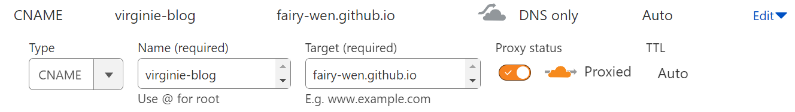
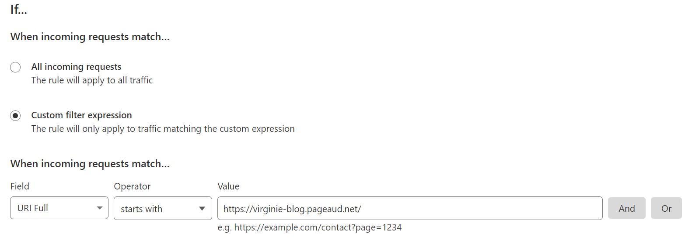
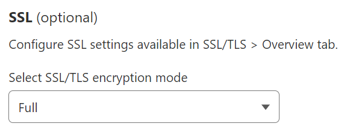

+++
title = 'Doctor Jekyll & Mister Hugo.'
date = 2024-05-30
draft = false
tags = ["billet","blogging"]
+++

Il y a 10 mois environ, je découvrais les [GitHub Pages](https://pages.github.com/) alors que je cherchais une façon de partager mes sketchnotes sur un site, plutôt qu'un simple repo GitHub.  
C'est ainsi que j'ai repris mon repository "conferences_notes" pour que son contenu puisse être utilisé par GitHub pour générer la première version de mon blog.  

Ce qui avait dirigé mon choix à l'époque c'était le fait que GitHub Pages pouvait interpréter du `Markdown`, un langage que je maîtrisais déjà, et qu'il était possible de personnaliser l'apparence avec un thème `Jekyll`.  

Niveau tuyauterie on restait sur quelque chose d'assez simple puisqu'il suffisait en gros d'avoir un `README.md` et un `_config.yml` à la racine du repo pour que GitHub sache générer la page.  

J'étais plutôt contente du résultat, en revanche j'étais face à un souci d'affichage des légendes des photos, et visiblement le texte était un peu petit chez certaines personnes.  
D'autre part, vu la façon dont j'avais organisé mon repo, l'utilisation d'un nom de domaine personnalisé nécessitait un peu de travail supplémentaire.

J'avais donc décidé d'essayer de corriger cela d'une façon ou d'une autre.  

Puis il y a deux semaines j'ai découvert [Hugo](https://gohugo.io/) en consultant [le blog de Julia March](https://lafillepassympa.com/).  
J'ai alors vu que là aussi, il était possible de partir d'un contenu écrit en `Markdown`, pour générer un site statique bien plus complet que la page GitHub : statistiques de visites, support des tags, mode d'affichage clair ou sombre piloté à la consultation de la page (suivant le thème utilisé) et j'en passe.  

Chouette alors ! Il ne m'en fallait pas plus pour me noter de migrer le blog sur ce mode.  

Évidemment, comme pour toute migration de utilisation d'un nouvel outil, cela ne s'est pas passé sans encombre (mais c'est ça qui est drôle et permet d'apprendre).  

Je commence donc par suivre le quickstart proposé par le site Hugo dans un repo git tout propre (judicieusement nommé "blog"), et là je me dis "ok cool ça va être fastoche" _(que nenni bien évidemment, coucou [l'effet Dunning-Kruger](https://fr.wikipedia.org/wiki/Effet_Dunning-Kruger)..._).

Bon, trouver un thème qui plaise, ça prend du temps, mais ne représente pas de difficulté particulière (quoi que, pour plusieurs d'entre eux je ne parvenais pas à avoir un build fonctionnel sur ma machine, sans comprendre pourquoi mais je vais y revenir plus bas).  

Enfin ça y est, j'ai un thème qui semble correspondre à ce que je veux, et je crée quelques pages de test. Build en local ok, je pousse sur GitHub, et configure une GitHub Action de génération de site Hugo (déjà implémentée par GitHub, pratique !).  

La première version de test fonctionne "en prod", je peux donc passer à l'étape suivante : pousser le vrai contenu.  

Après une modification de thème au passage, j'ajoute les premières "vraies" pages au repo. Génération en local ok. Je pousse sur GitHub : la génération échoue en timeout avec un message qui ne me parle pas trop (après tout, je ne suis pas dev front-end) :  

```
error calling partial: partial "head.html" timed out after 30s.
```

Commencent alors les heures de recherche sur la toile, pour comprendre...

Quand finalement, je tombe sur [ce billet de blog](https://craftycto.com/micro/hugo-cloudflare-build/) qui semble correspondre !  

Ce pourrait-il que ? Mais oui ! J'ai beaucoup d'images dans mon contenu, et effectivement sur ma machine le premier coup la génération a échoué, mais pas après (mise en cache de contenu ?).  
Et je pense que c'est pour la même raison que parfois je n'arrivais pas à générer le site quand je testais le thèmes avec beaucoup de contenu à traiter.  

Me voilà donc à augmenter le timeout de génération dans mon fichier `blog\config\_default\params.toml` (j'avais repris un peu de l'architecture du site exemple du thème), sans succès.  
Et pour cause, ce n'est pas dans ce fichier qu'il fallait effectuer la modification, comme l'explique [la documentation](https://gohugo.io/getting-started/configuration/) que je n'avais pas encore parcourue (il faut dire qu'elle est touffue, complète, mais touffue).  
Bref, un petit déplacement du paramètre vers `blog\config\_default\hugo.toml`, un push, et là enfin, le site est généré et disponible !  


Tant de temps passé à chercher, alors que les traces donnaient déjà une piste de résolution du problème :  
```
ERROR render of "home" failed: "/home/runner/work/blog/blog/themes/tailwind/layouts/_default/list.html:31:17": execute of template failed: template: _default/list.html:31:17: executing "main" at <partial "block/desc.html" .>: error calling partial: partial "block/desc.html" timed out after 30s. This is most likely due to infinite recursion. If this is just a slow template, you can try to increase the 'timeout' config setting.
ERROR render of "page" failed: "/home/runner/work/blog/blog/themes/tailwind/layouts/_default/baseof.html:20:5": execute of template failed: template: _default/single.html:20:5: executing "_default/single.html" at <partial "head.html" .>: error calling partial: partial "head.html" timed out after 30s. This is most likely due to infinite recursion. If this is just a slow template, you can try to increase the 'timeout' config setting.
ERROR render of "term" failed: "/home/runner/work/blog/blog/themes/tailwind/layouts/_default/list.html:31:17": execute of template failed: template: _default/list.html:31:17: executing "main" at <partial "block/desc.html" .>: error calling partial: partial "block/desc.html" timed out after 30s. This is most likely due to infinite recursion. If this is just a slow template, you can try to increase the 'timeout' config setting.
Total in 47158 ms
```

Mais étant donné que le build fonctionnait sur mon poste, je ne me suis pas dit que c'était bien là le problème.  

Dernière étape, l'utilisation de mon nom de domaine perso, proposée par la configuration de GitHub Pages.  
Là aussi j'ai fait face à quelques soucis.  

Je configure donc les DNS dans mon interface Cloudflare (mise en place pour faire de la domotique à la maison), GitHub me dit "c'est bon ok le domaine est accessible".  
Puis je tente la validation du domaine (dans les paramètres globaux de mon GitHub). Je lis les étapes, et me rend compte que ça pointe pas vers GitHub... Mince ! Le fait d'avoir de la redirection pour la domotique me bloquerait-elle pour avoir un nom de domaine personnalisé ? Hum...

Puis je me rends compte que dans l'interface Cloudflare, il y a une option (activée par défaut) de proxy des requêtes.  



Effectivement, ce n'est pas ce que je veux, je veux juste un changement DNS. Je désactive donc l'option, et ce coup-ci c'est bon, le retour de la commande `dig` permettant de vérifier la redirection renvoie le bon résultat.  
Mais le site ne fonctionne toujours pas. Le navigateur me renvoie un code `ERR_TOO_MANY_REDIRECTS`.  

C'est reparti pour un tour d'investigation. Celui-ci ne durera pas longtemps, je tombe bien vite sur [ce post stackoverflow](https://stackoverflow.com/questions/50145231/how-to-fix-err-too-many-redirects-on-custom-github-pages-domain).  
Je comprends donc que Cloudflare récupère la requête en `https` mais papote en `http` avec GitHub. Forcément, ça coince.  
Oui mais de là à changer complètement le mode de fonctionnement de Clouflare, je préfère éviter, ça risquerait de casser la domotique.  

Heureusement pour moi, il est possible de créer des règles personnalisées, ce que je fais donc :  
  
  

Et voilà, le site s'affiche.  
.  
.  
.  
Presque.
  
Le navigateur me dit que la connexion n'est pas sécurisée, car le certificat est émis au nom de github, et pas celui du site consulté... Haaaaaannnnn !  

Nouvelle recherche sur la toile. [Stackoverflow](https://stackoverflow.com/questions/67043175/how-can-i-get-github-pages-to-give-a-correct-ssl-certificate-for-my-www-subdomai) est encore une fois mon ami, après un ajout d'une nouvelle entrée dans les DNS, enfin c'est bon ! Le site s'affiche, le certificat est valide, c'est fluide !  

Prochaine étape, gérer une taille maximale pour l'affichage des images (je pense que ça va encore passer par du code `html` dans le `Markdown`, ça reste le trick ultime ^^), et avoir une image qui s'affiche dans les bloc de prévisualisation du lien vers le blog.  

Mais comme dit ma cop's [Aurélie Vache](https://x.com/aurelievache), faisons petit-à-petit.  
C'est quelque chose que j'essaye de garder en tête dans tout ce que j'entreprends, car mon cerveau voit (et **veut** !) tout de suite la _big picture_, et a du mal à imaginer les étapes.  

Je me pose donc régulièrement la question : "C'est quoi le besoin urgent à l'instant T ?".  

Et ça fonctionne plutôt bien, je crois.