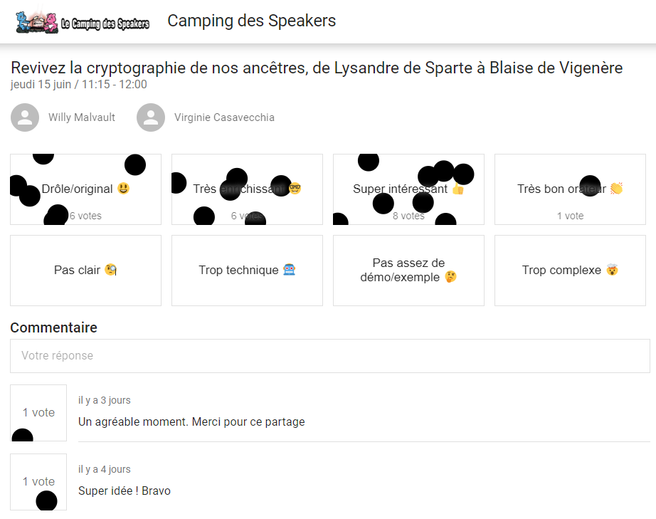

+++
title = 'Le camping des speakers 2023'
date = 2023-06-18
draft = false
tags = ["conference", "sketchnotes"]
categories = ["tech"]
+++

Les 15 et 16 juin 2023 a eu lieu la deuxième édition du [Camping des Speakers](https://camping-speakers.fr/) dans le golfe du Morbihan.
Il s'agit d'une conférence complètement atypique, mêlant sessions avec et sans slides, de 15 minutes pour les plus courtes à 45 minutes pour les plus longues, en intérieur ou en extérieur, en journée et également à la tombée de la nuit après le repas, le tout dans un camping de Baden.

J'avais déjà eu l'occasion de participer au Camping des Speakers en tant que speaker lors de la première édition en 2022, qui marqua d'ailleurs ma toute première expérience en tant que speaker dans une conférence.

Cette année, j'y participai de nouveau en tant que speaker, cette fois-ci en duo avec [Willy Malvault](https://twitter.com/malvultw) pour animer un atelier sur la cryptographie de nos ancêtres, et j'ai pu encore faire de formidables rencontres et assister à des sessions très intéressantes, sur des sujets variés.

Ce que j'apprécie tout particulièrement dans cette conférence en tant que speaker, c'est de pouvoir proposer des formats originaux sur des sujets pas obligatoirement en lien direct avec l'IT, et qui ne trouveraient pas forcément leur place dans des conférences plus classiques.
En tant de spectatrice, j'apprécie de pouvoir justement découvrir de nouvelles choses, de nouveaux métiers, dans un cadre unique, et d'avoir le temps d'échanger avec plein de personnes puisque tout le monde ou presque reste sur place pendant les 2 jours (voire plus !).

# Sessions du jeudi 15 juin

Après la keynote d'ouverture proposée par les organisateurs, je n'ai assisté à aucune session, mon atelier ayant lieu peu de temps après.

## Atelier La cryptographie de nos ancêtres

Nous avons eu le plaisir d'accueillir une douzaine de participants à notre atelier, lors duquel nous leur avons fait expérimenter 3 méthodes de chiffrement historiques : la scytale, le chiffre de César et le chiffre de Vigenère.
Pour cela, nous avions préparé des messages chiffrés avec chacune de ces méthodes, en 6 exemplaires, afin que les participants tentent de les déchiffrer.
Nous avons eu des retours très positifs, et avons apprécié nous aussi proposer ce sujet, dans ce format.

Vous pouvez voir quelques photos sur [ce post Twitter](https://twitter.com/CampingSpeakers/status/1669278041216802817).

Et notre super feedback !

## Le guide du voyageur LGBTQIA+ 

**[Elaine Dias Batista](https://twitter.com/elainedbatista)** - _en extérieur, sans slides_

Après la pause déjeuner, Elaine Dias Batista nous a parlé de ce qui se cache derrière ce sigle LGBT (en 15 minutes, pas le temps d'aborder le QIA+). Elle nous a ainsi présenté les 4 composantes des identités de genre et des identités sexuelles de chacun d'entre nous (sexe biologique, type d'attirance sexuelle et romantique, expression de genre et identité de genre), expliquant au passage les multiples combinaisons possibles et par conséquent la diversité de "profils" de nous humains.
De plus, Elaine étant d'origine brésilienne, nous avons pu également aborder la différence de culture entre le Brésil et la France.
En effet le Brésil est un pays très conservateur, où la communauté LGBT est peut-être plus visible qu'en France, mais où elle souffre probablement davantage de la critique et du regard d'une partie de la population qu'ici.

Bien qu'étant déjà familière avec plusieurs de ces notions et la diversité sous-jacente, je ne connaissais pas ce "principe" des 4 fondamentaux de notre identité, et ai apprécié que ce sujet soit proposé.
Pour aller plus loin sur le sujet, voir notamment le [GenderBread](https://www.itspronouncedmetrosexual.com/2018/10/the-genderbread-person-v4/) qu'Elaine nous a recommandé.

## De la tablette d'argile à ChatGPT : la passionnante histoire de la diffusion du savoir

**[Patrice De Saint Steban](https://twitter.com/patoudss)** - _en extérieur, sans slides_

Juste après l'intervention d'Elaine, Patrice de Saint Steban nous a proposé un rapide historique de la diffusion du savoir, depuis l'origine jusqu'à nos jours.
Le savoir a tout d'abord été transmis exclusivement par la parole, l'écriture n'existant pas encore.
Le principal inconvénient de ce mode de transmission est que le discours se déforme au fur et à mesure des transmissions. L'utilisation de contes et légendes vient tenter de contrer la faiblesse du bouche-à-oreille.

Viennent ensuite la tablette d'argile (ne permettant pas d'écrire beaucoup d'informations), le rouleau de parchemin (que l'on ne peut que parcourir du début à la fin), le livre (d'abord recopié à la main, puis petit à petit démocratisé grâce à l'imprimerie puis à l'expansion de la lecture dans les populations) et enfin l'informatique (Encarta, Wikipedia et plus récemment ChatGPT).

Sa conclusion, avec laquelle je suis plutôt d'accord, c'est qu'un nouvel usage ne vient pas obligatoirement remplacer les anciens : nous continuons de nous raconter des histoires oralement, nous continuons de lire des livres (papier ou sur tablette), il est fort probable qu'un outil comme ChatGPT viendra compléter l'éventail d'outils de transmission à notre portée.

## Pour éviter le dirty recruiting, on ne laisse pas ses valeurs dans un coin

**[Shirley Almosni Chiche](https://twitter.com/ShirleyAlmCh)** - _en intérieur avec slides_

C'est un sujet difficile que celui dont vient nous parler Shirley, dans un style sans chichis, sans langue de bois, sans peur de choquer et dans un style bien à elle que j'aime beaucoup.
Mêlant difficultés dont elle a été témoin et expériences vécues, que ce soit en tant que candidate ou recruteuse, et s'appuyant sur plusieurs sources, elle nous explique comment de manière inconsciente ou tout à fait délibérée nous pouvons nous retrouver à faire preuve de discrimination dans le monde du travail (et pas uniquement celui de l'IT).

Au-delà des multiples constats et remises en questions, Shirley nous laisse avec quelques pistes individuelles pour tenter d'aborder nos carrières de façon plus saine.

Ses slides : https://www.canva.com/design/DAFU7LtE1HM/gA3ptO1r-JELBYIstVyrVA/view?utm_content#DAFU7LtE1HM&utm_campaign#designshare&utm_medium#link&utm_source#publishsharelink

Quelques sources issues des slides :
* [Racism as a Determinant of health: a systematic review and meta-analysis](https://journals.plos.org/plosone/article?id#10.1371/journal.pone.0138511)
* [13è baromètre défenseur des droits](https://www.defenseurdesdroits.fr/fr/communique-de-presse/2020/12/13eme-barometre-de-la-perception-des-discriminations-dans-lemploi-des)
* [L'observatoire MeteoJob des discriminations à l'embauche](https://www.ifop.com/publication/lobservatoire-meteojob-des-discriminations-a-lembauche/)

## Bienvenue dans ma zone d'inconfort

**[Noémie Delrue](https://twitter.com/NoemieDelrue)** - _en intérieur avec slides_

Pour s'adresser à nous, Noémie a dû sortir de sa zone de confort. En effet, après un souci de santé, elle s'est mise à souffrir de peur de prendre la parole en public (y compris dans le cercle privé).
Dans une présentation parfaitement construite, elle nous raconte comment, petit à petit, elle a retrouvé la parole.
Elle nous explique via un parallèle avec une excursion de randonnée ce que signifie "sortir de sa zone de confort", ce que cela requiert pour pouvoir le faire et qu'est-ce que cela peut nous apporter.
Elle nous rappelle aussi qu'il est indispensable, que ce soit dans la vie personnelle ou professionnelle, de dire quand on sort de notre zone de confort pour réaliser telle ou telle tâche. L'avantage est qu'en cas d'échec on nous remerciera d'avoir fait l'effort et essayé. Et en cas de réussite, la fierté d'avoir réussi n'en sera que plus grande !

## Dessines-moi Rust 

**[Yannick Guern](https://twitter.com/\_Akanoa_)** - _en intérieur avec slides_

Entre 21h30 et 22h15, Yannick a réussi l'exploit de présenter quelques bases de la gestion mémoire (stack et heap) du langage `Rust`, et quels avantage cela représentait en comparaison avec des langages comme `C` (où la libération mémoire est explicite dans le code et manuelle, avec ainsi un risque d'erreur en développement loin d'être nul) et 'Java' (ou tout est géré par un Garbage Collector, qui peut se tromper, pénalise grandement le temps d'exécution et est difficilement personnalisable).

Avec ses illustrations et quelques exemples de code, nous avons d'abord vu un rapide rappel sur la gestion mémoire lors de l'exécution d'un programme, puis avons découvert le `Borrow checker` de `Rust`.

J'avais déjà envie de découvrir ce langage, et je dois dire qu'après cette présentation mon intérêt pour `Rust` s'en voit renforcé !

Son blog [La Forge](https://lafor.ge/), [un de ses articles sur le drop](https://lafor.ge/rust/reference/) et également celui sur la [stack et la heap](https://lafor.ge/rust/heap_stack/). 

Ses slides sont également disponibles juste ici : [Dessine-moi Rust 🦀](https://slides.com/akanoa/deck-b57dd2).

# Sessions du vendredi 16 juin

Le vendredi matin, nous avons eu droit à une magnifique keynote surprise délivrée par Solène Lapouge.

## Keynote surprise

**[Solène Lapouge](https://twitter.com/LapougeSolene)**, _en intérieur avec slides_

Dans sa keynote, Solène nous livre son histoire. Une histoire semée d'embûches, digne d'un roman, où le happy end se retrouve brisé en plein vol, l'obligeant à rebondir, une fois de plus, dans sa vie qui débute seulement.
Le dernier rebondissement, c'est celui de l'an dernier, au Camping des speakers, qui lui a ouvert une nouvelle voie dans sa carrière, que je lui souhaite des plus épanouissante.

## Dis papa, c'est quoi l'impression 3D ?

**[Yohan Lasorsa](https://twitter.com/sinedied)& [Sylvain Gougouzian](https://twitter.com/GouZ) (remplaçant de [Wassim Chegham](https://twitter.com/manekinekko))**, _en extérieur, sans slides et avec une vraie imprimante_

Après la keynote, je suis allée découvrir de plus près le fonctionnement des imprimantes 3D, quelles différentes méthodes et matériaux existent, et m'émerveiller devant tout ce qu'il était possible de réaliser grâce à cet outil.
Nous avons même pu observer en temps réel l'impression d'une petite pièce !

## Programmons ensemble... une boîte de vitesse !

**[Mathieu Passenaud](https://twitter.com/mathieupassenau)** - _en extérieur sans slides, mais avec de vraies boîtes de vitesse !_

Comme je l'ai dit plus haut, au camping des speakers on peut voir des sujets assez éloignés de la tech (j'avais présenté l'année dernière l'art de la fabrication du Cognac).
C'est ce que nous a proposé Mathieu, en venant nous expliquer le fonctionnement des boîtes de vitesse.
Nous avons commencé par voir les entrailles d'une boîte manuelle, puis une boîte automatiques, avons vu les boîtes des voitures hybrides comme dans les Toyota Prius, et après nous avoir expliqué le fonctionnement d'un train épicycloïdal, nous avons pu observer un prototype de boîte pilotée à variation continue avec un arduino (oui, on est donc revenu sur un peu de tech dans tout ça ^^).

Je ne suis pas sûre de pouvoir restituer les explications à mon tour, mais je suis ravie d'avoir pu observer ces engrenages !

Mathieu a laissé quelques liens via son compte Twitter pour aller plus loin :

* [Hybrid Planetary Gearset Trainer](https://www.youtube.com/watch?v#MsvVD0FaF28)
* [Fonctionnement de la boîte-pont hybride Prius (2e génération) P112 (eCVT)](https://www.youtube.com/watch?v#ZmHpSyTsfm0)

## 🗣️ Zut ! J'aurais du dire ça ! 🙊 Astuces pour parler avec aisance en public 🎙️

**[Willy Malvault](https://twitter.com/malvaultw) & [Sylvain Coudert](https://twitter.com/sylv_coud)**, - _en extérieur sans slides_

La dernière session à laquelle j'ai assisté fut celle de Willy (mon comparse pour l'atelier sur la cryptographie de nos ancêtres) et Sylvain (qui m'a ouvert le micro de son podcast [PunkinDev](https://podcast.ausha.co/punkindev) par 2 fois).
Durant 45 minutes, alternant explications et mises en pratique avec les volontaires parmi le public, nous avons pu avoir quelques astuces pour nous aider à nous exprimer en public, ne serait-ce que pour un entretien d'embauche.
Je retiens notamment :

* la respiration, lente et profonde, pour faire baisser les hormones du stress
* une posture droite et un visage souriant/ouvert pour susciter l'écoute de l'autre
* l'intention, croire en son discours, nécessaire pour convaincre l'auditoire

# L'after, et la conclusion

J'ai vraiment été ravie de pouvoir participer une nouvelle fois à cette conférence pas comme les autres, retrouver des personnes rencontrées l'année précédente ou encore lors du [Snowcamp](https://snowcamp.io/fr/) (après le ski, la piscine !).
Cette année j'ai fait le choix de ne repartir que le samedi matin afin de pouvoir profiter des sessions du vendredi après-midi ainsi que du barbecue du soir, je le referai probablement la prochaine fois !
