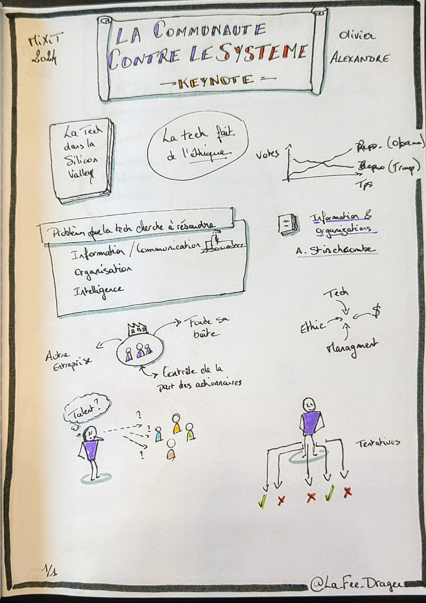
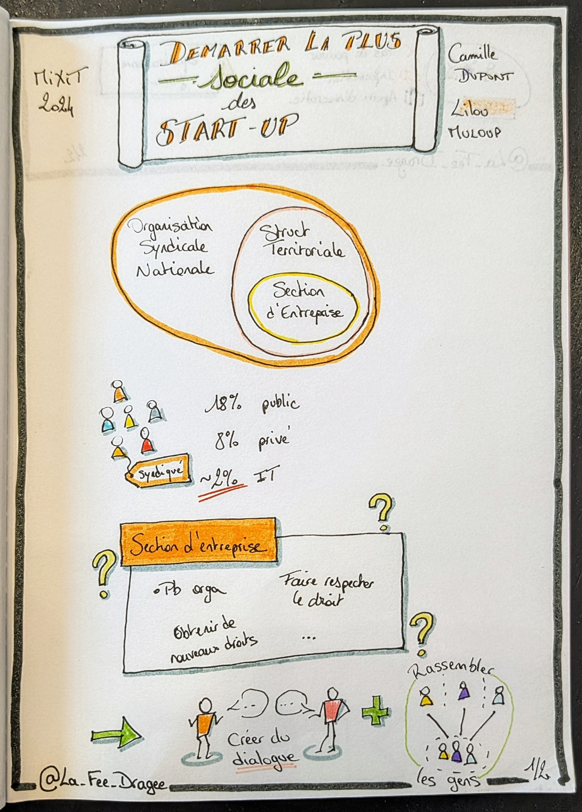
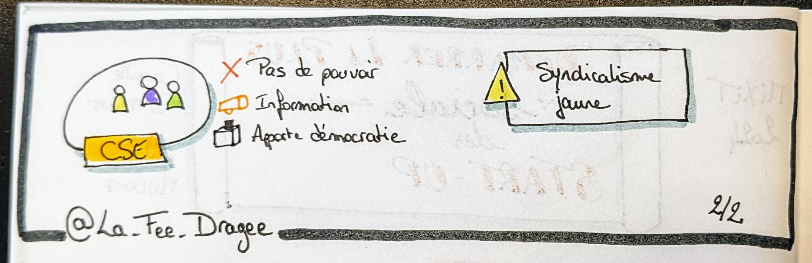
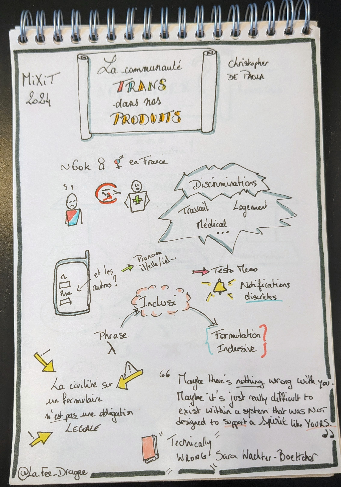
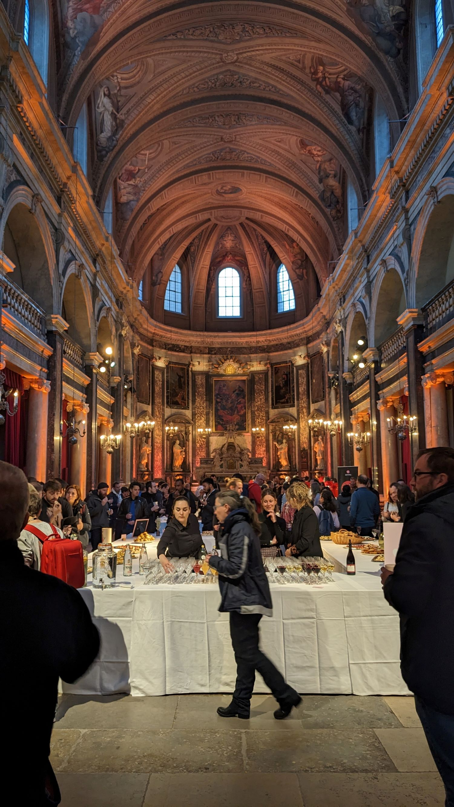
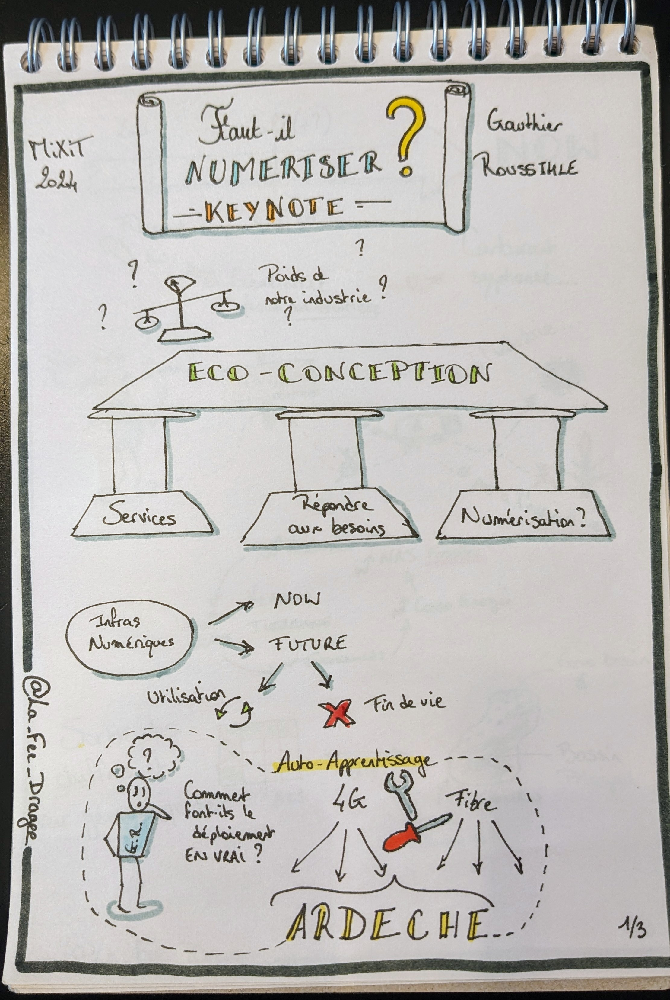
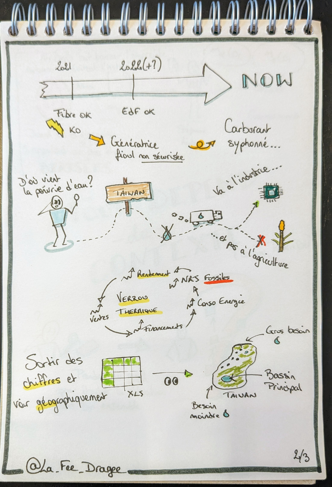
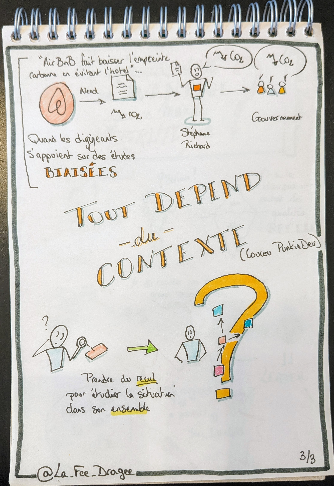
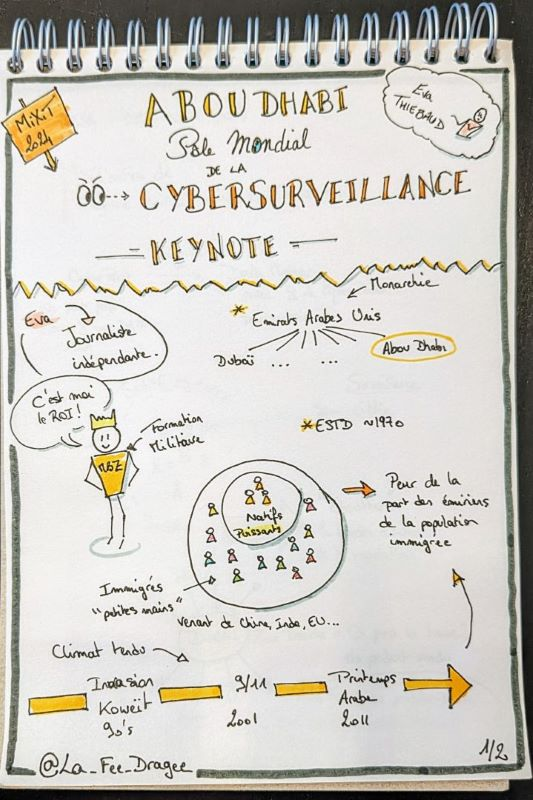
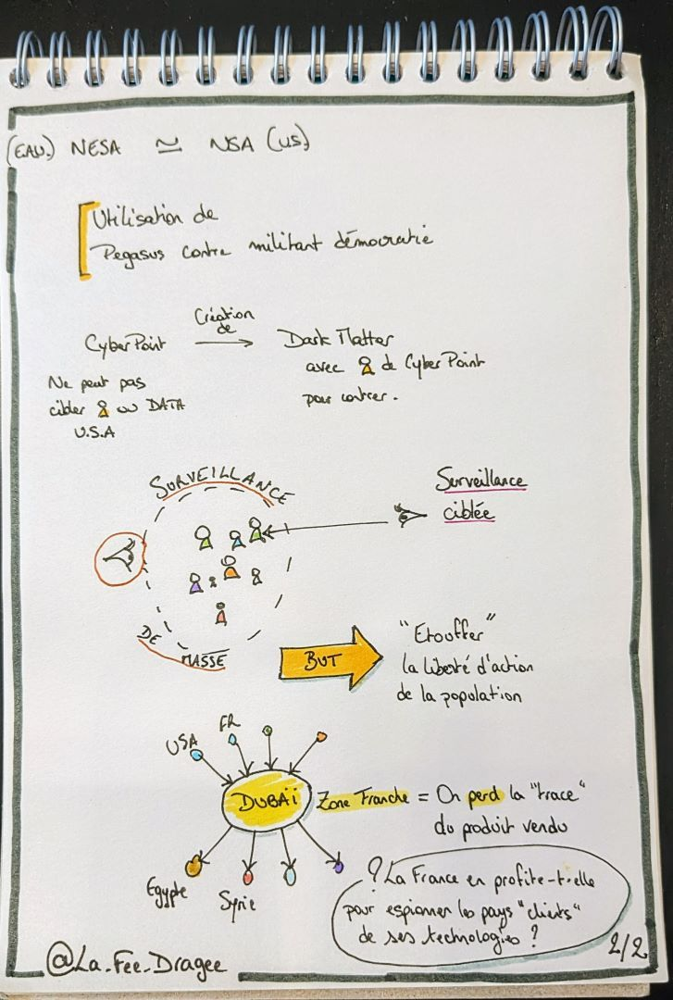

+++
title = 'MiXiT 2024'
linkTitle = 'MiXiT 2024'
date = 2024-05-06
draft = false
tags = ["conference", "sketchnotes"]
categories = ["tech"]
+++

**_Des crêpes, du cœur, des crêpes et du cœur._**

C'est ma première venue à MiXiT, une conférence lyonnaise dont j'avais entendu beaucoup de bien.
MiXiT, c'est une conférence un peu à part, où l'on parle un peu de tech mais pas que, on y parle d'éthique, de société, du monde de l'entreprise -_et on y mange des crêpes !_-.  

Elle se déroule sur le campus CPE (Chimie, Physique Electronique) de Lyon, à Villeurbanne, dans un bâtiment que j'ai trouvé très agréable pour l'évènement. Et au détour des stands, entre les sponsors tech "classiques", on trouve des stands d'associations qui œuvrent pour l'humain :  
- [Le Refuge](https://le-refuge.org/)  
- [Soutien Migrants Croix-Rousse](https://www.facebook.com/soutiensmigrantscroixrousse/?locale=fr_FR)  
- [Anciela](https://www.anciela.info/)

Pour aider financièrement les associations, l'organisation de MiXiT propose aux visiteurs de donner des _mixettes_ (de petits jetons symbolisant un don de 2€) aux associations.  
Ces _mixettes_ sont financées par des sponsors qui en achètent, 2 sont distribuées à chaque visiteur lorsqu'il récupère son badge, et les autres sont à récupérer soit sur les stands sponsors, soit dans les poches d'un certain Kévin (un vrai humain caché dans la conférence, vêtu d'un t-shirt rayé rouge et blanc).  
Et pour motiver tout ce monde, des cadeaux à gagner pour les plus gros donateurices 😉.

Enfin, un autre élément à part, c'est la présence d'[Antoine Louisgrand](https://www.linkedin.com/in/antoine-louisgrand-1a5681178) et sa nièce [Orane Louisgrand](https://www.instagram.com/orane_louisgrand/) pour immortaliser l'évènement par leurs dessins. En tant qu'artiste également, je suis d'autant plus touchée par la démarche.

# Jeudi 25 avril

## Keynote : La communauté contre le système

**[Olivier ALEXANDRE](https://www.linkedin.com/in/olivier-alexandre-579b5285/?originalSubdomain=fr)**

La keynote d'ouverture donnée par Olivier nous explique comment l'industrie numérique, notamment celle de la Silicon Valley, pèse dans le monde politique et révolutionne le monde e de l'entreprise depuis plusieurs décennies. On y a notamment vu les votes basculer de plus en plus en faveur des républicains, les codes vestimentaires des salariés passer du costume au hoodie corporate, le lieu de travail devenir également un lieu de loisirs. Dans cet espace où la concurrence entre les entreprises est rude, tout est bon pour fidéliser les salariés qui peuvent "traverser la rue pour 100$" selon les propos d'Olivier.  

Pour le côté histoire, la tech existe pour répondre à 3 besoins :  
- le besoin d'information et communication des informations, par exemple avec la naissance du transport ferroviaire nécessitant de savoir quel train passe où et quand, et transporte quoi  
- le besoin d'organisation, rendu possible grâce à la réponse au premier besoin  
- enfin l'intelligence, qui fait le lien entre les différents types d'information  

Les dirigeants des entreprises de pointe dans la tech cherchent incessamment les talents rares pour gagner la course, et un facteur de réussite est également de multiplier les tentatives, et ne pas s'arrêter sur un échec.  
Mais malgré une grande diversité de profils parmi les "petites mains" de la tech (genre, origine ethnique, sexualité), force est de constater que c'est beaucoup moins le cas lorsque l'on regarde les postes hauts placés des entreprises les plus florissantes du secteur. L'effort doit donc continuer pour que contrer cet effacement de diversité dans la hiérarchie.  

## [Atelier] Libère ta créature et embrasse tes bizarreries

**[Cyrielle Eudeline](https://www.linkedin.com/in/cyrielle-eudeline-50608368/)**  
**[Maria-eliza Paez](https://www.linkedin.com/in/maria-paez/)** _(qui n'a pas pu être présente)_  

Après la sketchnote, je me suis empressée d'aller à l'atelier "Libère ta créature et embrasse tes bizarreries" que j'avais loupé en novembre à l'[Agile Grenoble](../../2023/agile_grenoble/).  

L'idée de l'atelier et de nous familiariser avec quelques formes de neuro-atypie, en imaginant l'inconfort potentiel de situations professionnelles classiques.

> _Une remarque en passant, c'est que nous connaissons tous et toutes probablement une personne présentant une forme de neuro-atypisme puisque les personnes concernées représentent environ 13% de la population française : celleux qui écrivent de la main gauche, et passent la plupart de leur temps à s'adapter à une société adaptée aux droitiers·ères._  

Le principe était très simple et efficace puisque les participant·e·s étaient répartis en 5 tables, chacune étant associé à une forme de neuro-atypie (que j'appellerai "profil" par la suite) parmi :
- troubles DYS (dyslexie, dyscalculie, dyspraxie...)  
- TDAH (**T**rouble du **D**éficit de l'**A**ttention avec **H**yperactivité)  
- Asperger (un des **T**roubles du **S**pectre **A**utistique)  
- HPI (**H**aut **P**otentiel **I**ntellectuel)  
- Hypersensible

Nous avions également à disposition une fiche explicative indiquant les "bizarreries" du profil qui nous était associé, comme celles sur l'image ci-dessous.

Puis chaque table a tiré au sort une situation courante de la vie professionnelle, et nous avons alors essayé de lister les difficultés et sources d'inconfort auxquelles notre profil allait devoir faire face.  
A notre table, nous étions dans la peau d'une personne hypersensible, qui passait son entretien annuel.  

Après un partage commun entre les tables, nous avons ensuite imaginé les ajustements qu'il était possible de faire pour contrer ces difficultés.  

Je n'ai pas vu passer le temps, d'autant que j'avais à ma table Aurélie Vache que j'ai toujours plaisir à retrouver en conférences, ainsi qu'Emmanuelle Gouvart avec qui j'ai beaucoup sympathisé.  

Les slides sont toujours disponibles [par ici](https://drive.google.com/file/d/1JIo5kNFwnFYJghJPBfLwtP3vC7VVtqf9/view), n'hésitez pas à les consulter !

## Pause dej et crêpes

Tout est dans le titre, à midi c'est évidemment pause déjeuner avec [La Fine Fourchette](https://www.lafinefourchette.fr/) pour nous régaler durant les 2 journées de conférences.  
Mais la star des papilles à MiXiT ce sont les crêpes de Raph' ! Alors j'ai zappé la keynote de l'après-midi et en ai profité pour aller chercher une crêpe caramel au beurre salé.

## La plus sociale des startup

**Camille Dupont**
**Lilou Miloup**

Bien repue, je me suis dirigée vers le talk de Camille et Lilou parler de syndicalisme et défense des droits des salariés dans une entreprise.  
Le sujet me semble important et intéressant, en revanche je n'ai pas l'impression d'avoir appris beaucoup de choses (mais ce n'a pas été le cas de tout le monde), n'étant pas novice en la matière.  

  

## La communauté trans dans les produits numériques

**[Christopher De Paola](https://www.linkedin.com/in/christopherdepaola-design/)**

Pendant un format "lightning" de 20 minutes, Christopher, homme trans (donc né·e femme) est venu nous parler de l'absence de place pour les personnes trans dans les services numériques, et des impacts parfois vitaux que cela peut parfois avoir (en plus des régulières discriminations dont les personnes peuvent faire l'objet de la part des autres humains).  
Sa présentation a été très inspirante pour moi, sur bien des aspects, et reflète parfaitement ce qu'est la conférence **MiXiT**.  

Je retiens par exemple l'anecdote de l'examen médical n'ayant pu être effectué car réalisable uniquement sur les femmes, or Christopher avait déjà changé d'état civil, et donc inscrit dans le logiciel en tant qu'homme, or ledit logiciel ne proposait pas l'examen en question pour un patient homme...  

Une autre chose dont on ne se rend pas compte dans les toutes ces interfaces d'inscription, c'est que ça peut également amener à révéler contre sa volonté le fait qu'une personne est trans (on dit également _outer_), par exemple lorsque l'on doit indiquer son identité civile, avec donc un genre et un prénom qui ne sont plus d'usage.  

Notons au passage qu'il n'est pas obligatoire d'indiquer "monsieur" ou "madame" sur un document, et d'ailleurs la DGFIP ne le fait plus depuis 2022 : [voir l'article du Point ici](https://www.lepoint.fr/societe/les-courriers-des-impots-ne-mentionneront-plus-monsieur-ni-madame-16-07-2022-2483493_23.php).  
A l'instar du remplacement des fameux "_nom de jeune fille/nom d'épouse_" qu'on délaissera au profit de "_nom de naissance/nom marital_", il est plus que temps de remplacer les _M/Mme_ par le pronom choisi par l'utilisateur·ice.  

Et pour finir, un argument que je trouve extrêmement pertinent et puissant, c'est qu'en laissant de la place pour les personnes atypiques (LGBT+, neuroatypiques, en situation de handicap...) dans nos produits, le reste de la population prendra conscience de leur existence.

  

## Réunions en non-mixité choisie, un moteur pour féminiser sa boîte

**[Laury Maurice](https://www.linkedin.com/in/laury-maurice-874758b0/)**

Sur un format de 20 minutes également, Laury nous a expliqué comment au sein de Shodo était né un groupe de réflexion non-mixte ayant pour but d'apporter davantage d'égalité de genre dans l'entreprise.  

Bien évidemment, tout ne s'est pas fait du jour au lendemain, mais grâce à leurs réflexions et à l'écoute des dirigeants, de nombreuses mesures ont été mises en place, et le nombre de femmes dans l'entreprise a doublé en moins d'un an !  

Vous pouvez retrouver un très bon résumé directement sur le site de Shodo : [https://shodo.io/notre-lutte-pour-legalite-de-genre/](https://shodo.io/notre-lutte-pour-legalite-de-genre/).  

## Soirée à la chapelle de la trinité

Outre les crêpes, s'il y a une chose à ne pas rater à MiXiT c'est la soirée !  
Jeudi soir le rendez-vous était donné à la chapelle de la trinité, magnifique lieu pour continuer à discuter et faire des rencontres.  

Seul bémol : la nourriture. Si durant la conférence la _Fine Fourchette_ avait des alternatives adaptées (et de qualité) aux différents régimes alimentaires (végétar·lien, sans lactose, sans gluten...) pour les repas du midi, ce n'était pas le cas pour la soirée où il s'agissait d'un autre traiteur, et plusieurs personnes n'ont malheureusement pas pu profiter du buffet (qui au demeurant était très bon !).

Durant la soirée j'ai pu profiter d'une animation son et lumière basée sur le nombre de personnes en contact physique avec le dispositif. Plus il y a de gens, plus il y avait de pistes sonores. C'était très chouette.  

J'ai également échangé un moment avec Antoine Louisgrand, qui en a profité pour faire mon portrait que j'ai récupéré le lendemain ❤️.  

  

# Vendredi 26 avril

## Keynote : Faut-il numériser ?

**[Gauthier Roussilhe](https://gauthierroussilhe.com/)**

Pour la keynote d'ouverture de la seconde journée, Gauthier Roussilhe (chercheur spécialisé sur les enjeux environnementaux de la numérisation) nous invite à prendre du recul sur les impacts de la numérisation de la société.  
Et pour répondre à cette question, il nous emmène sur le terrain, en Ardèche, où il a étudié le déploiement en réel de la 4G et de la fibre, révélant quelques situations rocambolesque dignes d'un film de comédie (voire pour les plus vieux d'entre-nous d'un sketch des _Inconnus_).  
Ajoutez à ça le fait que les pouvoirs politiques ne font pas toujours mieux que tonton Roger quand il traîne sur Facebook (à savoir brandir des articles/études sans s'assurer de son bien-fondé ou sa véracité), et on obtient la réponse fétiche de [PunkinDev](https://podcast.ausha.co/punkindev) : **_Ca dépend du contexte !_**

Au-delà du côté cocasse de certains de ses propos, le message à retenir est surtout de prendre du recul, observer la situation dans son ensemble afin d'éviter tout raisonnement biaisé.  
Un exemple très simple : le commerce en ligne. De _prime abord_ on se dit que ça évite des émissions de C0² puisqu'on utilise un réseau d'acheminement de colis déjà existant, plutôt que de se rendre en solo en magasin.  
Oui mais n'oublions pas de prendre en compte dans l'équation :  
- les mobilités douces  
- les nombreux retours de colis  

Gauthier nous a également parlé des pénuries d'eau à Taïwan, puisque les ressources sont acheminées vers l'industrie électronique plutôt que l'agriculture. Et là il ne suffisait pas de regarder les chiffres dans un tableur, il fallait également resituer ces chiffres géographiquement sur l'île pour comprendre la situation dans son ensemble.  

En somme il s'agissait là d'une très bonne keynote, très instructive, que j'ai beaucoup appréciée.  

La vidéo de la keynote : [sur Youtube](https://www.youtube.com/live/rgsI6DHJkWg?si=9y3r5qGwtyWrOejQ&t=831).  

  
  
  

## [Apparté] Parlons sketchnotes

Le reste de la matinée, j'ai passé pas mal de temps à parler sketchnotes avec [Aurélie Vache](https://twitter.com/aurelievache).  
Elle m'a fait essayer son iPad, car de mon côté je m'entraîne aux sketchnotes numériques sur une vieille tablette Samsung de 2014 et réfléchis à quel équipement choisir pour la remplacer.  
Effectivement l'application Goodnotes disponible sur iOS est particulièrement pratique pour réaliser des sketchnotes, entre le "lissage" des tracés, la possibilité de créer sa bibliothèque d'objets ou encore les différents types de fond affichables sur la feuille (blanc, ligné, à points...).  

En attendant de pouvoir avoir moi aussi une telle tablette, je travaille les sketchnotes numériques sur ma tablette actuelle, car les sensations ne sont pas les mêmes qu'avec du papier, des feutres et des crayons, et la façon de faire n'est pas la même.  
Et pour se rapprocher des sensations du vrai papier et des crayons, voici 2 astuces qu'Aurélie m'a données :  
- les films "paper feel / paper like" à poser sur l'écran, pour reproduire la sensation d'accroche du papier réel (je n'ai pas réussi à en trouver pour ma tablette, elle doit être trop vieille :sob:)  
- les stylets adaptés, de la taille d'une crayon à peu près, plutôt que les petits stylets d'origine

## MiXTeen

MiXiT, c'est également depuis 10 ans en 2024 le [MiXTeen](https://mixteen.org/) : une association de passionné·es qui a pour but de faire découvrir l'univers de la programmation de façon ludique aux enfants de 7 à 15 ans, principalement grâce à la programmation de petits robots.  
Des ateliers sont organisés environ tous les 2 ou 3 mois, sur une demi-journée en général.

## Keynote : Abou Dhabi, pôle mondial de la cybersurveillance

**[Eva Thiebaud](https://www.linkedin.com/in/eva-thi%C3%A9baud-700b84193/)**

Pour la keynote de début d'après-midi, Eva nous a parlé de comment Abou Dhabi, membre des Emirats Arabes Unis, opère la surveillance de la population vivant sur son sol, et pourquoi.  
Il faut savoir qu'à Abou Dhabi la majeure partie de la population est immigrée, en provenance de Chine, d'Inde, mais aussi d'Europe. De plus, les différents événements géopolitiques dans le secteur depuis les années 90 favorisent un climat plutôt tendu aux Emirats Arabes Unis.  
Ainsi, le gouvernement surveille de près la population via à la fois une surveillance de masse et une surveillance ciblée, notamment envers les opposants politiques.  

Il y a également tout un volet assez flou autour de la vente de matériel via Dubaï en zone franche, qui invite à se poser des questions sur d'éventuels objectifs cachés d'espionnage de la part de la France envers certains pays.  

La conférence a été assez compliquée à suivre pour moi je dois l'avouer, mais nous a rappelé combien rien est simple en matière de politique internationale.  

La vidéo de la keynote [sur Youtube](https://www.youtube.com/live/rgsI6DHJkWg?si=SAWtwqHfSOlG3CMy&t=17523).  

  
  

## Atelier : Figma

**[Antoine Candy](https://www.linkedin.com/in/antoine-candy-2347b1105/?originalSubdomain=fr)**  
**[Simon Mercier](https://www.linkedin.com/in/merciersimon/)**  

Le reste de l'après-midi, avant la keynote de clôture, j'ai participé à un atelier afin de découvrir le logiciel Figma.  
Il permet entre autres de réaliser et **tester** des maquettes d'interface, en prenant en compte les différents équipements disponibles (ordinateur, téléphones, montres connectées...).  
Le gros avantage que je vois à cet outil c'est non seulement la possibilité de simuler la navigation au sein de la maquette, mais aussi l'interface avec les outils de développement front-end, et la possibilité pour les équipe de développement de corriger les maquettes si besoin.  
Au cours de l'atelier nous n'avons fait qu'effleurer les possibilités de l'outil, mais cela permet d'avoir une idée des possibilités qu'il offre, et éventuellement de le mettre en place dans ses projets/son organisation.

## Keynote : Les innovations ont-elles un genre ?

**[Marion Coville](https://www.linkedin.com/in/marion-moossye-coville-3b152710/)**  

Beaucoup de choses se mélangent dans ma tête quand je pense à la keynote de clôture de Marion.  
Son propos était à la fois drôle, touchant, engagé, révoltant, parfaitement inscrit dans l'événement et j'en passe.  
On ne compte plus les fois où le "masculin" l'emporte, et pas seulement grammaticalement : un produit conçu par des hommes et qui n'est pas adapté aux femmes (coucou la ceinture de sécurité et les applications de santé sans suivi menstruel), des diagnostiques médicaux inadaptés, ou encore des produits modifiés pour le public féminin, alors que le produit initial était parfaitement mixte (les rasoirs électriques ou jetables par exemple).  
Et encore aujourd'hui, les produits que nous concevons et développons ne sont pas forcément adaptés à l'ensemble de la population, puisque nous sommes les premiers (voire les seul·es) _beta-testeur·euses_. Or nos applications et produite vont être utilisées par des personnes éventuellement en situation de handicap, neuro-atypiques, dont la langue maternelle n'est pas le français, trans, ou pas très à l'aise avec les outils numériques. Il est donc malheureusement "facile" de contribuer de façon involontaire au manque d'inclusivité de notre industrie, si l'on n'y prend pas garde.  

J'étais tellement captivée que je n'ai pas fait de sketchnotes, heureusement la vidéo de sa keynote est disponible [sur Youtube](https://www.youtube.com/live/rgsI6DHJkWg?si=S6KX4WozHoPatZom&t=27720), je vous conseille vivement de la visionner !  

Retrouvez également son [interview MiXiT On Air](https://www.youtube.com/live/rgsI6DHJkWg?si=RpKb3wTSuD6NmWzC&t=21888).  

# Le mot de la fin

Pour moi, la conférence a tenu ses promesses : j'y ai rencontré de nouvelles personnes très chouettes, j'ai appris quelques astuces pour lutter contre l'exclusion, découvert des choses que je ne soupçonnais même pas (principalement dans les keynotes), j'ai discuté TDAH de nos enfants avec d'autres parents...  
J'ai été séduite par la façon dont les choses sont gérées : la loterie pour avoir une chance d'obtenir son billet, le soutien aux associations via les mixettes, les vraies alternatives végé/sans gluten/sans lactose pour les repas, le rythme de la conférence.  
J'ai trouvé cela très agréable et inspirant, j'espère revenir bientôt...

Merci les orgas !