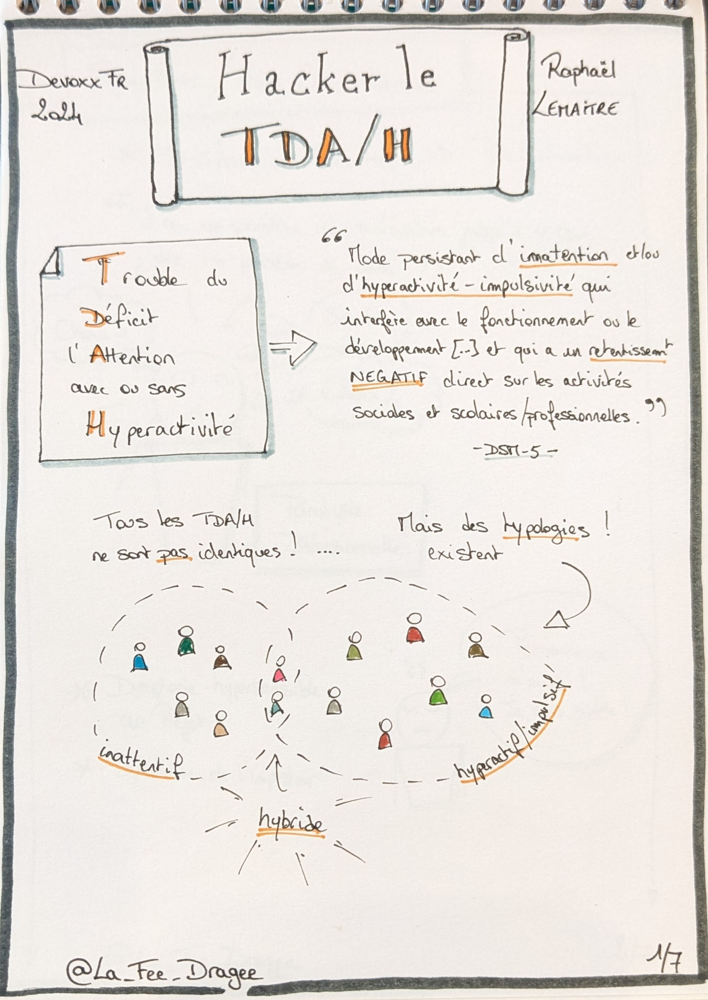
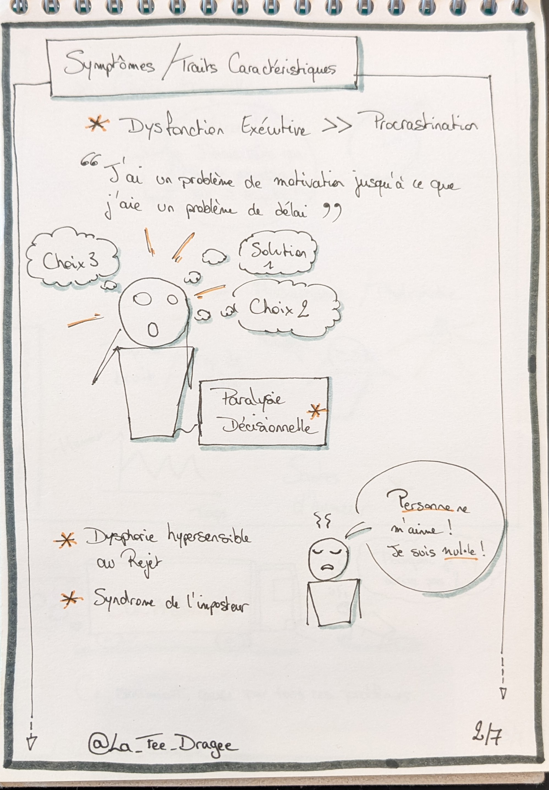
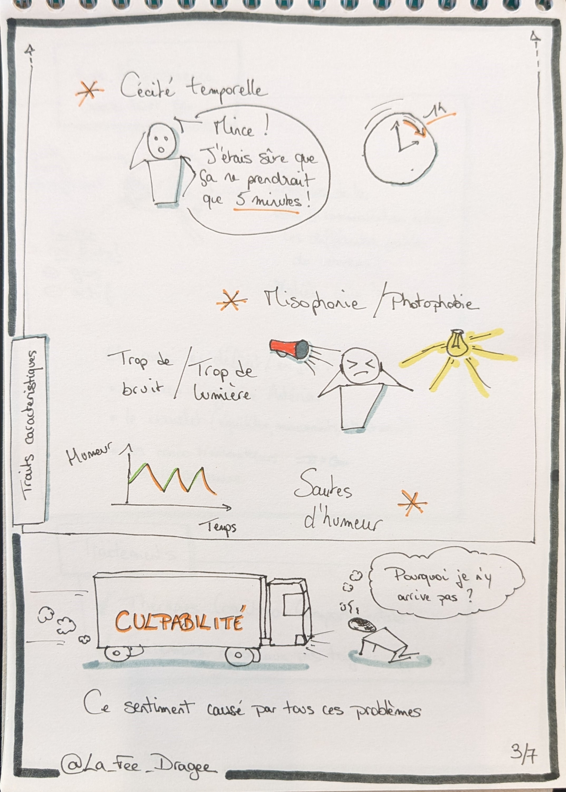
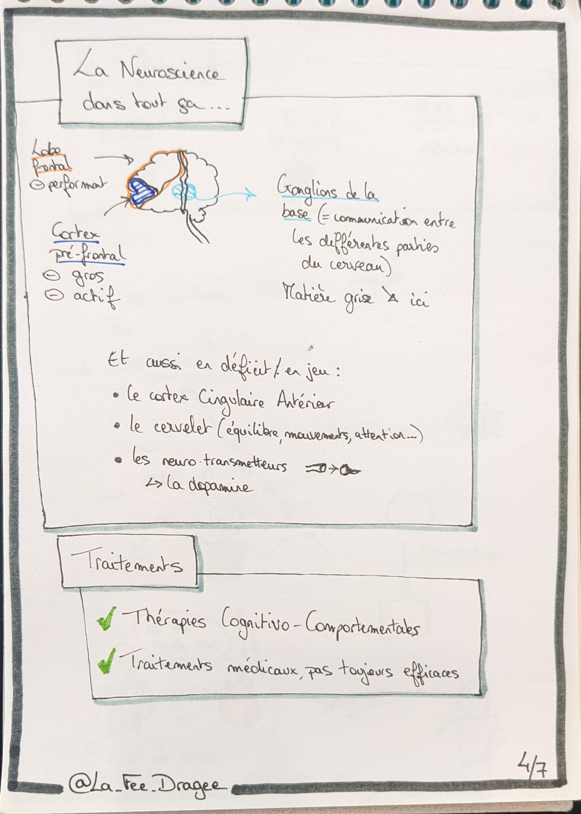
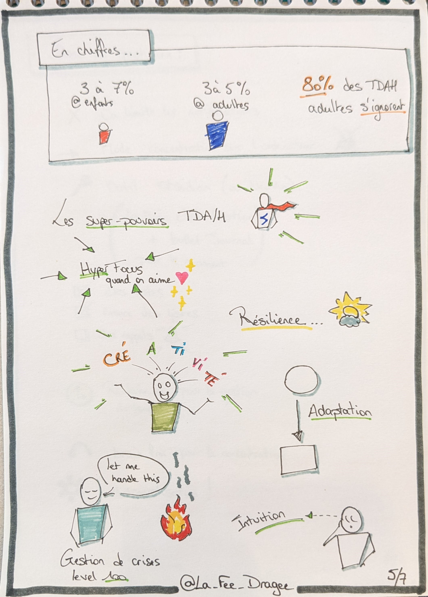
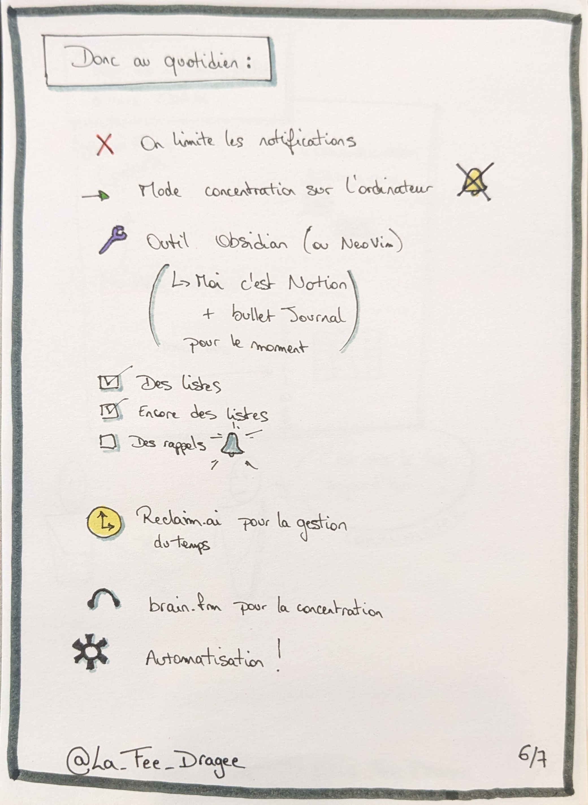
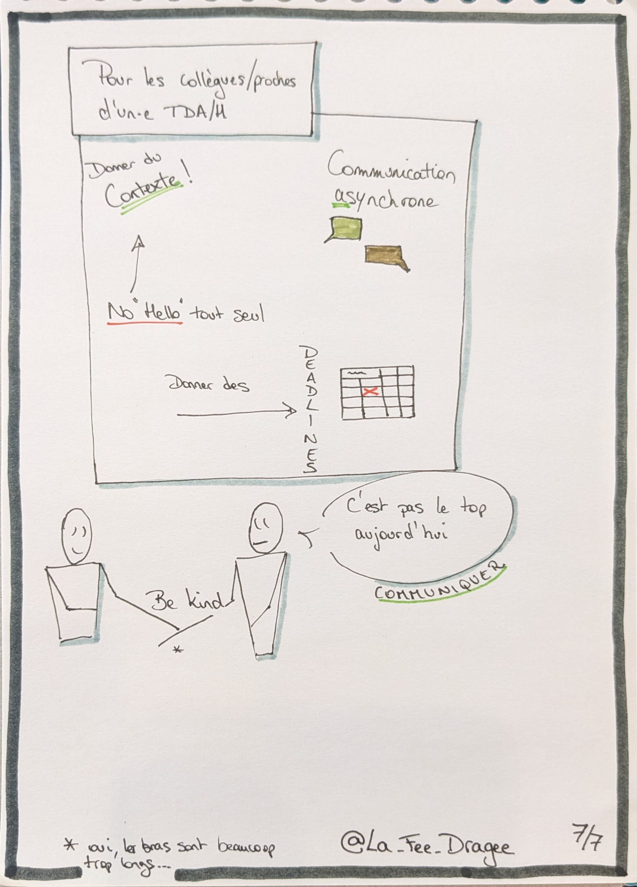

+++
title = '[Devoxx France] Hacker le TDAH'
date = 2024-06-18
draft = false
tags = ["conference","sketchnotes","neuro-atypie","TDAH"]
categories = ["tech"]
+++

Il y a quelques jours, j'ai regardé le replay d'une conférence donnée lors du [Devoxx France 2024](https://www.devoxx.fr/) : Hacker le TDAH : Stratégies pour le développeur moderne.  

# La vidéo

Si vous souhaitez visionner le replay, le voici : 

  
  

# Ce que j'en ai pensé

Dans son talk, [Raphaël Lemaitre](https://bsky.app/profile/rlemaitre.com) commence par expliquer en partie ce qu'est le TDAH (Trouble du Déficit de l'Attention avec ou sans Hyperactivité), étape indispensable pour comprendre les stratégies proposées par la suite.  

Étant déjà sensibilisée au TDAH, la première partie comportait beaucoup des rappels pour moi (mais pas que !), et je trouve que les explications étaient assez claires, de même pour les exemples des difficultés que l'on peut rencontrer au quotidien avec cette forme de neuro-atypisme.  

Mais tout espoir n'est pas perdu, car il est possible d'une part de dompter le cerveau, d'autre part certaines particularités de fonctionnement peuvent être transformées en super-pouvoirs dès lors qu'on les a identifiées et que l'on dispose des bonnes méthodes.  

Enfin avant tout, il me semble que le fait de connaître son propre fonctionnement est déjà un énorme premier pas, qui permettra ensuite l'acceptation, la communication, et l'estompage de la culpabilité.

# Mes sketchnotes

Histoire de continuer à m'exercer à la prise de notes visuelles, j'ai réalisé quelques pages de sketchnotes que voici.  


  
  
  


  
  
  


  
  
