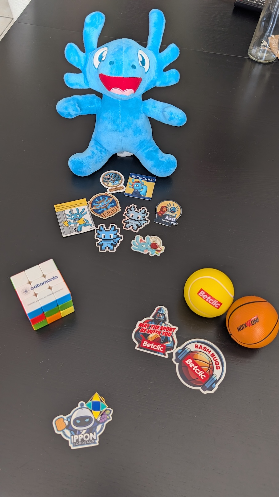
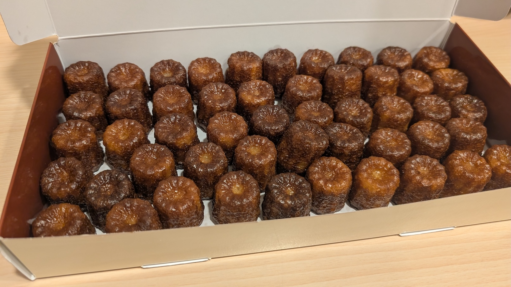

+++
title = "BDX I/O 2025"
date = 2025-11-16
tags = ["conference", "sketchnotes"]
categories = ["tech"]
+++

Bien que n'habitant pas dans la région bordelaise, j'ai soumis et ai été acceptée à l'édition 2025 la conférence [BDX I/O](https://bdxio.fr/) : en effet j'y ai habité il y a quelques années, et suis originaire de la région Aquitaine. Venir à Bordeaux, c'est un peu comme (re)venir à la maison.  
Me voici donc de retour au pays des canelés pour présenter de nouveau mon talk à propos de [Typst](https://typst.app/).  

A l'heure où j'écris ces lignes la captation de ma présentation n'est pas encore disponible, mais devrait arriver sur la [chaîne Youtube](https://www.youtube.com/@bdxio) de la conférence.  

Et sans plus attendre, voici mon récap !

# Jeudi 6 novembre - soirée speakers

La soirée speakers s'est déroulée dans le quartier de Bordeaux-Lac (non loin du lieu de la conférence), qui a bien changé depuis que j'ai quitté la région il faut bien le dire !  

Après un petit tour nostalgique par le centre-ville pour notamment aller croquer un canelé, j'ai rejoint le restaurant qui accueillait la soirée, trempée par la pluie (un mois de novembre classique à Bordeaux ☔).  

La soirée était super, la nourriture excellente et copieuse. J'ai pu faire connaissance avec quelques speakers bordelais, et discuter longuement avec Horacio et Jordane que je n'avais pas vu depuis un bon moment.  

# Vendredi 7 novembre

## Keynote - Prédire l'imprévisible : comment penser le futur à l'ère de l'IA

**[Luvodic Cinquin](https://www.linkedin.com/in/ludoviccinquin/)**

La keynote d'ouverture a été donnée par Ludovic Cinquin, qui conseille les entreprises dans leur développement.  
Il nous présente quelques-un des enjeux principaux liés à l'évolution de l'IA dans les années à venir, et comment les projections sur le devenir de l'IA et son impact sur notre monde ont évolué récemment.  

Une keynote intéressante, mais que j'aurais aimé voir aborder le coût humain/sociétal de l'IA en plus de l'aspect technologique (seul le coût "énergétique" a été abordé).  

  
  

## Biomimétisme et cybersécurité : s'inspirer de 3 milliards d'années d'évolution pour mieux se protéger
_Format conférence 45 minutes_

**[Ludovic Lefebvre](https://github.com/Ludovic33Fr)**

Après la keynote, je suis allée m'intéresser au biomimétisme appliqué à la cybersécurité.  

J'ai trouvé le sujet intéressant et bien construit, avec un bon équilibre entre description du vivant et application à un projet réel.  

Un seul point m'a fait "tiquer", l'utilisation du terme _honeypot_ qui dans mes souvenirs de sécurité réseau/système désigne plutôt un leurre que l'on va volontairement laisser "vulnérable" pour détecter les comportements frauduleux. Dans l'exemple de Ludovic, il s'agit davantage d'identifier les cibles "favorites" pour les surveiller et protéger davantage.

  
  

## Leadership inclusif, les 5 micro-pratiques pour transformer vos dynamiques d'équipe
_Format lightening 15 minutes_

**[Christelle Bordon](https://www.linkedin.com/in/christellebordon)**

Dernier sujet auquel j'ai assisté avant la pause déjeuner, un _lightening_ présentant 5 ensembles de pratiques à mettre en place au quotidien afin de favoriser l'inclusion et réduire les discriminations (quelles qu'elles soient) au sein de nos équipes.  
J'ai beaucoup apprécié cette présentation, on ressort avec une cheat-sheet prête à être affichée dans son bureau, voyez plutôt ! 👇

## Quête de goodies et pause déjeuner

Ayant un peu de temps supplémentaire pour la pause déjeuner, j'en ai profité pour faire un tour aux stands des sponsors et collecter quelques tampons sur mon billet afin de pouvoir gagner un cadeau surprise (et également récupérer quelques goodies et autres stickers auprès des sponsors) !  
Un fois 5 tampons récupérés, j'ai pu tirer au sort un numéro dans le coffre aux trésors, qui m'a permis de gagner un petit agenda.  

Par ailleurs le buffet servi à midi était très bon, varié et copieux, idéal pour ~~la sieste~~ le reste de la journée.  

  

  

## Défi : L’accessibilité au bout des doigts !
_Format atelier 2h30_

**[Océane Gillard](https://www.linkedin.com/in/oceane-gillard/)**  
**[Patrice de Saint Steban](https://github.com/patou)**  

L'après-midi je suis allée participer à l'atelier d'Océane et Patrice que j'attendais avec pas mal d'impatience.  

Il s'agissait en effet de commencer par se mettre à la place d'une personne malvoyante utilisant son téléphone avec le _talkback_ (fonctionnalité qui verbalise tout ce qui se passe à l'écran), puis d'apprendre à rendre une page web plus accessible en utilisant correctement les balises HTML (ce qui visiblement est loin d'être une habitude de ce que j'ai compris).  

Bilan de la première étape : quel enfer de réapprendre à utiliser son téléphone avec le talkback et les "nouveaux" contrôles de l'écran !  
Je me suis rendue compte qu'il était plus long et compliqué de comprendre la logique de l'interface, car le feedback utilisateur est beaucoup plus lent et moins clair que lorsque l'on peut voir son écran.  

Concernant la partie web, n'ayant jamais réellement faire de développement web qui plus est en HTML, j'ai posé quelques questions un peu naïves, mais ai compris le fonctionnement et l'enjeu de la démarche.  

L'atelier sera de nouveau donné [lors du SnowCamp](https://app.voxxr.in/events/snowcamp26/talks/11/details), dans un format un peu plus long laissant davantage de place à la mise en œuvre des bonnes pratiques.  

## De la pseudoscience pour mon (pseudo) management
_Format conférence 45 minutes_

**[Anaïs Huet](https://www.linkedin.com/in/anais-huet-coach-agile/)**

N'ayant pas pu voir ce talk lors de l'édition [2025 du MiXiT](../MiXiT/index.html) car il tombait en même temps que celui d'Albane sur la semaine de 4 jours, j'ai absolument tenu à venir y assister cette fois (parce que le sujet m'intéresse beaucoup, et Anaïs est une super oratrice ❤️).  

Sans aucun jugement ni dogmatisme, elle nous explique ce qui se cache derrière la plupart des tests de personnalités, et quelles conclusions on peut en tirer (ou pas).  
_Spoiler alert_ : la plupart n'ont aucun fondement scientifique, certains sont associés à des pratiques pointées du doigt par la [miviludes](https://www.miviludes.interieur.gouv.fr/), mais ce n'est pas pour autant que c'est le mal incarné.  
Cela permet aussi de se rendre compte que tout le monde ne fonctionne pas de la même façon, et de pouvoir mieux se connaître et savoir faire un pas vers l'autre.  
En bref, rien n'est tout blanc ou tout noir...

Les références du talk sont [sur cette page](https://drive.google.com/file/d/1q4ok2iDis_p92-hzI7v50-A-4wTyp9PI/view?usp=drivesdk).  

 management, 1 sur 2")  
 management, 2 sur 2")  

## T'as vu mes docs ? Je les fais en Typst !
_Format lightening 15 minutes_

Après la dernière pause de la journée, c'est à mon tour de présenter mon sujet.  
Tout s'est très bien déroulé, la salle était plutôt bien remplie et les feedbacks positifs (ce qui fait toujours plaisir avouons-le 🤗).  

Les slides (incluant les feedback) sont disponibles [juste ici](./mes_docs_en_Typst.pdf).  

## Keynote de fermeture

J'ai beaucoup aimé la keynote de fermeture. Après une vidéo _flashback_ de la journée, nous avons eu droit à un quiz interactif préparé par l'équipe d'organisation (avec des lots à gagner à la clé).  
J'ai trouvé le principe très sympa, permettant de finir la journée sur une note ludique (bon je n'ai pas gagné, mais me suis bien amusée !).

## After-party

Afin de clore la journée sur une note plus informelle, le rendez-vous était donné dans un bar as très loin (à 500 mètres à pieds d'un de mes anciens logements) pour se retrouver entre speakers et participant·es.  
La soirée fut également très agréable, même si je suis rentrée assez tôt en raison de l'horaire trèèèèès matinal de mon vol retour 😅.

# Conclusion

Je suis ravie d'avoir pu participer à ce BDX I/O 2025. J'ai encore une fois fait de super rencontres, et ai pu apprendre de nouvelles choses.  
L'équipe d'organisation était aux petits soins, je les remercie énormément !  
Nous avons d'ailleurs été gâtés avec un super t-shirt souvenir comportant les noms de toustes les speakers de cette édition, ainsi qu'un petit lego tout mignon qui trône désormais sur mon bureau.  
  

Une pensée aussi pour les mini-canelés de [La Toque Cuivrée](https://www.la-toque-cuivree.fr/) qui nous attendaient en salle speaker, ils étaient délicieux !  
  

A bientôt Bordeaux !