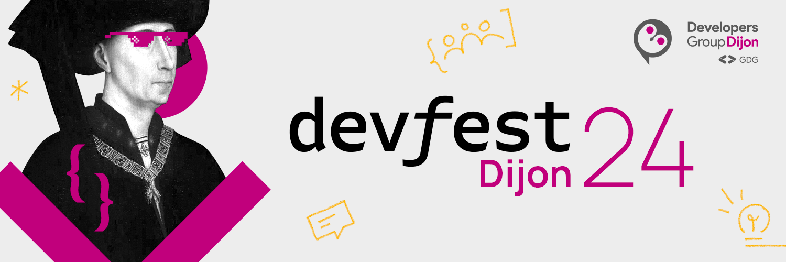
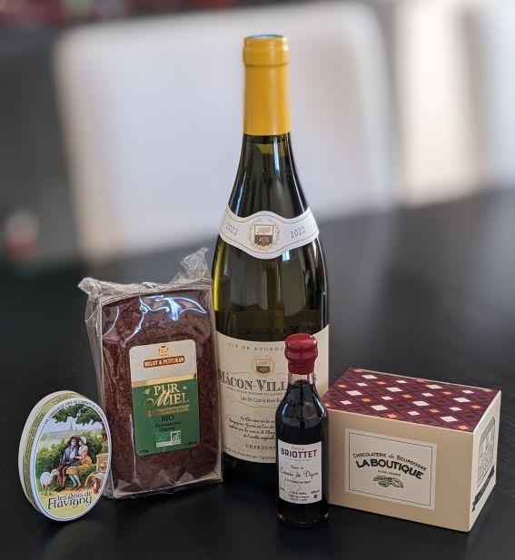

+++
title = "DevFest Dijon 2024"
summary = "Pourquoi je l'ai créé, qu'est-ce que j'en retire ?"
date = 2025-01-10
draft = true
tags = ["conference", "sketchnotes"]
categories = ["tech"]
+++

**_Voyage au pays des ducs de Bourgogne._**

En décembre dernier, j'ai eu le plaisir d'intervenir pour la première fois au [DevFest Dijon](https://devfest.developers-group-dijon.fr/), une toute jeune conférence née en 2022.  
La conférence s'est déroulée au sein de l'IUT de Dijon sur une seule journée le vendredi 6 décembre.  

Mais comme souvent, nous speaker·ines avons eu le plaisir de profiter d'un _speaker diner_ organisé par l'équipe de la conférence, au Bamagotchi.  
J'y ai passé une très bonne soirée, où j'ai pu retrouver des copains, des personnes croiées au [MiXiT](../../2024/MiXiT/), ou encore des duchesses.  
Ce fut également l'occasion de faire de nouvelles rencontres.  

L'équipe nous a également régalé d'un super panier garnier à nos arrivée le vendredi matin, voyez par vous-même :

Le vendredi, j'ai assisté à quelques conférences et donc pris des sketchnotes que je vous partage bien entendu ici.  
Mais n'étant pas en grande forme (et donnant moi-même un talk), j'ai alterné conférences et pauses tout au long de la journée et n'ai donc assisté qu'à 4 sujets avant de devoir repartir.  

Note :
Les sketchnotes seront bientôt ajoutées à cet article

# Quand le terminal dévore la UI : TUI pour tout le monde !

**[Thierry Chantier](https://noti.st/titimoby)**
_Format conférence 50 minutes_

La journée commence avec _TitiMoby_, qui nous présente dans un nouveau talk le concept de Textual User Interface.  
L'idée : disposer d'une interface utilisateurice à mi-chemin entre les lignes de commandes et une interface graphique "lourde", comme par exemple la commande htop.  
Et il est donc possible, via des API, de développer sa propre TUI, dans nos langages favoris.  
Thierry nous donne des exemples en Pyhton, Go ou encore Rust.  

Et bien sûr, cela se poursuit par une démo, dans ces différents langages, lors de laquelle il nous montre comment il interagit avec son repo GitLab sans bouger de son terminal !

# La crypto Hardware - _Comment sécuriser nos devices ?_
_Format short 20 minutes_

**Vincent Thivent** 

Après une pause dans la matinée, je suis allée écouter Vincent nous parler de sécurisation Hardware, thème important qui recoupe avec le cœur d'activité de mon entreprise actuelle [Quarkslab](https://www.quarkslab.com/).  

Partant du constat qu'il y a aujourd'hui beaucoup de failles dans le monde de l'IoT (ou internet des objets), et donc une certaine méfiance de la part du grand public à cet égard, Vincent souhaite expliquer la façon dont la sécurité est abordée dans les produits de son entreprise : à savoir principalement des systèmes de badges sans-contact.  

Malheureusement j'ai trouvé que le talk manquait de construction, de clarté, et je pense qu'un format de 20 minutes est trop court pour aborder ce thème.

# Faire simple, la clé de la durabilité ?
_Format conférence 50 minutes_

**[Bertrand Delacrétaz](https://fosstodon.org/@bdelacretaz)**

L'après-midi, après avoir profité d'un buffet plus que copieux, je suis allée écouter Bertrand, venu de Suisse pour nous parler de simplicité, (sans être simpliste !), dans nos produits (qu'il s'agisse de logiciels, ou de choses matérielles).  
En nous présentant quelques exemples issus de son expérience professionnelle, .  

J'ai particulièrement apprécié sa présentation, notamment par son rythme posé sans être lent, ses exemples concrets et son discours inspirant sans être moralisateur. Et j'ai pu faire de très jolies sketchnotes !

# Comment merger sa PR en 10 secondes : REX mob code review
_Format short 20 minutes_

**[Thibaut Cantet](https://www.linkedin.com/in/thibaut-cantet-1299095/)**

Pour la dernière session de la journée, je me suis intéressée aux mob code review mises en place par Thibaut dans son équipe, afin de fluidifier le processus de développement, diffuser les compétences, harmoniser les pratiques de dev, etc.  
Comme pour beaucoup de REX de ce type, le constat de départ est une équipe en souffrance, des livraisons laborieuses, des revues de codes entassées pendant des jours, des blocages quand les gens sont en vacances...  

La solution mise en place ici a donc été entre autres de dédier un temps récurrent où toute l'équipe se retrouve pour revoir les _Pull Request_ en attente, à savoir au début de chaque demi-journée. Cette pratique, couplée au pair-programming, a ainsi permis d'améliorer la situation.

Bien évidemment tout ne s'est pas mis en place du jour au lendemain, et ce type de changement nécessite la confiance de la hiérarchie, mais il est toujours intéressant et important d'avoir du recul sur nos pratiques, et la possibilité de les changer (qui a dit _Agile_ ?).  

# Conclusion

J'étais ravie de pouvoir assister à cette conférence, l'ambiance était top et nous avons été très bien reçu·es.  
J'espère avoir de nouveau l'occasion de venir, que ce soit en tant qu'intervenante ou participante !