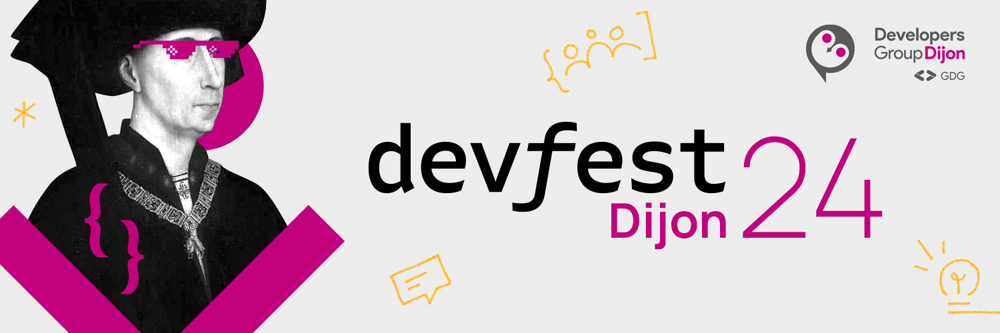
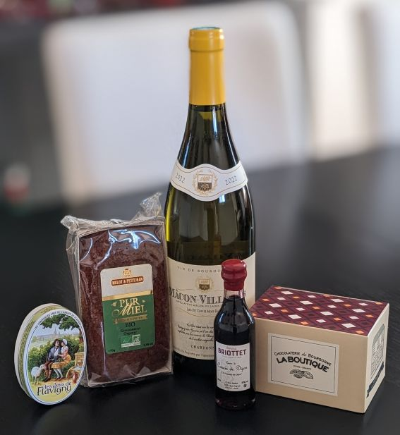
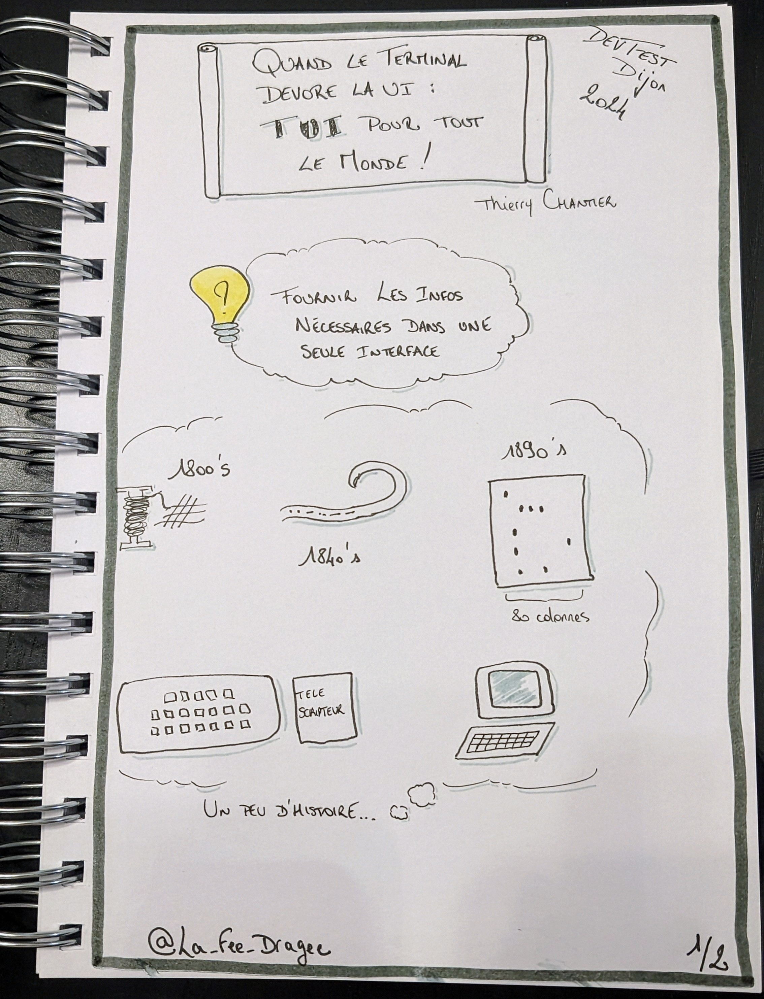
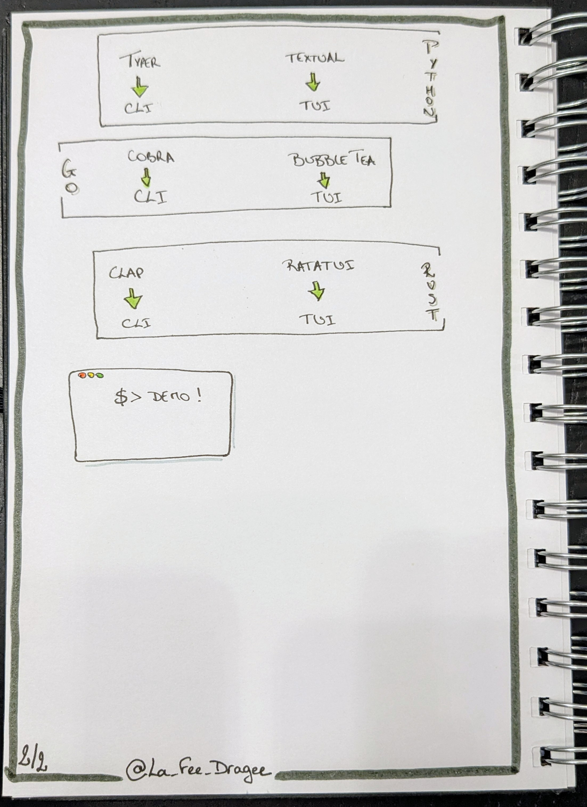
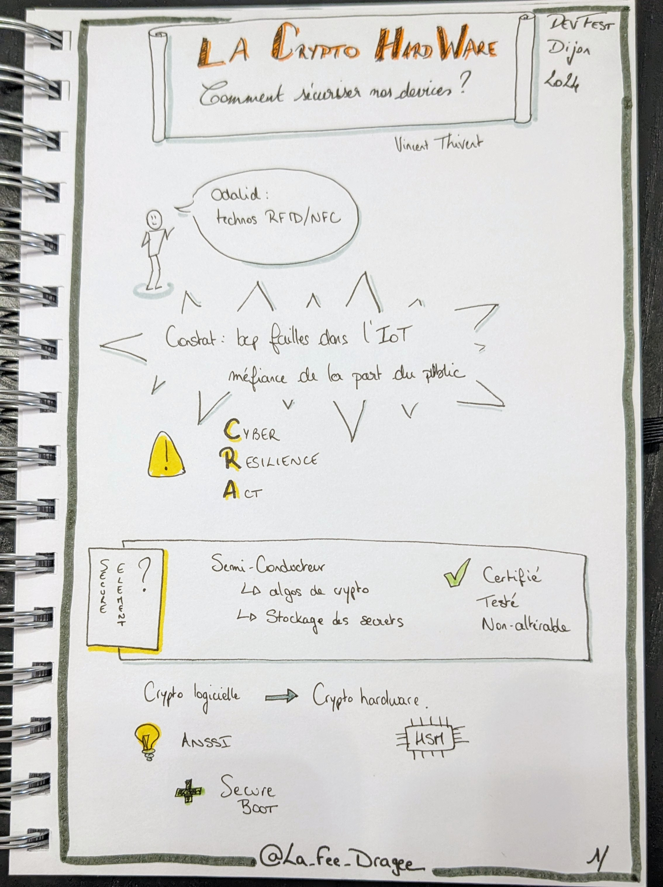
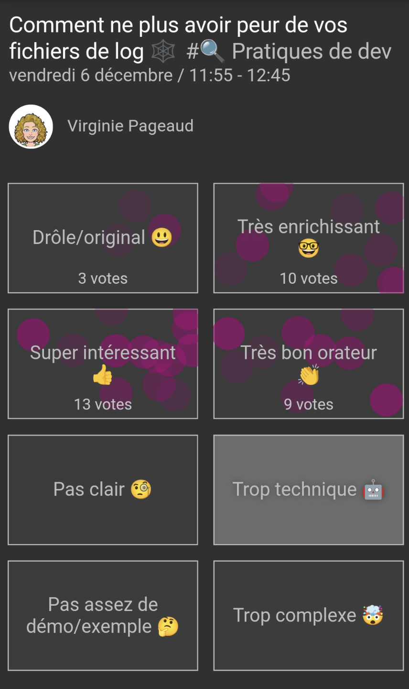
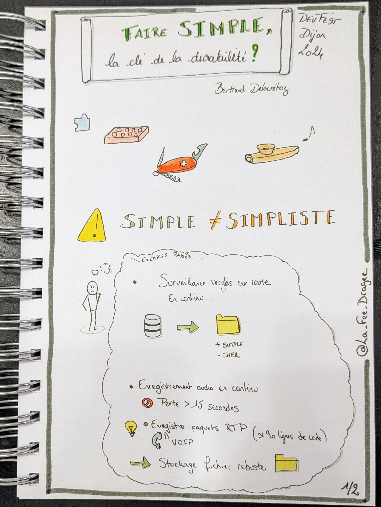
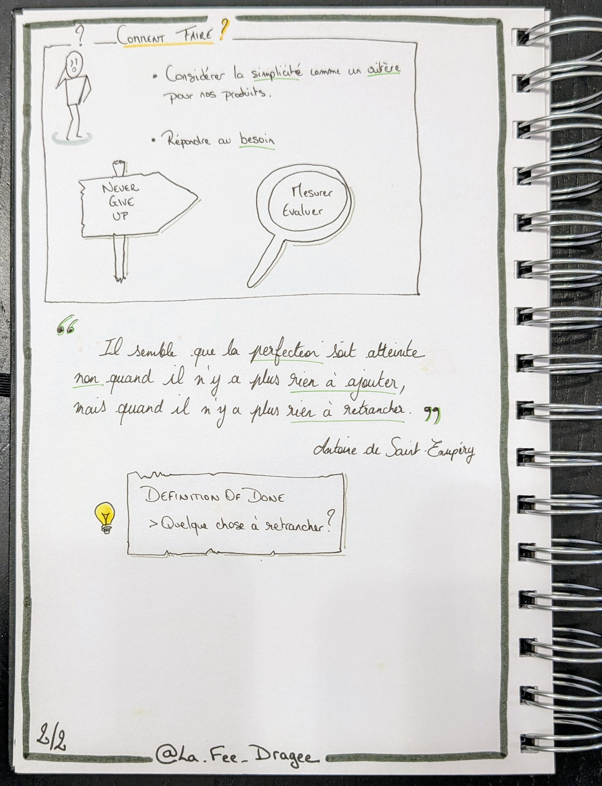

+++
title = "DevFest Dijon 2024"
date = 2025-01-11
draft = false
tags = ["conference", "sketchnotes"]
categories = ["tech"]
+++

**_Voyage au pays des ducs de Bourgogne._**

En décembre dernier, j'ai eu le plaisir d'intervenir pour la première fois au [DevFest Dijon](https://devfest.developers-group-dijon.fr/), une toute jeune conférence née en 2022.  
La conférence s'est déroulée au sein de l'IUT de Dijon sur une seule journée le vendredi 6 décembre.  

Comme souvent, nous speaker·ines avons eu le plaisir de profiter d'un _speaker diner_ organisé par l'équipe de la conférence, au [Bamagotchi](https://www.facebook.com/Bamagotchi.dijon/?locale=fr_FR), en plein cœur de la cité internationale de la Gastronomie et du Vin.  
J'y ai passé une très bonne soirée, où j'ai pu retrouver des copains, des personnes croisées au [MiXiT](../../2024/mixit/), ou encore des duchesses.  
Ce fut également l'occasion de faire de nouvelles rencontres.  

De plus, à notre arrivée à la conférence le lendemain matin, l'équipe nous a régalé d'un super panier garni, voyez par vous-même :

Le vendredi, j'ai assisté à quelques conférences et donc pris des sketchnotes que je vous partage bien entendu ici.  
Mais n'étant pas en grande forme (et donnant moi-même un talk), j'ai alterné conférences et pauses tout au long de la journée et n'ai donc assisté qu'à 4 sujets avant de devoir repartir.  

# Quand le terminal dévore la UI : TUI pour tout le monde !  
_Format conférence 50 minutes_  

**[Thierry Chantier](https://noti.st/titimoby)**  

La journée commence avec _TitiMoby_, qui nous présente dans un nouveau talk le concept de Textual User Interface.  
L'idée : disposer d'une interface utilisateurice à mi-chemin entre les lignes de commandes et une interface graphique "lourde" (comme par exemple la commande htop).  

Cela s'avère utile quand par exemple on ne souhaite pas sortir de son terminal, où que l'on a uniquement accès à un terminal et pas d'interface graphique (entre autres).

Il est donc possible, grâce à des bibliothèques spécifiques, de développer sa propre TUI, dans nos langages favoris.  
Thierry nous donne des exemples en Python (avec [Textual](https://github.com/Textualize/textual)), Go (avec [Bubble Tea](https://github.com/charmbracelet/bubbletea)) ou encore Rust (avec [Ratatui](https://ratatui.rs/)).  

Et bien sûr, cela se poursuit par une démo, dans ces différents langages, lors de laquelle il nous montre comment il interagit avec son repo GitLab sans bouger de son terminal !

  
  

# La crypto Hardware - _Comment sécuriser nos devices ?_
_Format short 20 minutes_

**Vincent Thivent** 

Après une pause dans la matinée, je suis allée écouter Vincent nous parler de sécurisation Hardware, thème important qui recoupe avec le cœur d'activité de mon entreprise actuelle [Quarkslab](https://www.quarkslab.com/).  

Partant du constat qu'il y a aujourd'hui beaucoup de failles dans le monde de l'IoT (ou internet des objets), et donc une certaine méfiance de la part du grand public à cet égard, Vincent souhaite expliquer la façon dont la sécurité est abordée dans les produits de son entreprise : à savoir principalement des systèmes de badges sans-contact.  

Malheureusement j'ai trouvé que le talk manquait de construction, de clarté, et je pense qu'un format de 20 minutes est trop court pour aborder ce thème, mais le sujet me semble pertinent !

# N'ayez plus peur de vos fichiers de log
_Format conférence 50 minutes_

> NB : Les slides sont disponibles [sur ce lien]([DevFest%202924]%20Comment%20ne%20plus%20avoir%20peur%20de%20vos%20fichiers%20de%20log.pdf).  

L'heure de la pause déjeuner approche, il est alors temps pour moi de donner mon talk sur les fichiers de log.  
Tout s'est très bien passé, les questions ont été intéressantes, dont les réponses sont loin d'être "binaires" je dirais.  

Parmi les questions en voici 2 particulièrement intéressantes à mon sens :  

**1. Une recommandation sur le délai de conservation des fichiers de logs ?**

Je n'ai pas de recommandation particulière car cela **dépend** complètement **du contexte**.  
En revanche voici quelques éléments à prendre en compte dans la réflexion :
- l'espace de stockage disponible  
- la quantité moyenne de log généré par équipement et par jour  
- les délais légaux applicables suivant le domaine métier  
- la "latence" client pour la remontée d'anomalies (si côté client ou exploitation par exemple, on sait que l'on peut avoir des anomalies remontées sur des traitements effectués plusieurs jours/semaines/mois auparavant)  

**2. Que faire des appels au log debug une fois l'application stable ?**

Ici aussi, cela **dépend du contexte** car en effet les logs de debug, même si ce niveau n'est pas actif à l'instant T, peut pénaliser les performances de l'application (en autres...).  
D'un autre côté, c'est une source d'information à laquelle on a déjà réfléchi, et il serait dommage de tout jeter (surtout pour les interfaces avec des services externes).

A mi-chemin, il est possible (au moins dans certains langages) de faire en sorte d'exclure de la compilation ces lignes de debug.  
Ainsi on allège nos exécutables, on évite de pénaliser les performances à l'exécution, sans devoir supprimer du code utile.  
Bien sûr, il y a probablement encore d'autres façons d'aborder ce sujet !

Côté feedback, ils ont été très positifs et constructifs :  

# Faire simple, la clé de la durabilité ?
_Format conférence 50 minutes_

**[Bertrand Delacrétaz](https://fosstodon.org/@bdelacretaz)**

L'après-midi, après avoir profité d'un buffet plus que copieux, je suis allée écouter Bertrand, venu de Suisse pour nous parler de simplicité, (sans être simpliste !), dans nos produits (qu'il s'agisse de logiciels, ou de choses matérielles).  
Il évoque tout d'abord quelques exemples célèbres de simplicité dans la vie courante, dont le succès dure depuis des décennies : les puzzle, les petites briques de construction, le couteau suisse (je le soupçonne d'être un poil chauvin sur ce coup 😉) ou encore le kazoo (d'ailleurs il en fabrique en impression 3D et m'en a offert un ❤️).  

Puis, il nous raconte quelques épisodes professionnels, lors desquels il aura fallu faire preuve de créativité pour répondre au besoin de ses clients (et pas des moindres !). Des solutions qui seront restées parfois plus de 20 ans en production !  
La base de tout, se recentrer sur le BESOIN (on en parle souvent, on l'applique moins souvent). 
Par exemple, il n'est pas toujours nécessaire d'utiliser une base de données, lorsqu'un stockage par fichier suffit (et en plus c'est moins cher !).  
On en revient d'une certaine façon selon moi aux principes de baby-steps : répondre au besoin de la façon la plus simple possible, et construire nos solutions petit à petit sans chercher à prédire un futur qui sera de toutes façons différent de ce que l'on avait prévu.

J'ai beaucoup apprécié sa présentation, notamment par son rythme posé sans être lent, ses exemples concrets et son discours inspirant sans être moralisateur. Et j'ai pu faire de très jolies sketchnotes !

  
  

# Comment merger sa PR en 10 secondes : REX mob code review
_Format short 20 minutes_

**[Thibaut Cantet](https://www.linkedin.com/in/thibaut-cantet-1299095/)**

Pour la dernière session de la journée, je me suis intéressée aux mob code review mises en place par Thibaut dans son équipe, afin de fluidifier le processus de développement, diffuser les compétences, harmoniser les pratiques de dev, etc.  
Comme pour beaucoup de REX de ce type, le constat de départ est une équipe en souffrance, des livraisons laborieuses, des revues de codes entassées pendant des jours, des blocages quand les gens sont en vacances...  

La solution mise en place ici a donc été entre autres de dédier un temps récurrent où les 4 ou 6 membres de l'équipe de développement (j'avoue avoir oublié le nombre précis) se retrouvent pour revoir les _Pull Request_ en attente, à savoir au début de chaque demi-journée. Cette pratique, couplée au pair-programming, a ainsi permis d'améliorer la situation.

Bien évidemment tout ne s'est pas mis en place du jour au lendemain, et ce type de changement nécessite la confiance de la hiérarchie, mais il est toujours intéressant et important d'avoir du recul sur nos pratiques, et la possibilité de les changer (qui a dit _Agile_ ?).  

# Conclusion

J'étais ravie de pouvoir assister à cette conférence, l'ambiance était top et nous avons été très bien reçu·es.  
J'espère avoir de nouveau l'occasion de venir, que ce soit en tant qu'intervenante ou participante !