+++
title = 'MiXiT 2025'
linkTitle = 'MiXiT 2025'
date = 2025-05-17
tags = ["conference", "sketchnotes"]
categories = ["tech"]
+++

**_Toujours avec des crêpes et du cœur._**

# La conférence en général

En ce mois d'avril 2025 j'ai eu le plaisir d'assister pour la deuxième fois à la conférence [MiXiT](https://mixitconf.org/) à Lyon.  

Venue une première fois [l'an passé](../../2024/MiXiT/), j'avais hâte de retrouver ce qui fait la particularité de cette conférence : les sujets parlant d'éthique, d'inclusivité, et de tout ce qui peut nous rendre le monde professionnel meilleur (et nous aussi par la même occasion), sans pour autant bouder les sujets tech.  

## Un mot sur les keynotes

Les keynotes de cette année ont je pense rempli leur rôle : nous alerter, nous informer, nous faire réagir.  
Plusieurs fois j'aurais aimé pouvoir écouter davantage les personnes invitées, notamment [David Chavalarias](#keynote--changer-dère-numérique-pour-préserver-la-démocratie-) et [Valérie Charolles](#keynote--nos-manières-de-compter), car au final 30 minutes c'est très court pour aborder de tels sujets !  

## De la facilitation graphique

Côté illustrations, cette année encore [Scribissimo](https://www.linkedin.com/in/antoine-louisgrand-1a5681178/) était présent en la personne d'[Orane](https://www.instagram.com/orane_lsgrd) pour saisir parfaitement l'essence des sujets présentés.  

Voici les photos de quelques-unes de ses réalisations : 

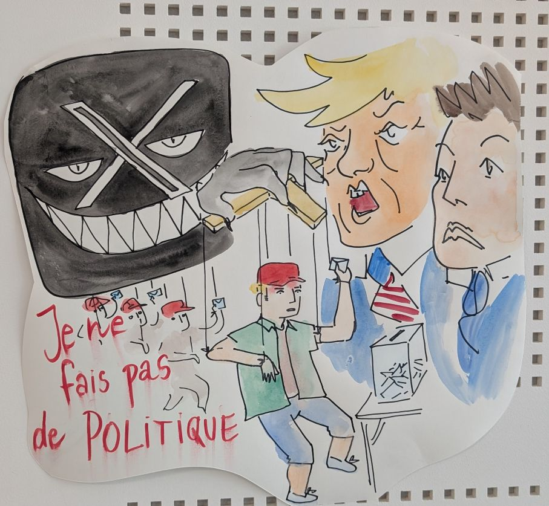  

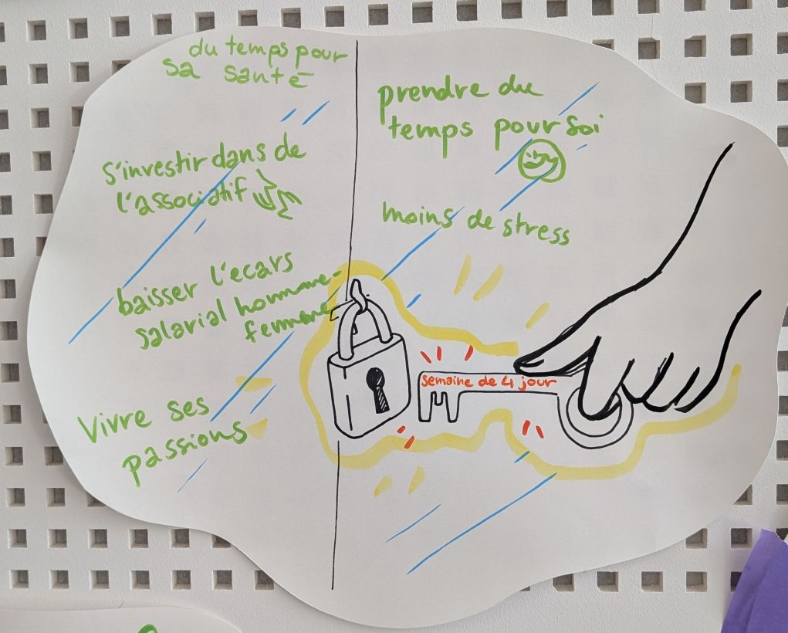

## Comme une pommade sur le cœur : les crêpes

Et bien sûr, MiXiT ne serait pas MiXiT sans ses délicieuses crêpes qui embaument de leur parfum tout le hall du CPE Lyon (perso, je les préfère juste avec un peu de sucre ❤️). Il vaut mieux s'armer de patience pour en manger une, ou "sacrifier" un slot de talk pour avoir moins de monde (il faut bien laisser les neurones se reposer, non ?).

# La journée du mardi 29 avril

## Keynote : Robustesse, une nouvelle culture tech ?

**[Olivier HAMANT](https://www.linkedin.com/in/olivier-hamant-a55149153)**  

La première keynote est donnée par Olivier HAMANT, chercheur à l'INRAE. Il nous explique comment et pourquoi la performance ne peut pas être robuste, les dangers que cela représente pour notre monde actuel, et nous invite à changer notre axe de progrès vers davantage de robustesse.  

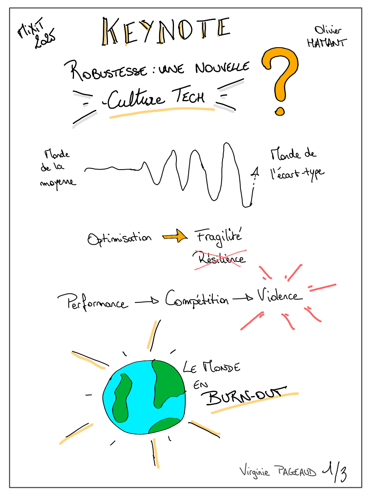  
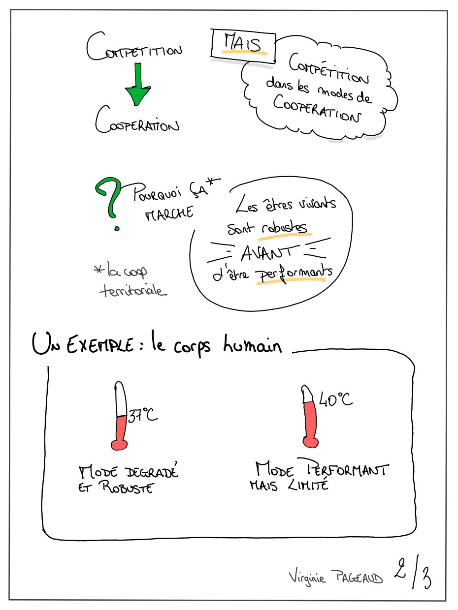  
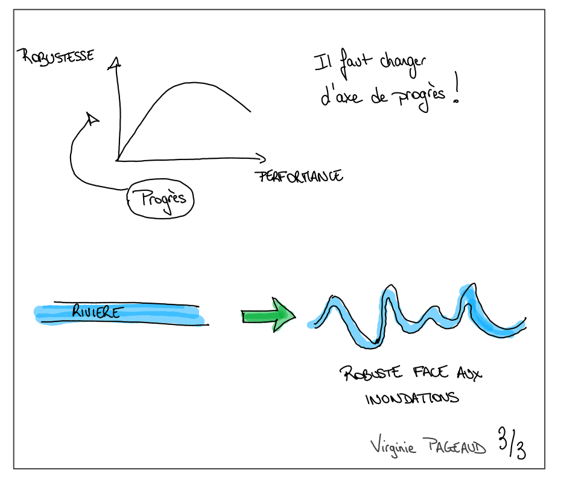  

## Au-delà des heures : la semaine de 4 jours comme levier d'égalité
_Conférence 45 minutes_  

**[Albane Veyron](https://www.linkedin.com/in/albane-fagot-veyron/)**  

C'est probablement le talk que j'attendais le plus : comment et pourquoi la semaine de 4 jours s'avère être un puissant levier d'égalité au sein de l'entreprise.  
En partant de la [roue des privilèges](https://rfnb.ca/informer/boite-a-outils/rfnb/roue-des-privileges) (ou roue des inégalités), elle nous explique comment le recours à la semaine de 4 jours peut réduire les inégalités au sein des différentes "catégories" de la roue, comme le handicap, l'éducation ou encore la santé mentale, **tout en étant bénéfique pour les entreprises**.  

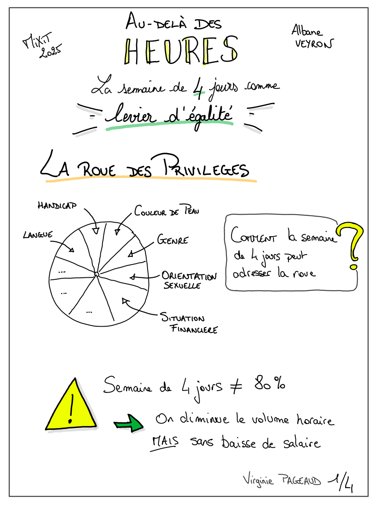  
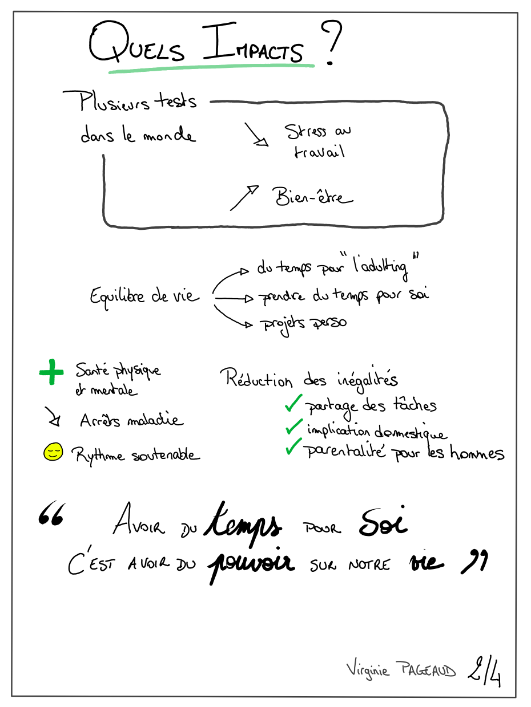  
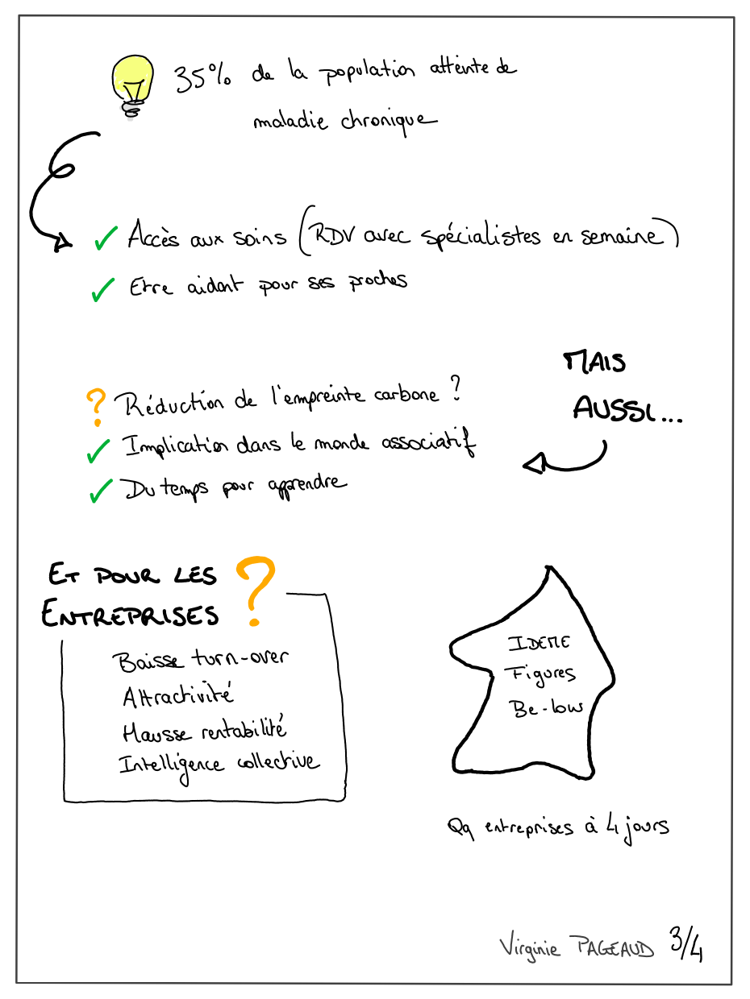  
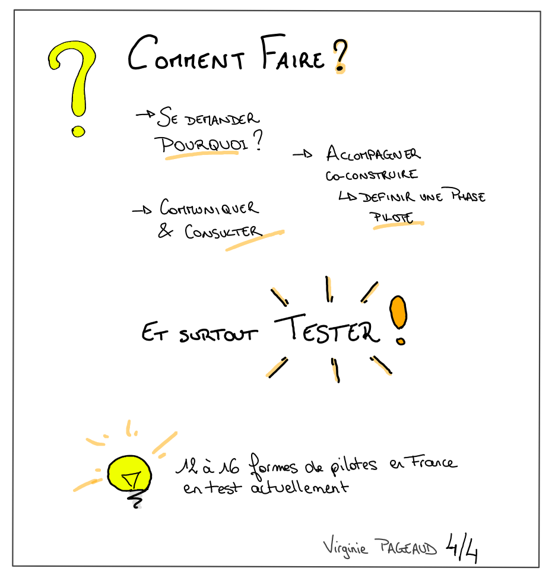  

## Création d'une pépinière de test, entre reconversion et handicap
_Conférence 45 minutes_  

**[Aurélia RIBEIRA](https://www.linkedin.com/in/aurelia-ribeira-b36987134/)**  
**[Solène LAPOUGE](https://www.linkedin.com/in/sol%C3%A8ne-lapouge/)**  

S'il y a des initiatives qui montrent qu'on peut changer la donne en matière d'inclusion, celle-ci en fait indéniablement partie.  
Aurélia et Solène sont venues nous raconter ce projet dont le but a été de former des personnes en situation de handicap au métier du test logiciel, en créant une pépinière.  

L'objectif n'est pas seulement de "donner du travail" à ces personnes, mais surtout de leur offrir une véritable réinsertion en entreprise "finale", au lieu de rester au sein de la société de service.  
Entre formation technique, accompagnement humain, formation des équipes chez les clients, c'est un projet multi-dimensionnel qui montre à quel point les entreprises peuvent choisir de faire bouger les lignes.  

J'espère que cette initiative se poursuivra encore longtemps, et pourra en inspirer bien d'autres !

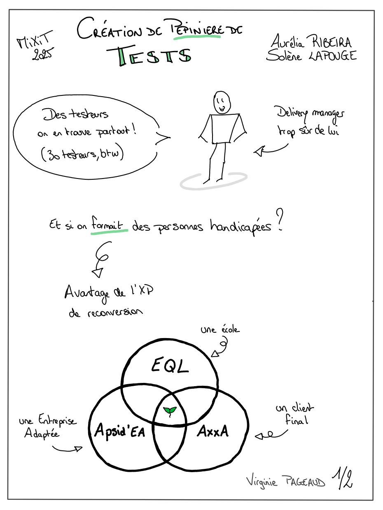  
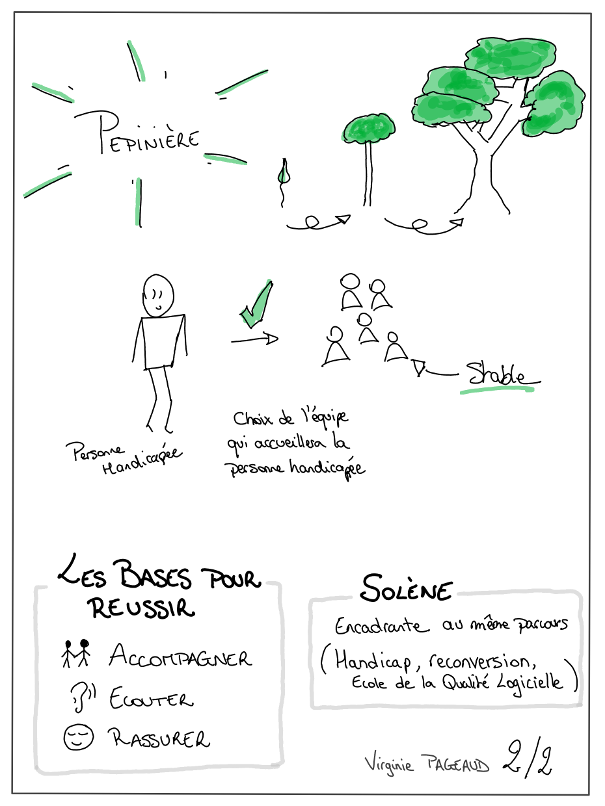  

## Keynote : Nos manières de compter
_**Périls économiques, démocratiques et écologiques**_

**[Valérie CHAROLLES](https://www.valerie-charolles.fr/)**  

Pour la deuxième keynote de la journée, nous avons écouté la philosophe Valérie CHAROLLES au sujet des chiffres, des nombres, et de la façon dont ils peuvent être détournés pour biaiser notre perception des choses, et donc influencer nos prises de décision.  
Pas toujours évident à suivre juste après la pause déjeuner, je l'ai perçue essentiellement comme une introduction à ce vaste sujet et son histoire, qui mérite notre attention.  

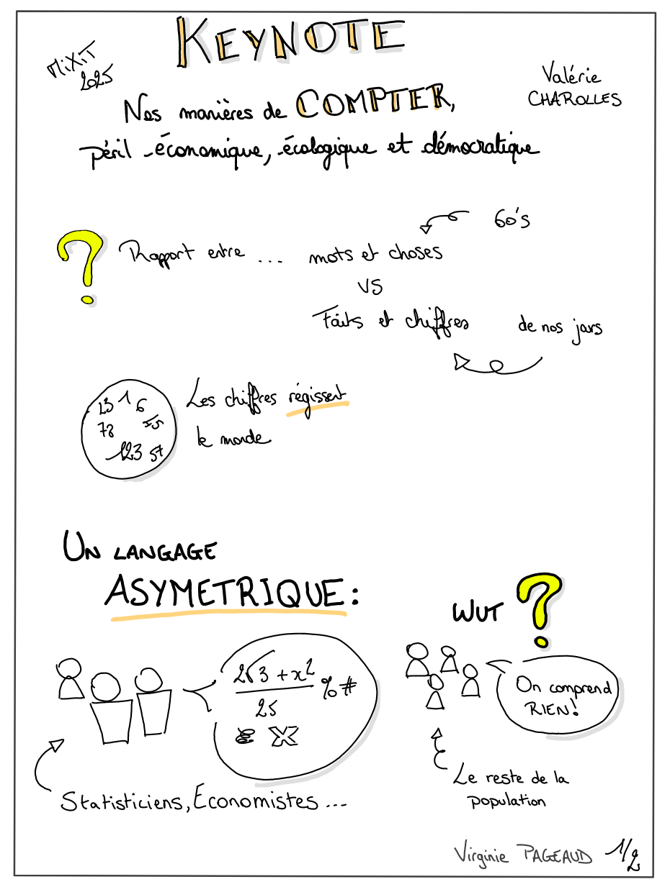  
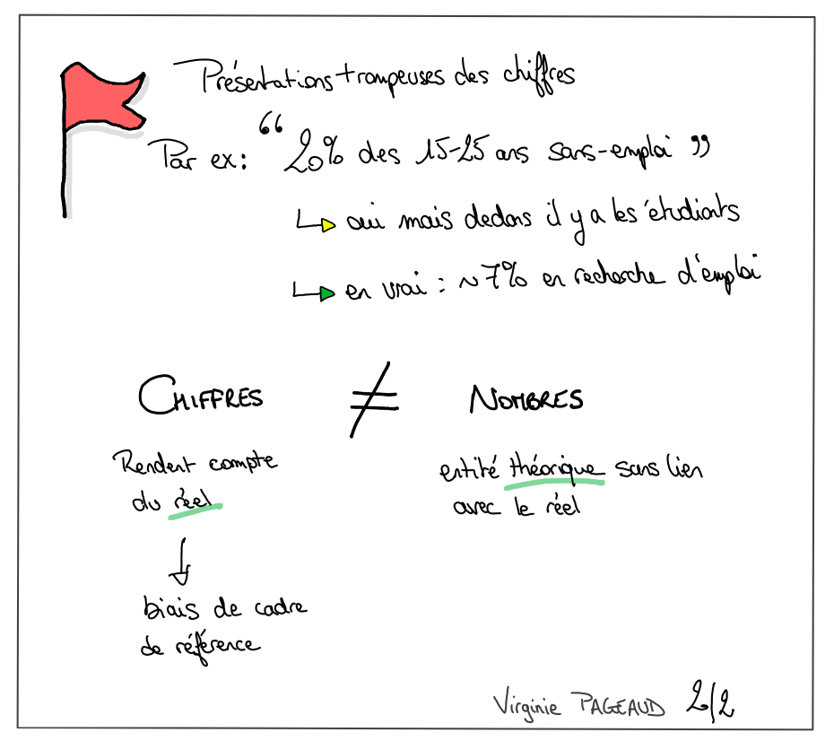  

## Le langage inclusif : un levier d'engagement dans les équipes
_Conférence 45 minutes_  

**[Diane MOINET](https://www.linkedin.com/in/diane-moinet/)**  

Déjà convaincue par ce sujet notamment grâce à [cette vidéo](https://youtu.be/url1TFdHlSI?si=9KyBqUOMUM6xdjDd) sur la chaîne Scilabus, je voulais néanmoins avoir un regard supplémentaire sur la question, et me donner l'occasion de faire une sketchnote sur le sujet 🙂.  

J'ai bien fait, car j'ai découvert que les biais de représentation sont aussi observés dans les langues "non genrées" (par exemple en anglais, les noms de métiers sont les mêmes pour les hommes et les femmes), du fait des stéréotypes dans la société.  
J'ai aussi découvert quelques moyens supplémentaires d'avoir une écriture inclusive, notamment l'adressage direct.  

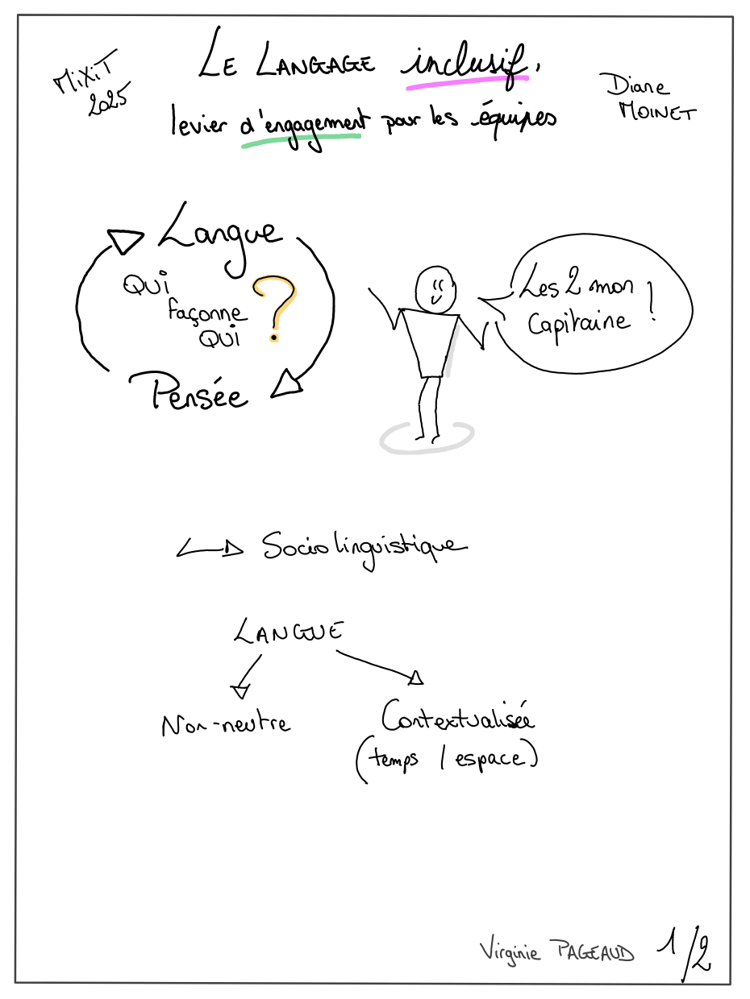  
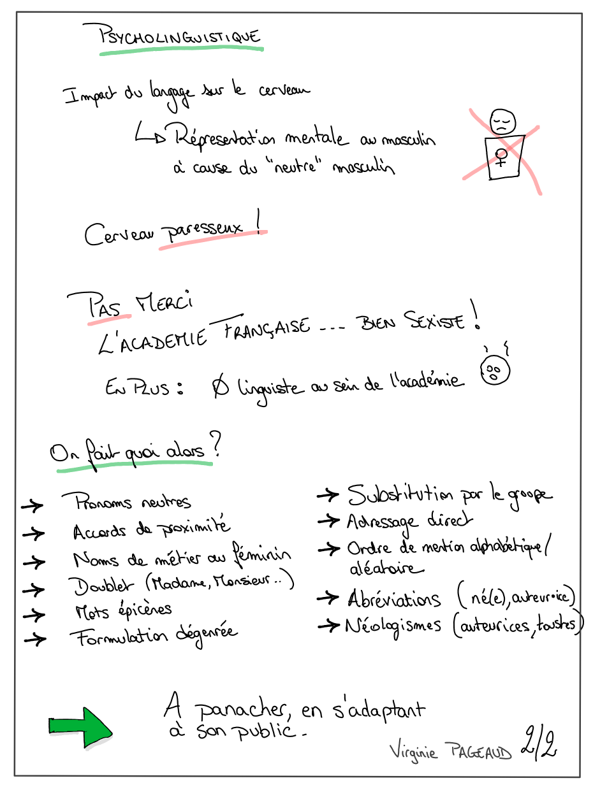  

## Medtech : transformons la santé par la data
_Lightning 20 minutes_  

**[Montaine MARTEAU](https://www.linkedin.com/in/montaine-marteau/)**

Dans ce lightning, Montaine nous a montré pourquoi et comment les données de santé recueillies sont sous-exploitées, à l'heure ou l'IA peut révolutionner la recherche médicale.  
Un aperçu très intéressant des difficultés techniques, entre protection des données personnelles, diversité des formats de données et besoin de "petites mains"...

_Pas de sketchnote._

## Keynote : _Design : Sabotage, Hacking & Politique_

**[Geoffrey DORNE](https://geoffreydorne.com/)**

Je suis assez mitigée concernant l'intervention de Geoffrey. J'ai trouvé qu'elle manquait de construction et l'ai ressentie davantage comme de "l'auto-promo" que comme une invitation au questionnement.  
J'aurais aimé peut-être que les exemples de "détournement de concept/visuel" soient moins nombreux, mais mieux expliqués (pourquoi il a construit le visuel de telle ou telle façon, quels sont les mécanismes cognitifs derrière...). 

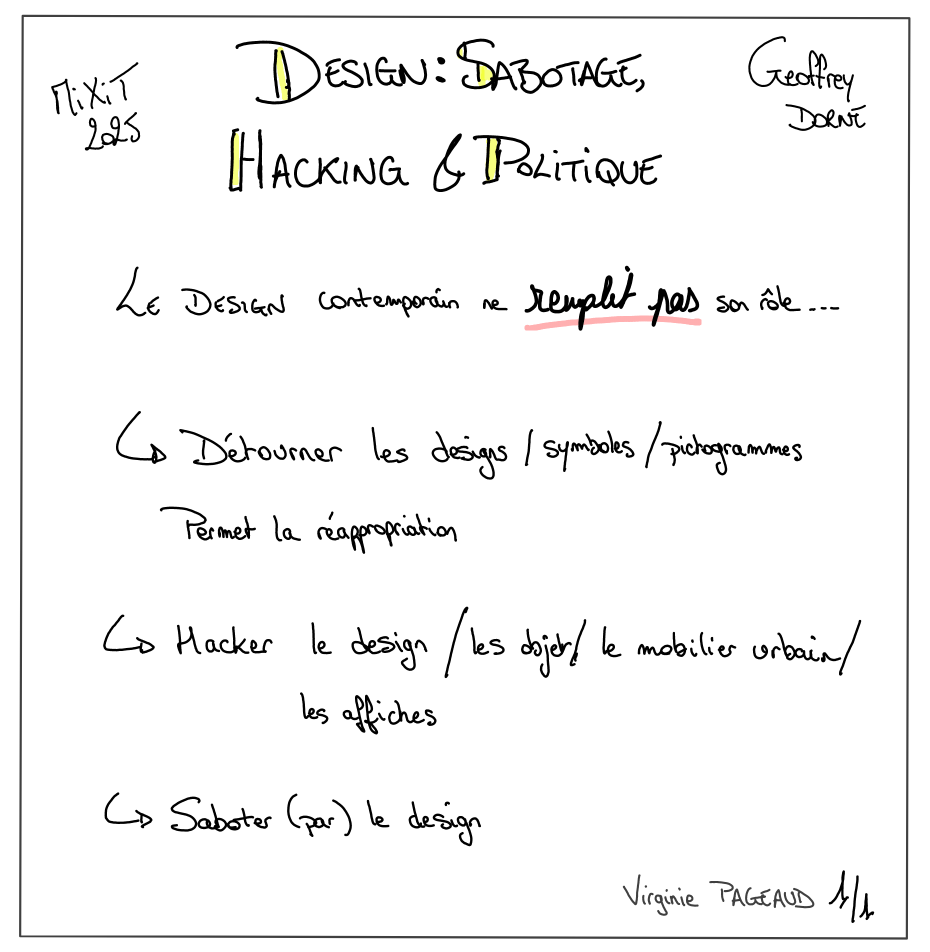  

## Soirée MiXiT à l'Hôtel de Ville

Cette année, c'est l'Hôtel de Ville de Lyon qui a accueilli la soirée MiXiT.  
Bien que le lieu soit exceptionnel il faut le dire, j'ai été quelque peu déçue de la soirée par rapport à [celle de l'année dernière](../../2024/MiXiT/#soirée-à-la-chapelle-de-la-trinité) (et n'était pas la seule).  

En effet, le lieu était extrêmement bruyant, et le catering quasi-inexistant. J'ai donc écourté la soirée pour aller manger, et me reposer. 

# La journée du mercredi 30 avril

## Keynote : Changer d'ère numérique pour préserver la démocratie ?

**[David CHAVALARIAS](https://www.linkedin.com/in/david-chavalarias/)**

La seconde journée commence sur les chapeaux de roues avec l'intervention de David CHAVALARIAS, mathématicien et chercheur au CNRS ISC-PIF.  
Il fait également partie du mouvement [HelloQuitteX](https://helloquittex.com/).  
Durant ces 30 minutes, il nous a expliqué une partie des mécanismes de manipulation de l'opinion via les réseaux sociaux : en gros, la propagande moderne.  

Il a également présenté les "étapes" de transformation d'un régime ouvert (une démocratie saine), à un régime fermé (une dictature). Le constat fait froid dans le dos au sujet de la Russie et des USA, et l'on se sent tout petit dans cette bataille...  

  
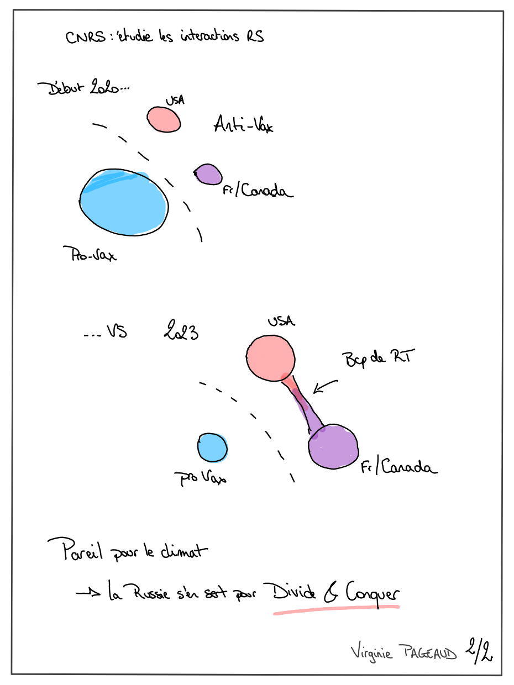  

## Highway to fail : l'histoire d'un échec prévisible
_Conférence 45 minutes_

**[Céline LOUVET](https://www.linkedin.com/in/celinelouvet/)**

Ce n'est ~~pas toujours~~ jamais facile de parler de ses échecs, mais c'est ce qu'a fait Céline.  
Elle nous a retracé l'histoire de ce projet de start-up dont l'échec était tellement prévisible, quand on sait reconnaître les signaux d'alerte (et que le contexte s'y prête).  

Mais il y a des fois où l'on ne voit pas ces signes, et où l'attrait de la nouveauté nous fait oublier le reste. Après tout, nous restons des êtres vivants animés d'émotions et de désirs.  
La force de ce talk est nous présenter ici ce qui aurait pu être évité, et nous donne des points de vigilance lorsque l'on entreprend.  

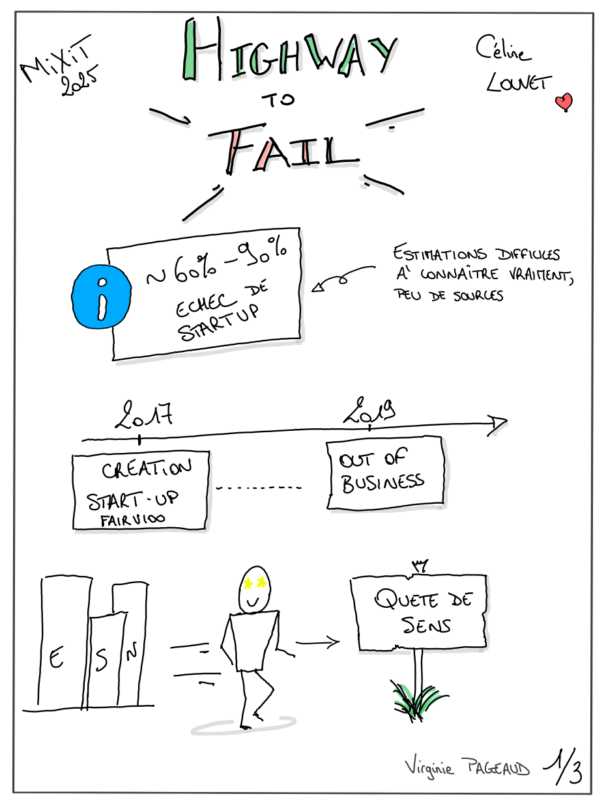  
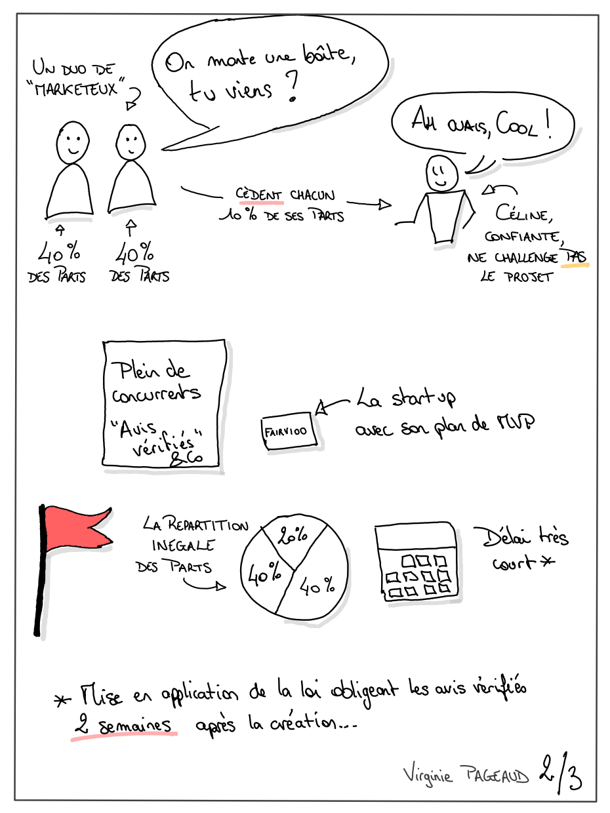  
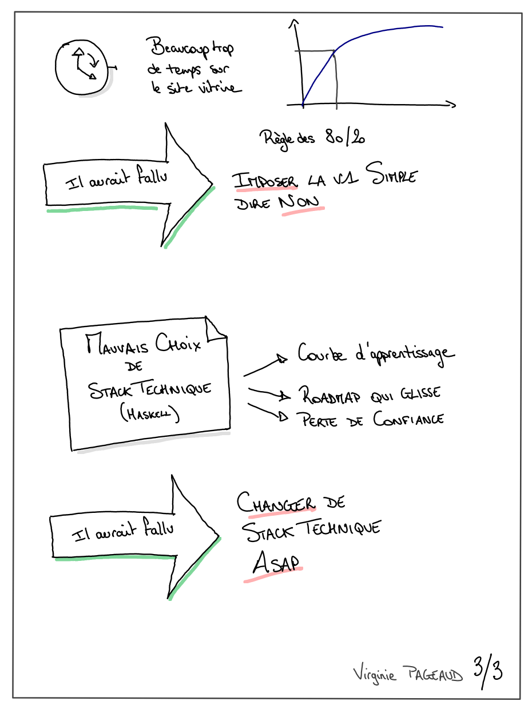  

## Un développeur sous couverture parmi les utilisateurs
_Conférence 45 minutes_

**[Aurélien BOUDOUX](https://www.linkedin.com/in/aurelienboudoux/)**  

Quand le développement logiciel rencontre le monde de la scierie, on obtient l'histoire d'Aurélien, qui s'est retrouvé à scier du bois pour sa mission de développement d'application.  
Un contexte hors du commun, un retour à l'essentiel, où l'humain reste la clé.  

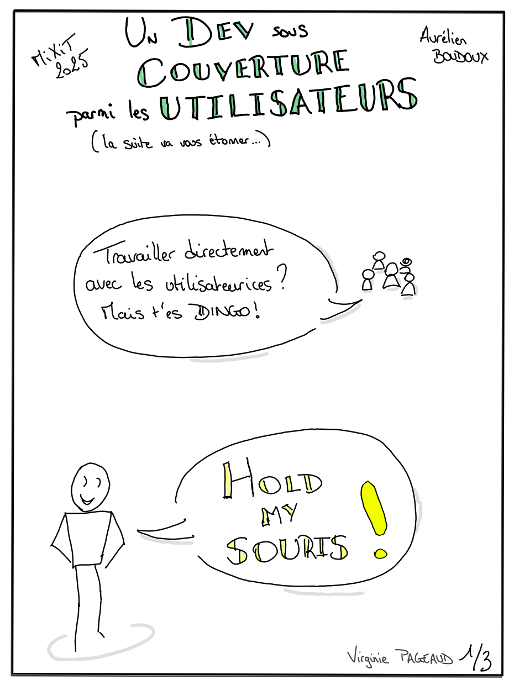  
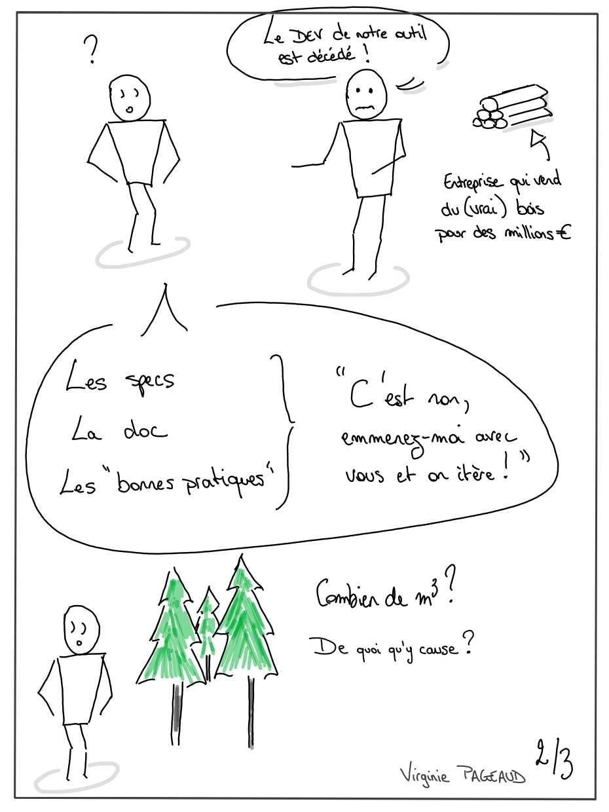  
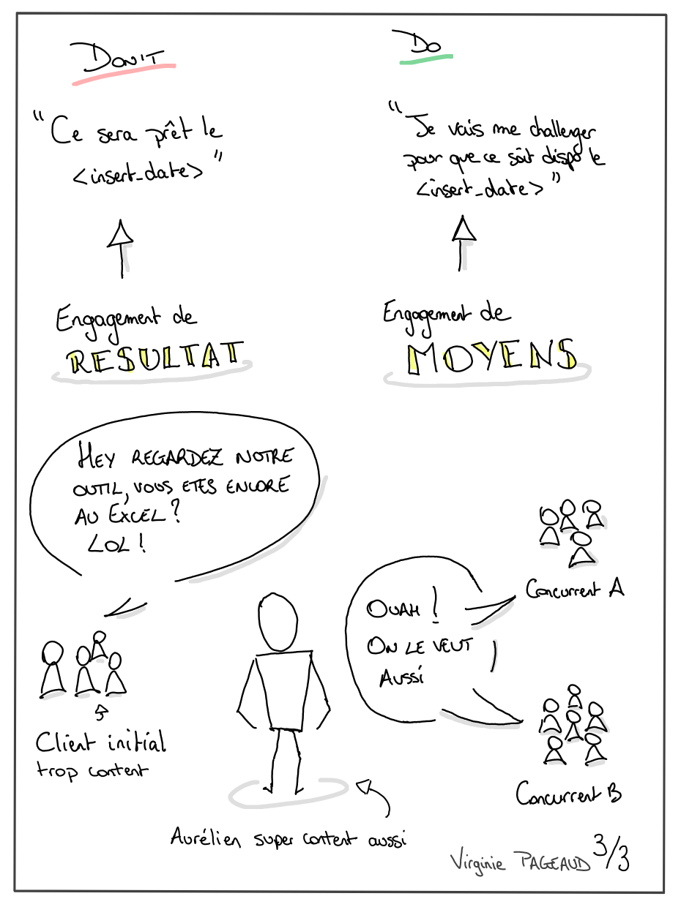  

## Les super-pouvoirs méconnus de Docker Desktop
_Conférence 45 minutes_

**[Guillaume LOURS](https://www.linkedin.com/in/guillaumelours/)**  
**[Philippe CHARRIERE](https://www.linkedin.com/in/phcharriere/)**  

Pour ce dernier talk, j'ai suivi la démo de Guillaume et Philippe au sujet de Docker Desktop.  
Malgré leur soucis techniques, j'ai pu avoir un aperçu des possibilités de cet outil, et suis plutôt fière de ma sketchnote 🙂

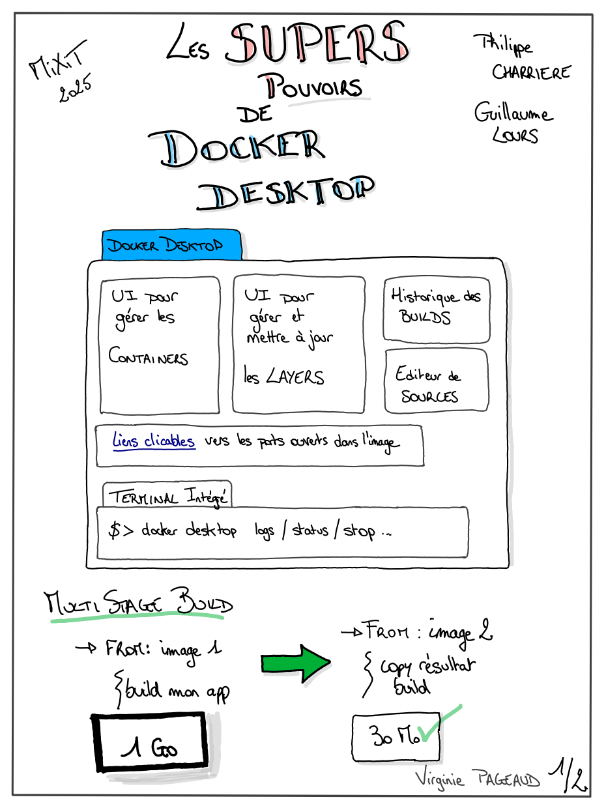  
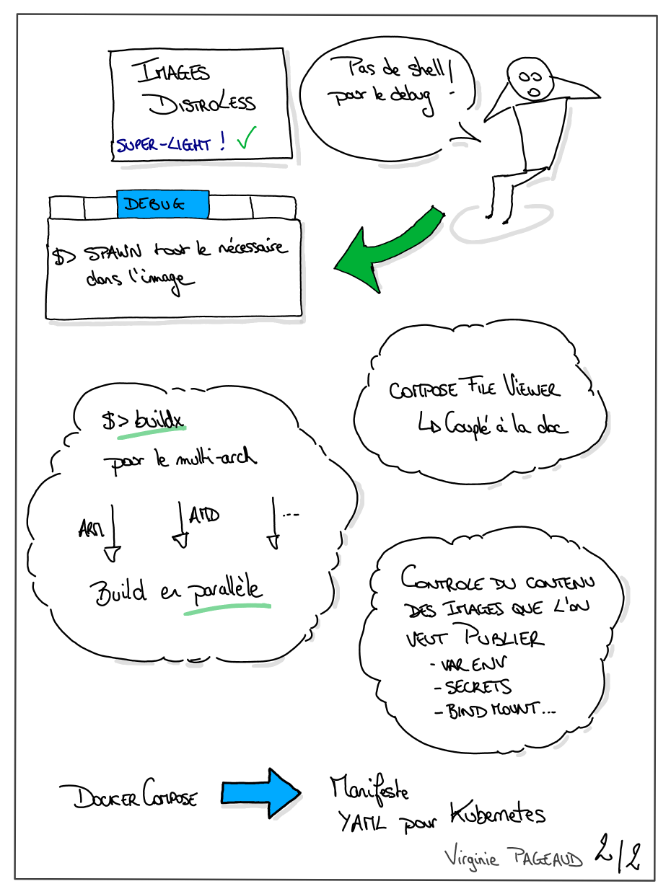  

# Conclusion

Même si j'ai préféré l'édition 2024 de la conférence (pas uniquement d'un point de vue contenu, mon contexte personnel ayant changé depuis), j'ai néanmoins passé une bonne conférence 2025.  
Outre les conférences en elles-mêmes je retiens : 
- une équipe d'organisation au top,  
- les repas du midi de la Fine Fourchette toujours excellents  
- le plaisir d'avoir soutenu des associations grâce [aux mixettes](https://mixitconf.org/2025/mixette).

J'ai hâte de voir ce que la prochaine édition nous réserve !