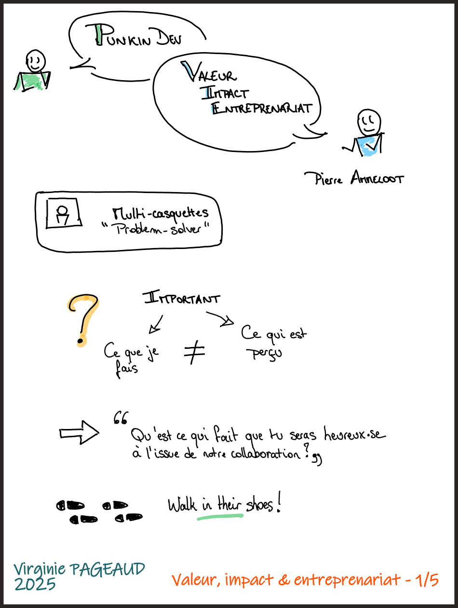
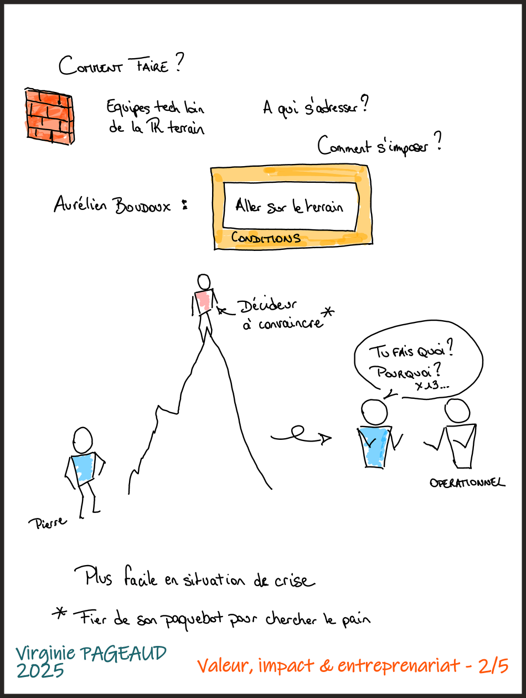
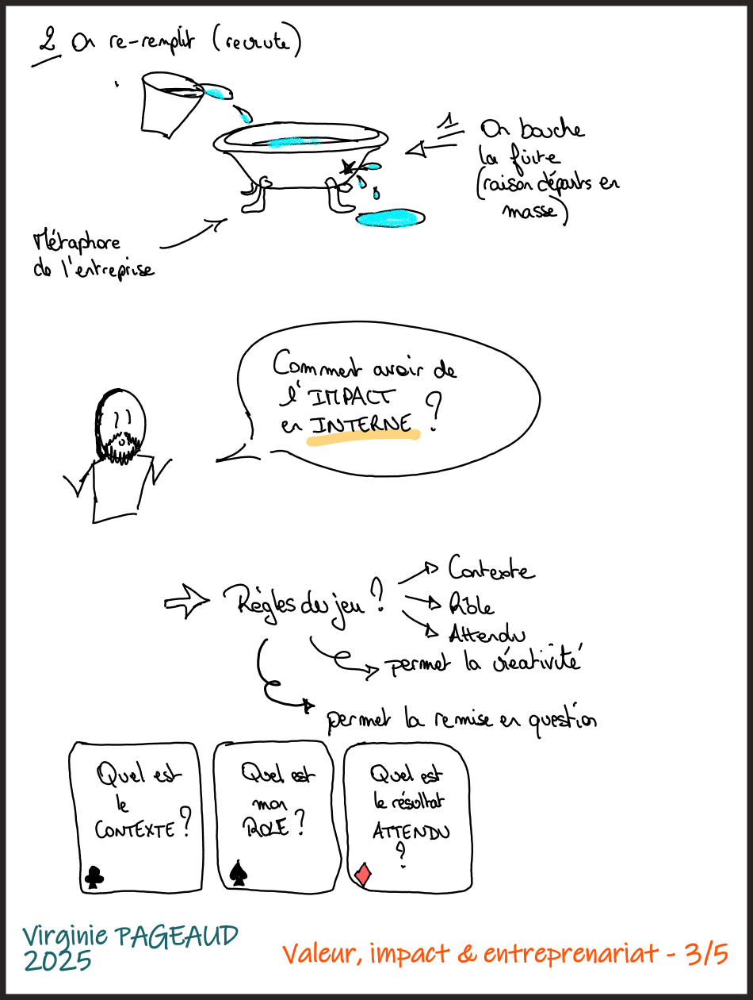
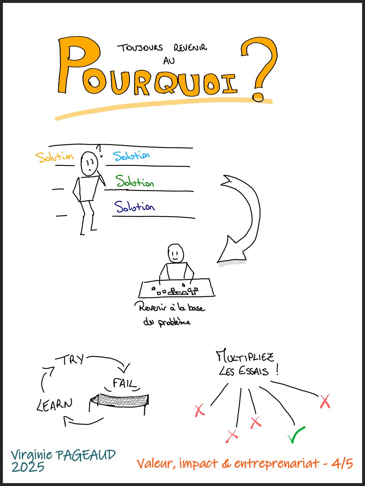
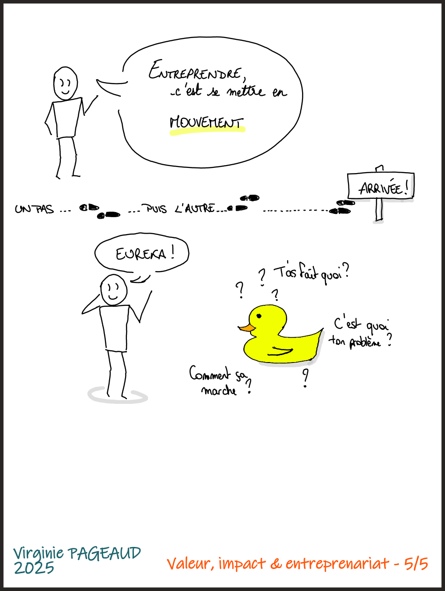

+++
title = "De la valeur et de l'impact en entreprise"
summary = "Sketchnote de l'épisode de podcast de PunkinDev avec Pierre Ammeloot"
date = 2025-03-23
draft = false
tags = ["podcast", "sketchnotes"]
categories = ["tech"]
+++

Depuis un certain temps maintenant, j'écoute le podcast [PunkinDev](https://podcast.ausha.co/punkindev) de l'ami Sylvain Coudert (avec plus ou moins de régularité ces derniers temps je dois bien l'avouer).

Parmi eux il y en a un qui m'a particulièrement marquée : l'épisode avec [Pierre Ammeloot](https://www.linkedin.com/in/pierreammeloot/) parlant de valeur, d'impact, et d’entreprenariat.  
En effet, ayant été un certain temps (et l'étant toujours aujourd'hui d'ailleurs) dans un rôle d'assistance aux clients de mon entreprise, la question de l'impact et de comment apporter la bonne réponse à un problème client est plutôt récurrente dans mon quotidien professionnel.  

J'ai trouvé que Pierre et moi avions des profils assez similaires, des généralistes aimant faire le lien entre des mondes qui ne se comprennent pas toujours. Son intervention m'a aussi permis de prendre du recul sur mon profil, à un moment où j'étais entre 2 emplois et où je réfléchissais beaucoup à la valeur que je pouvais apporter à une entreprise ou une équipe.  
Je retiens notamment la nécessité de demander souvent "Pourquoi" à son interlocuteurice, afin d'identifier les vrais besoins, les problèmes à la racine (les gens ont une fâcheuse tendance à demander directement une solution qu'ils ont imaginée, plutôt que d'exprimer leur besoin), l'utilité de se mettre à leur place pour comprendre leur contexte, leurs contraintes.  

Il a également rappelé à juste titre que "qui ne tente rien n'a rien" : il ne faut pas hésiter à expérimenter des choses (quand le contexte y est favorable, bien entendu), _"Sur un malentendu ça peut marcher"_. Dites-vous que derrière les succès des gens autour de vous, il y a aussi des échecs, qui sont tombés dans l'oubli pour la plupart, et que donc votre perception est _biaisée_.

Évidemment cela peut sembler un peu naïf/facile de dire "Paris ne s'est pas faite en un jour", mais il est justement bon de rappeler que ce que vous observez aujourd'hui est le résultat d'une succession d'étapes, de petits pas, arrivés les uns après les autres.  
L'expérience, la connaissance, ou encore la capacité à être force de proposition ne s'acquièrent pas du jour au lendemain.  

Je vois d'ailleurs ici un joli parallèle avec les principes des petits incréments de valeur dans le développement logiciel, sauf qu'ici le produit à développer, c'est soi-même (un jour je ferai un billet sur tous les parallèles entre l'artisanat du logiciel et la vraie vie...). 

Et donc, ayant l'envie de pouvoir revenir régulièrement sur les idées évoquées pendant l'épisode, j'ai décidé d'en faire une sketchnote (une de mes premières avec ma [Boox Note Air4 C](https://shop.boox.com/products/noteair4c?gad_source=1&gclid=Cj0KCQjw4v6-BhDuARIsALprm33kMT2Poyxynrjq48xgCeZ7bNG1oUY3XoPZo9bJUiJYUXGrN0JMlA4aAvuiEALw_wcB) d'ailleurs).

Vous pouvez retrouver l'épisode [sur Ausha](https://podcast.ausha.co/punkindev/s04e06-pierre-ammeloot-nous-parle-valeur-impact-entreprenariat), et les sketchnotes juste ici.

  
  
  
  
  