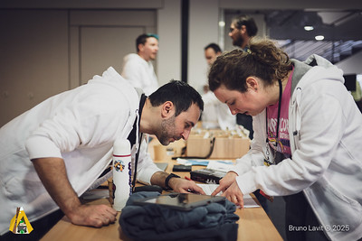
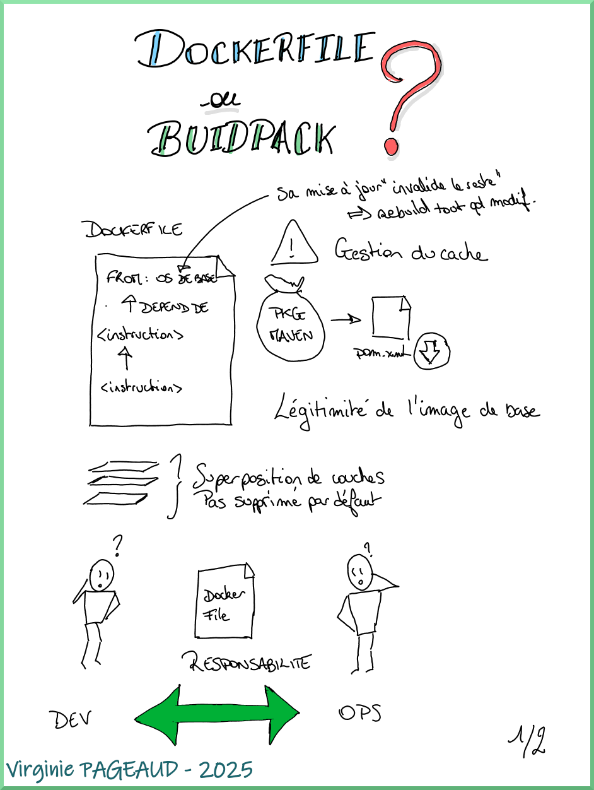
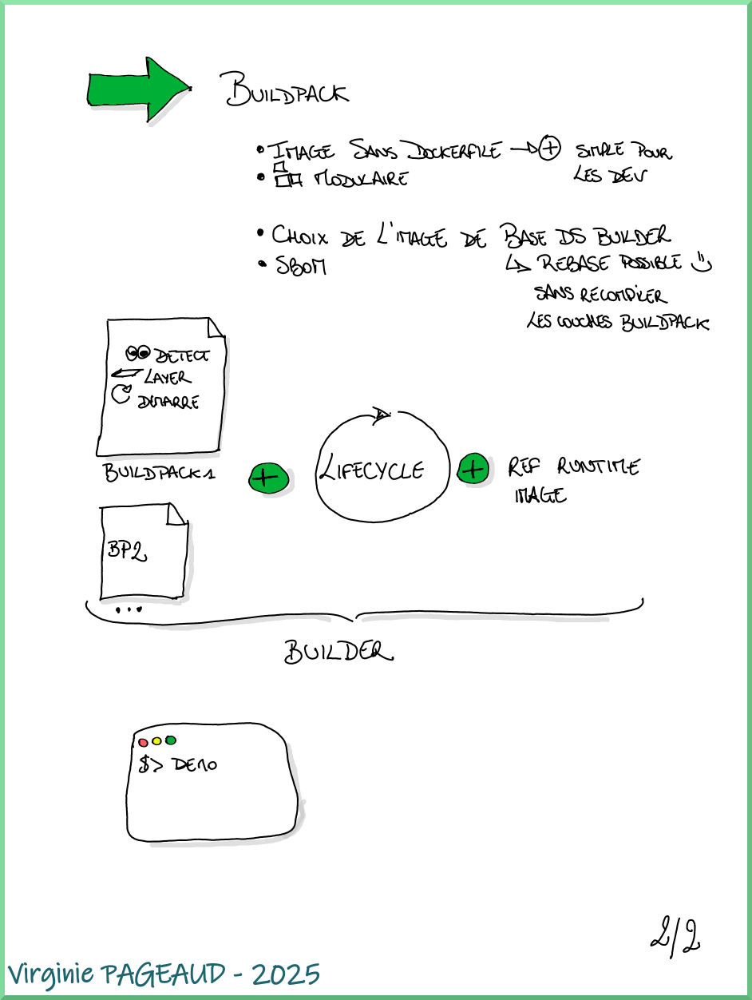
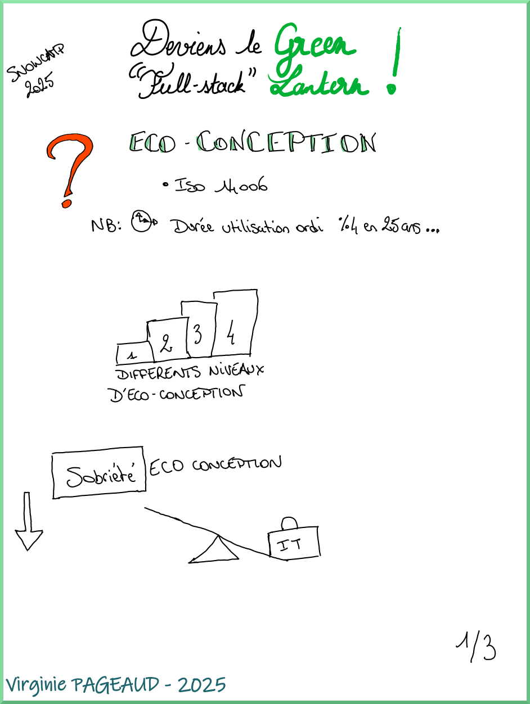
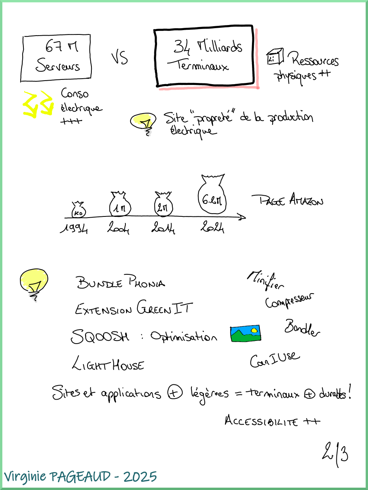
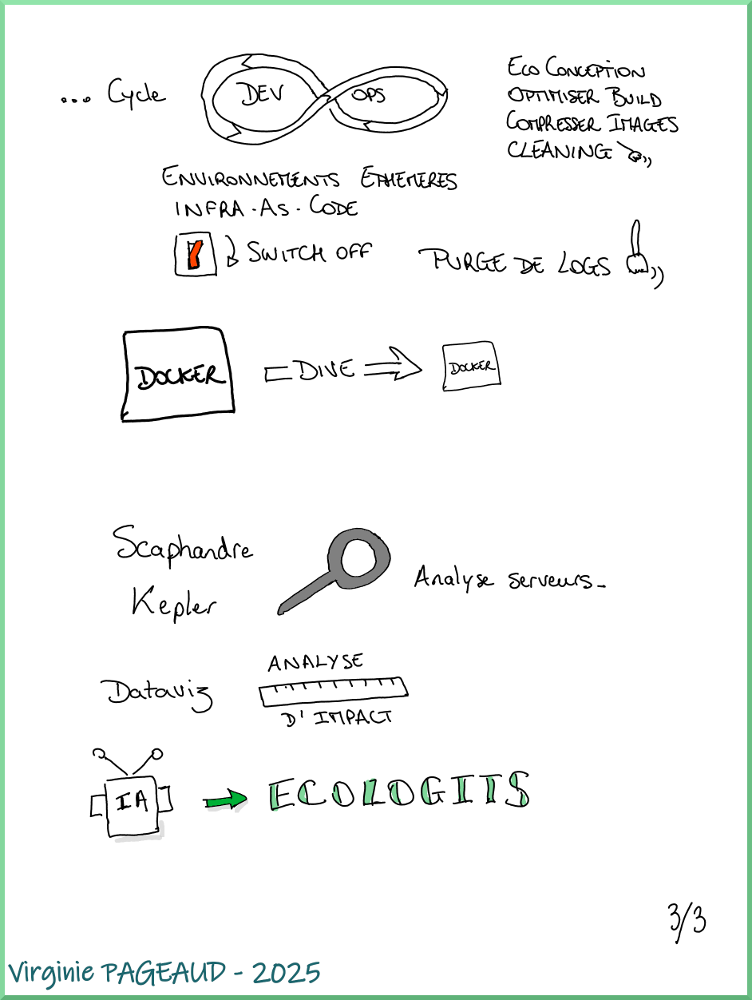

+++
title = "SnowCamp 2025"
date = 2025-04-18
tags = ["conference", "sketchnotes", "bénévolat"]
categories = ["tech"]
+++

**_La conférence tech au cœur des Alpes_**

Depuis un peu plus d'an maintenant, je fais partie de l'équipe d'organisation de la conférence SnowCamp qui se déroule à Grenoble.  

D'abord coach pour la première édition du tremplin au SnowCamp, j'ai ensuite intégré complètement l'équipe en revêtant la veste blanche des bénévoles en 2024.  

Pour cette édition 2025 qui s'est déroulée du 22 au 25 janvier, j'avais donc toujours cette veste blanche, avec en prime durant l'année écoulée la casquette de référente pour l'organisation de la deuxième édition du tremplin (une initiative de [CraftsRecords](https://craftsrecords.org/)), en plus du "quotidien" au sein de l'équipe comme la sélection des sujets, et l'amélioration continue de l'événement.  

Allez, je m'en vais vous raconter tout ça.

# Le SnowCamp plus en détail

Le SnowCamp, c'est une conférence tech, dont la ligne éditoriale se veut très axée sur l'aspect technologie (avec néanmoins un petit peu de place pour d'autres types de sujets avec une catégorie "Hors piste").  
Elle se déroule sur 4 jours :  
- mercredi : les universités, des sessions de 3h pour se plonger dans un sujet ou une techno  
- jeudi et vendredi : les conférences plus classiques sur un format de 20 ou 45 minutes  
- samedi : une _unconférence_ sur les pistes de ski ou en randonnée raquettes pour échanger de façon moins formelle entre intervenant·es et participant·es

# La préparation du tremplin

Cette année je m'étais portée volontaire pour être en charge de l'organisation du tremplin.  
Ce n'est pas pour autant que j'étais seule à la barre, j'étais la référente et un cheffe d'orchestre de l'activité.  

Organiser le tremplin c'est :  
✅ trouver des coaches,  
✅ gérer le CFP (_Call For Proposals_, c'est à dire les candidatures),  
✅ organiser les sessions de sélection des candidats et candidates,  
✅ organiser les répétitions groupées,  
✅ organiser grande soirée du tremplin (donc trouver un lieu -merci encore à [Criteo](https://www.criteo.com/fr/)- et une date mi-décembre, quand toutes les entreprises organisent leurs soirées de Noël).  

Ah, oui, au milieu de tout ça j'ai commencé un nouveau job au mois d'octobre, pas le temps de s'ennuyer dans ces conditions !  

Pour cette édition, l'ouverture du CFP était au début de l'été, jusqu'à la mi-septembre. Nous avons ensuite procédé à la sélection des sujets, et débuté l'accompagnement en octobre, et programmé la soirée du tremplin le 18 décembre.

Au programme nous avions (les vainqueur·es sont identifié·es avec une 🏅):  
- *"LinkedIn Mastery, Être Bruce Wayne ou Batman : sous les projecteurs ou dans l’ombre"* par [Jade Crotto-Miglietti](https://www.linkedin.com/in/jadecrottomiglietti/)  
- 🏅 *"Donjons et Pythons: la chevaleresse à la rescousse"* par [Juliette Grillère](https://www.linkedin.com/in/juliette-grill%C3%A8re-etudiante-ingenieure/)  
- *"La joie des deadlines"* par [Eric Papazian](https://www.linkedin.com/in/ericpapazian/)  
- *"Ensemble jusqu'en prod : comment nous avons transformé notre vision du 'terminé'"* par [Thibault Rihet](https://www.linkedin.com/in/thibault-rihet/)  
- *"Smalltalk, voyage futuriste dans le passé !"* par [Lionel Armanet](https://www.linkedin.com/in/lionelarmanet/)  
- 🏅 *"Vanilla JS et le Web standard : c'est sous côté en fait !"* par [Pierre Arquier](https://www.linkedin.com/in/pierre-arquier-515b5181/) et [Igor Zachcial](https://www.linkedin.com/in/igor-zachcial/)  

La captation de la soirée est disponible sur [la chaîne Youtube de CraftsRecords](https://www.youtube.com/playlist?list=PLIYXcdwc2smEPm2cWq14-qyPvm4qZ0Hig).  

# Les jours-J

Bien que la conférence se déroule sur 3 jours avec les universités du mercredi, je n'étais présente que les 2 jours de conférences classiques jeudi et vendredi, n'étant pas disponible mercredi.  

## Côté orga

Assister à une conférence, c'est déjà quelque chose qui me demande beaucoup d'énergie en général.  
Faire partie de l'orga, encore plus ! Mais c'est aussi ce que j'aime dans l'organisation : être en mouvement, accompagner les intervenant·es et participant·es et apporter ma contribution à la tenue d'un événement qui a de l'importance à mes yeux.  

On arrive en général dès l'ouverture des lieux, à 8h environ, afin de préparer les banques pour l'accueil des visiteuses et visiteurs, accueillir les sponsors qui vont alors monter leurs stands, ou encore vérifier le bon fonctionnement de l'application de billetterie sur le téléphone.  
L'accueil du jeudi matin est le plus intense, car en plus de valider les billets, nous devons remettre à chaque participant·e son badge d'accès pour la conférence, ce qui prend évidemment un certain temps. Le reste de la journée s'enchaîne (très) vite.  

Nous nous répartissons la présence à l'accueil ainsi que l'installation des speakers dans leur salle tout au long de la journée.  
Ca n'a l'air de rien comme ça, mais il est important d'être là pour se charger de la mise en place du micro, vérifier que l'écran fonctionne, et éliminer un peu de stress que certaines et certains peuvent avoir au moment d'intervenir (même pour des speakers "aguerris" !).  

A la fin de cette journée, le "Meet&Greet" prend place : un temps d'échange entre visiteur·euses, intervenant·es et sponsors autour d'un buffet et de boissons suivi par le repas speaker dans un restaurant de Grenoble, l'occasion de passer un moment de détente autour d'un bon repas !  

La journée du vendredi démarre un peu plus calmement en général, mais avec un grand besoin de café 😅 
Elle s'enchaîne elle aussi assez vite, et s'achève par le traditionnel service de Chartreuse verte _(à consommer avec modération)_.  

## Côté talks et sketchnotes

Je n'avais pas fait de sketchnotes depuis un certain temps au moment du SnowCamp, et je me suis rendue compte que j'avais un peu les mêmes difficultés que lorsque j'ai commencé à en faire : avoir une vision de synthèse, et ne pas trop écrire de texte.  
De plus, j'ai utilisé pour la première fois à cette occasion une [tablette numérique](https://shop.boox.com/products/noteair4c?gad_source=1&gclid=Cj0KCQjw4v6-BhDuARIsALprm33kMT2Poyxynrjq48xgCeZ7bNG1oUY3XoPZo9bJUiJYUXGrN0JMlA4aAvuiEALw_wcB). Je n'avais pas encore toutes mes marques, ce qui a donc un peu ralenti mon rythme de prises de notes (surtout qu'en plus je gérais l'installation des speakers en même temps).  
Je n'ai pas toujours pris de notes, notamment pendant le quiz "Questions pour un conteneur" d'Aurélie et Shérine (difficile d'écrire et répondre au quiz sur le téléphone en même temps 🤣), ou encore pendant le talk de Marcy sur le techno-autoritarisme. 

Voici le récap des talks auxquels j'ai assisté, ainsi que les notes prises pour l'occasion. J'ai également mis les liens vers les slides et vidéos quand elles étaient dispos.  

D'autres ressources sont disponibles sur le [repo GitHub du SnowCamp](https://github.com/snowcamp/snowcamp-supports-sessions/blob/main/2025.md), ainsi que les photos de l'événement sur [Flickr](https://www.flickr.com/photos/162459903@N02/albums/72177720323348522/).

### Keynote : Anatomie d'une backdoor : xz-utils
_Format conférence 45 minutes_

**[Quentin DUNAND](https://www.linkedin.com/in/quentindunand/)**  
**[Wassim AHMED-BELKACEM](https://www.linkedin.com/in/wassim-ahmed-belkacem-8937271a4/)**

Pour la keynote d'ouverture de l'édition 2025, nous avons sélectionné le talk de Quentin et Wassim, qui raconte l'histoire de cette faille de sécurité mise en place petit à petit, sur des mois voire des années, au sein de la bibliothèque opensource xz-utils.  
Une backdoor, ou porte dérobée, c'est un moyen d'accéder à un appareil à l'insu de son propriétaire, afin d'y exécuter un code malveillant, voire pire comme c'était le cas ici: en prendre le contrôle. 

La faille `xz-utils` aurait pu compromettre toutes les machines accessibles en ssh (autant dire, un sacré paquet), sans la découverte inopinée de la supercherie par Andres FREUND, ingénieur allemand chez Microsoft. 

Entre explications techniques et sociologiques, nous avons ici une histoire digne d'un film d'espionnage, très bien expliquée par oQuentin et Wassim.  

Pas de sketchnote pour cette keynote, mais les slides sont disponibles [par ici](https://github.com/ABWassim/SnowCamp-2025/blob/main/SnowCamp2025_XZ-Utils.pdf).

### Bâtissez des applications invincibles grâce à `TEMPORAL`
_Format conférence 45 minutes_

**[Vincent PRIMAULT](https://www.linkedin.com/in/vincent-primault/)**

Vincent nous a présenté [`TEMPORAL`](https://temporal.io/), un orchestrateur de tâches permettant de développer des applications plus robustes.  
Cet outil permet de décrire des activités (petites tâches) dans différents langages (`Go`, `TypeScript`, `Python`...), elles-mêmes intégrées à un workflow global qui peut être écrit dans un autre langage.  
L'idée ici est de dissocier les responsabilités entre le code "qui fait" (l'activité), et le code qui orchestre (le workflow).

  
  

### Des tests performants grâce à un jeu de données réaliste
_Format conférence 45 minutes_

**[Martin CHORAINE](https://www.linkedin.com/in/martin-choraine/?originalSubdomain=fr)**

Vaste sujet que celui des tests automatisés. Des tests unitaires aux tests d'endurance, en passant par l'intégration ou encore les tests aux limites, on n'exécute pas les mêmes suites de tests aux mêmes moments, et on n'utilise pas les mêmes données selon les cas !  
Avec Martin nous avons vu quels moyens nous avons pour créer ces différents jeux de données, en fonction du besoin et des moyens.

  
  
  

### Intégrons, faisons grandir et progresser les jeunes dev
_Bonnes pratiques et retours d'expériences à l'intention des (vieux) devs_  
_Format schuss 20 minutes_  

**[Alexandre Touret](https://blog.touret.info/)**

Alexandre est venu rappeler aux équipes de développement ayant déjà un peu roulé leur bosse, quelques bonne pratiques pour accueillir et accompagner les jeunes développeurs et développeuses. L'occasion de rappeler que ce qui est devenu évident, habituel voire automatique pour nous, ne l'est pas du tout pour quelqu'un arrivant tout juste dans le milieu professionnel.  
Intégrer une nouvelle entreprise n'est déjà pas évident pour quelqu'un d'expérimenté, chaque entreprise et même chaque équipe ayant ses propres habitudes, son propre contexte, son historique. Ca l'est d'autant moins pour quelqu'un qui n'a pas toute l'expérience du travail en entreprise.  

Une question très importante a été posée par une personne du public : comment concilier cela avec le télétravail ?  
Parmi les éléments de réponse, réserver des journées de travail en présentiel où mentor et junior se retrouvent pour éviter l'isolement (n'êtes-vous jamais resté bloqué·e trop longtemps sur un problème sans oser poser de question au début de votre carrière, ou même encore aujourd'hui ?). 
Un autre élément de réponse selon moi (intégrée pour la première fois en full télétravail dans une nouvelle entreprise en octobre 2024) est de penser à communiquer davantage : se réserver des plages dédiées à l'échange, car le distanciel rend la communication plus difficile et plus "rare".  

Lorsque l'on est sur site, on se croise à la machine à café, on mange ensemble, on partage un même bureau ou open-space, il est donc plus facile de voir que quelqu'un a besoin d'aide, ou de se dire "ah mais tiens tu peux peut-être m'aider". A distance, il faut se rappeler que l'on n'est pas seul·e et qu'il ne faut pas hésiter à contacter ses collègues. C'est là aussi où un _daily stand-up_ sera d'autant plus bénéfique : il permet de savoir qui est "là" ou pas, planifier un échange avec une personne de l'équipe en cas de besoin, dire comment on va (pensez à activer vos caméras !).

Il n'y a pas de sketchnotes pour ce talk, en revanche vous pouvez retrouver :
- [les slides](https://speakerdeck.com/alexandretouret/rvd24-integrons-faisons-grandir-et-progresser-les-jeunes-devs-bonnes-pratiques-et-retours-dexperiences-a-lintention-des-vieux-devs)  
- [une captation vidéo](https://www.youtube.com/watch?v=V3jCZgEgUn8) effectuée à Riviera DEV 2024  

### La résilience, c'est l'affaire de tous, donc c'est l'affaire de PersonneS !
_Format conférence 45 minutes_

**[Benjamin GAKIC](https://www.linkedin.com/in/benjamingakic/?originalSubdomain=fr)**  
**[Willy Malvault](https://www.linkedin.com/in/%F0%9F%9B%A1%EF%B8%8F-willy-malvault-aa584814/)**

La résilience, c'est la capacité à surmonter un événement imprévu. C'est une faculté qui peut aussi bien s'appliquer au monde du vivant qu'au monde logiciel.  
C'est bien de ce dernier dont nous ont parlé Benjamin et Willy, en nous décrivant plusieurs niveaux de résilience et de solutions, exemples à l'appui.  

Les slides sont disponibles [ici](https://fr.slideshare.net/slideshow/la-resilience-c-est-l-affaire-de-tous-donc-l-affaire-de-personnes-snowcamp-pptx/275081309).

  
  
  
  

### Questions pour un conteneur
_Format conférence 45 minutes_

**[Aurélie VACHE](https://www.linkedin.com/in/aurelievache/)**  
**[Shérine KHOURY](https://www.linkedin.com/in/sh%C3%A9rine-khoury-437758a)**

Pour la dernière conférence à laquelle j'ai assisté jeudi, Aurélie et Shérine proposent dans un format quiz de tester et approfondir ses connaissances au sujet des conteneurs.  
Etant pour ma part assez novice concernant la création et l'utilisation des conteneurs, j'étais loin du top 3 dans le classement !  
J'ai trouvé le format original et intéressant pour casser un peu la routine des présentations pour "classiques".

Pas de sketchnote ici, mais une captation vidéo effectuée lors de TouraineTech est disponible [par ici](https://www.youtube.com/watch?v=T_pOiul_T14)

### Keynote : Débugguez votre salaire ! Mes stratégies gagnantes pour réussir sa négociation salariale !
_Format conférence 45 minutes_

**[Shirley ALMOSNI-CHICHE](https://www.linkedin.com/in/shirley-almosni-chiche/)**

La keynote du vendredi porte comme à son habitude sur un sujet d'ouverture, moins tech que celui du jeudi.  
Cette année nous avons invité Shirley qui a présenté ses stratégies pour débugger notre salaire, dans une ambiance one-woman-show que j'aime beaucoup.  

Son talk a été capté plusieurs fois dans diverses conférences, dont [BDX I/O](https://www.youtube.com/watch?v=BKayyLc6YH8).

### Dockerfile ou buildpack ? Mais au fait, c'est quoi buildpack ?
_Format conférence 45 minutes_

**[Benjamin EINAUDI](https://www.linkedin.com/in/antechrestos/)**
**[Loïc ROSSO](https://www.linkedin.com/in/loicrosso/)**

Avec Benjamin et Loïc j'ai découvert qu'on pouvait décrire la construction d'une image `Docker` grâce à `buildpack`, plutôt qu'un `Dockerfile`.  
J'ai trouvé ce sujet très intéressant, la modularité et "l'intelligence" offertes par `buildpack` ont quelques intérêts, notamment dans mon cas générer des images similaires pour des OS différents, ou avec une version différente d'une application en particulier, sans devoir recalculer tous les _layers_ du reste de l'image.  

Un outil à garder dans un coin de sa tête au cas où donc !

  
  

### Sablier : Démarrez et arrêtez automatiquement vos applications peu utilisées
_Format schuss 20 minutes_

**[Léo GATELLIER](https://www.linkedin.com/in/leogatellier/)**

Dans ce format de 20 minutes, Léo nous présente [`Sablier`](https://docs.sablier.com/api/overview), une API permettant d'arrêter de démarrer automatiquement des applications peu sollicitées, permettant de réduire l'utilisation de nos infrastructures.  

Les ressources de son talk sont disponibles sur son [repo GitLab](https://gitlab.com/lgatellier/talk-sablier), une version pdf des slides est également disponible [par ici](https://lgatellier.gitlab.io/talk-sablier/).  

### Deviens le Green "full-stack" Lantern
_Format conférence 45 minutes_

**[Matthieu VINCENT](https://www.linkedin.com/in/matthieu-vincent-ab25064/)**
**[Sylvain GOUGOUZIAN](https://www.linkedin.com/in/gouz/)**

Avec Matthieu et Sylvain, nous abordons le sujet du "_GreenIT_". Le constat est sans appel, avec l'augmentation des performances des nos infrastructure, nous avons augmenté la "gourmandise" de nos logiciels et sites web. Nos équipements durent de moins en moins longtemps, on remplace au lieu de réparer.
L'escalade est sans fin, et depuis l'arrivée des IA génératives et les successions de _trends_ qui changent chaque semaine, notre consommation énergétique est tout simplement scandaleuse.

Un des leviers, à notre échelle de membres d'entreprises de l'IT, et d'avoir recours à _l'éco-conception_ de nos produits afin de réduire leur impact environnemental (et leur permettre de tourner sur des équipements plus "vieux"). Matthieu et Sylvain nous ont ainsi partagé plusieurs outils et bonnes pratiques pour intégrer cette éco-conception.

  
  
  

### Techno-autoritarisme et design persuasif
_Format conférence 45 minutes_

**[Marcy Ericka CHAROLLOIS](https://www.linkedin.com/in/marcy-ericka-charollois-1604/)**

S'il est un sujet dont on n'a pas forcément envie de parler tellement c'est effrayant, c'est bien celui de Marcy.  
Et pourtant, il est essentiel. Pour comprendre comment nous pouvons être manipulés par les algorithmes, comprendre quels sont les risques liés au fait de confier nos données personnelles à des entreprises, comprendre comment les mécanismes de manipulation de l'opinion ont évolué au fil du temps.  
Heureusement, Marcy nous propose également des pistes pour nous en sortir, et lutter contre le risque de dérive qui pointe le bout de son nez (voire pas que le bout) aux US et en Europe.  

Pas de sketchnote ici non plus, mais une captation vidéo effectuée lors de son passage à Codeurs en Seine est disponible [par ici](https://www.youtube.com/watch?v=5Qeo1zYbkOM).