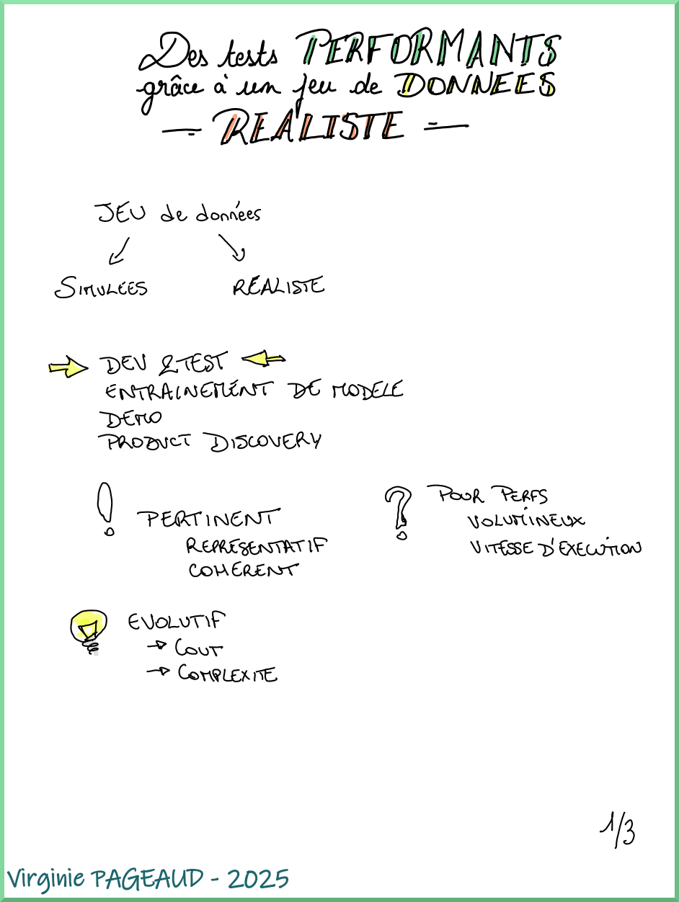
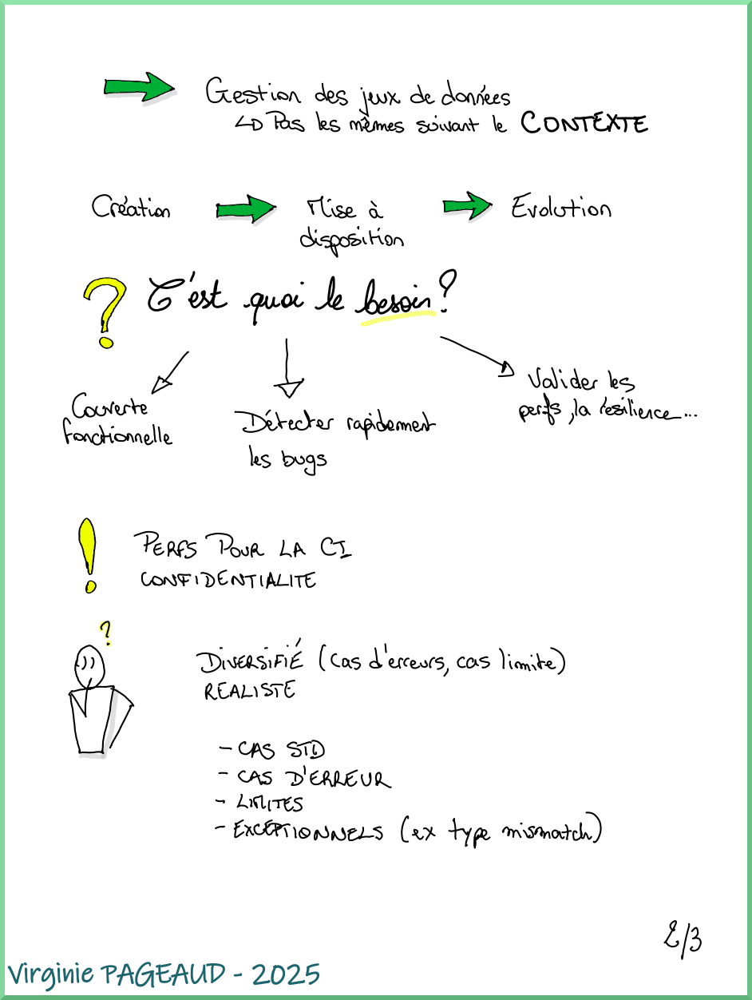
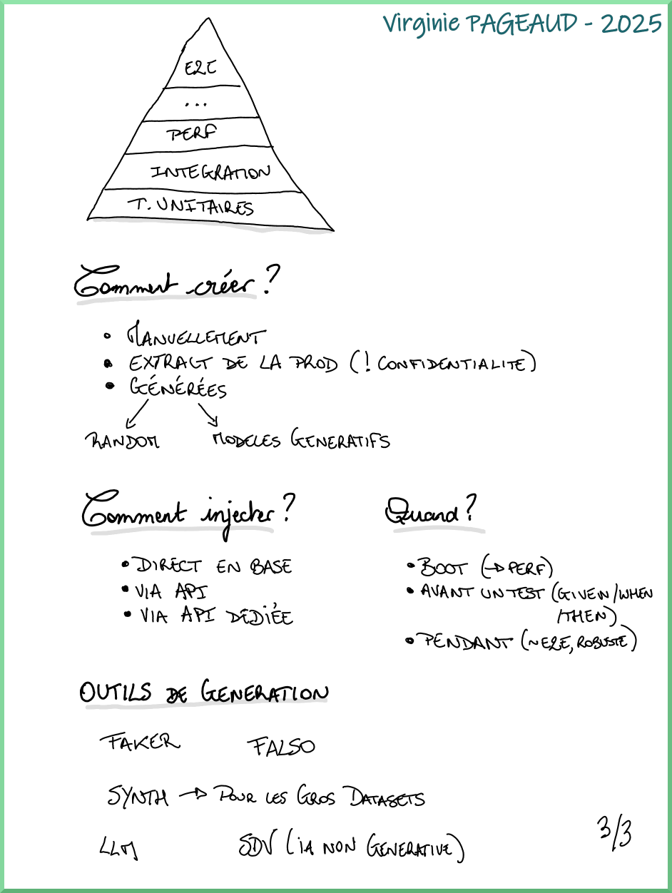
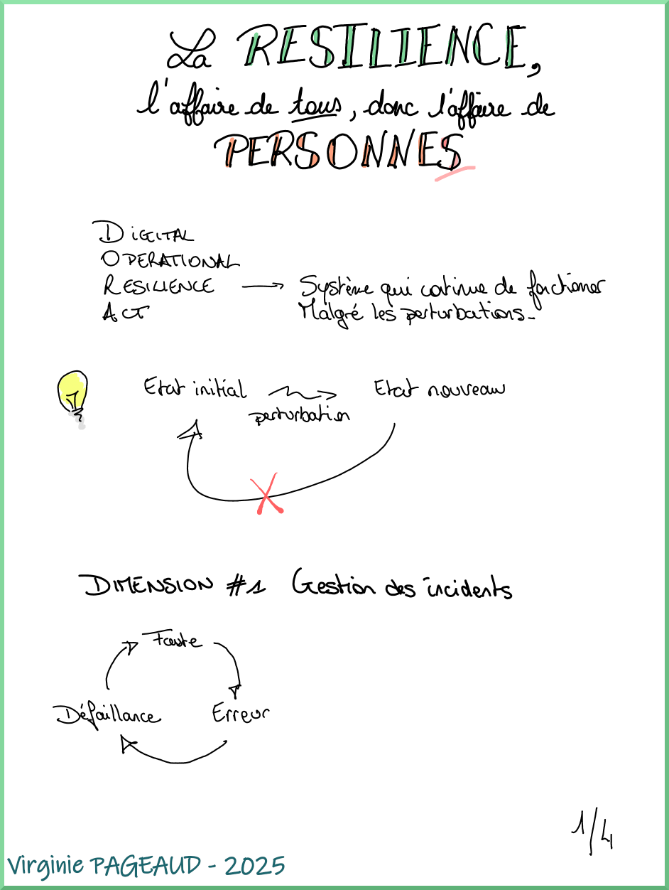
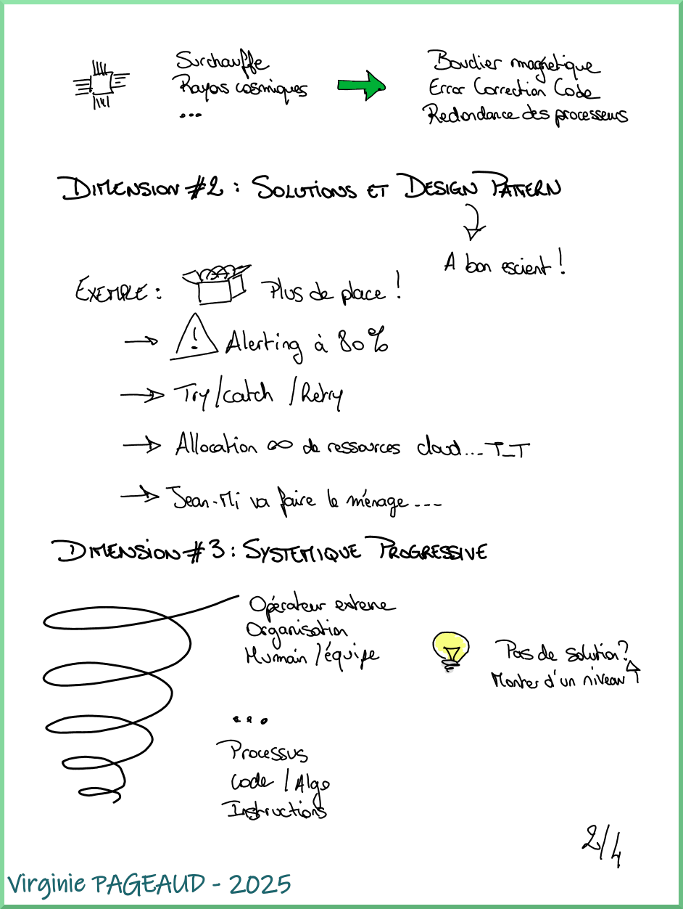
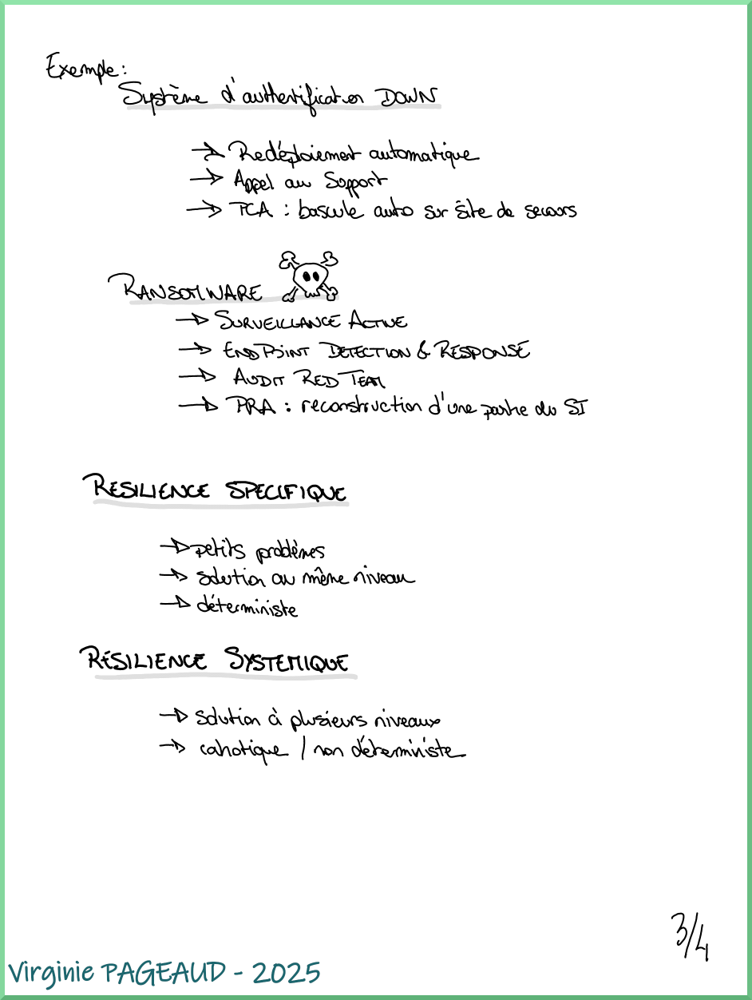
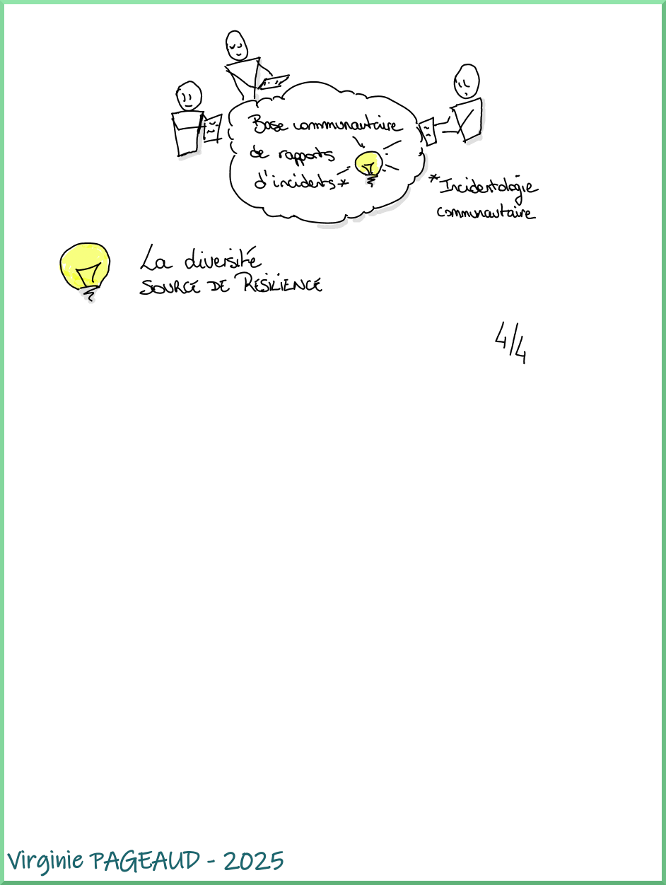

+++
title = "SnowCamp 2025"
date = 2025-02-12
draft = true
tags = ["conference", "sketchnotes", "bénévolat"]
categories = ["tech"]
+++

**_La conférence tech au cœur des Alpes_**

Depuis un an maintenant, je fais partie de l'équipe d'organisation de la conférence SnowCamp qui se déroule à Grenoble.  

D'abord coach pour la première édition du tremplin au SnowCamp, j'ai ensuite intégré complètement l'équipe en revêtant la veste blanche des bénévoles en 2024.  

Pour cette édition 2025 qui s'est déroulée du 22 au 25 janvier, j'avais donc toujours cette veste blanche, avec en prime durant l'année écoulée la casquette de référente pour l'organisation de la deuxième édition du tremplin (une initiative de [CraftsRecords](https://craftsrecords.org/)), en plus du "quotidien" au sein de l'équipe comme la sélection des sujets, et l'amélioration continue de l'événement.  

Allez, je m'en vais vous raconter tout ça.

# Le SnowCamp plus en détail

Le SnowCamp, c'est une conférence tech, dont la ligne éditoriale se veut très axée sur l'aspect technologie (avec néanmoins un petit peu de place pour d'autres types de sujets avec une catégorie "Hors piste").  
Elle se déroule sur 4 jours :  
- mercredi : les universités, des sessions de 3h pour se plonger dans un sujet ou une techno  
- jeudi et vendredi : les conférences plus classiques sur un format de 20 ou 45 minutes  
- samedi : une _unconférence_ sur les pistes de ski ou en randonnée raquettes pour échanger de façon moins formelle entre intervenant·es et participant·es

# La préparation du tremplin

Cette année je m'étais portée volontaire pour être en charge de l'organisation du tremplin.  
Le comité étant une association, ce n'est pas pour autant que j'étais seule à la barre, j'étais la référente et un peu cheffe d'orchestre de l'activité.  

Organiser le tremplin signifie trouver des coaches, gérer le CFP (Call For Proposals, c'est à dire les candidatures), organiser les sessions de sélection des candidats et candidates, organiser les répétitions et la grande soirée du tremplin.  

Avec au milieu un nouveau job de mon côté que j'ai commencé au mois d'octobre, tout un programme !  

Pour cette édition, l'ouverture du CFP était au début de l'été, jusqu'à la mi-septembre. Nous avons ensuite procédé à la sélection des sujets, et débuté l'accompagnement en octobre, et programmé la soirée du tremplin le 18 décembre.

Au programme nous avions :  
- *"LinkedIn Mastery, Être Bruce Wayne ou Batman : sous les projecteurs ou dans l’ombre"* par Jade Crotto-Miglietti  
- *"Donjons et Pythons: la chevaleresse à la rescousse"* par Juliette Grillère  
- *"La joie des deadlines"* par Eric Papazian  
- *"Ensemble jusqu'en prod : comment nous avons transformé notre vision du 'terminé'"* par Thibault Rihet  
- *"Smalltalk, voyage futuriste dans le passé !"* par Lionel Armanet  
- ~~*"Vanilla JS et le Web standard : c'est sous côté en fait !"* par Pierre Arquier et Igor Zachcial  

La captation de la soirée est disponible sur la chaîne Youtube de CraftsRecords : https://www.youtube.com/playlist?list=PLIYXcdwc2smEPm2cWq14-qyPvm4qZ0Hig.  

# Les jours-J

Bien que la conférence se déroule sur 3 jours avec les universités du mercredi, pour ma part je n'ai pris part que les 2 jours de conférences classiques jeudi et vendredi, n'étant pas disponible mercredi.  

## Côté orga

Assister à une conférence, c'est déjà quelque chose qui me demande beaucoup d'énergie en général.  
Faire partie de l'orga, encore plus ! Mais c'est aussi ce que j'aime dans l'organisation : être en mouvement, accompagner les intervenant·es et participant·es et apporter ma contribution à la tenue d'un événement qui a de l'importance à mes yeux.  

On arrive en général dès l'ouverture des lieux, à 8h environ, afin d'accueillir les sponsors qui vont alors monter leurs stands, préparer les banques pour l'accueil des visiteuses et visiteurs, ou encore vérifier le bon fonctionnement de l'application de billetterie sur le téléphone.  
L'accueil du jeudi matin est le plus intense, car en plus de valider les billets, nous devons remettre à chaque participant·e son badge d'accès pour la conférence, ce qui prend évidemment un certain temps.  
Le reste de la journée s'enchaîne assez vite.  
Nous nous répartissons la présence à l'accueil ainsi que l'installation des speakers dans leur salle tout au long de la journée.  
Ca n'a l'air de rien comme ça, mais il est important d'être là pour se charger de la mise en place du micro, vérifier que l'écran fonctionne, et éliminer un peu de stress que certaines et certains peuvent avoir au moment d'intervenir (même pour des speakers "aguerris" !).  

A la fin de la journée, le "Meet&Greet" prend place : un temps d'échange entre visiteur·euses, intervenant·es et sponsors autour d'un buffet et de boissons.

Il y a également ensuite le repas speaker dans un restaurant de Grenoble, l'occasion de passer un moment de détente autour d'un bon repas !  

La journée du vendredi démarre un peu plus calmement en général, mais avec un grand besoin de café :sweat_smile: 
Elle s'enchaîne elle aussi assez vite, et s'achève par le traditionnel service de Chartreuse verte _(à consommer avec modération)_.  

## Côté talks et sketchnotes

Je n'avais pas fait de sketchnotes depuis un certain temps au moment du SnowCamp, et je me suis rendue compte que j'avais un peu les mêmes difficultés que lorsque j'ai commencé à en faire : avoir une vision de synthèse, et ne pas trop écrire de texte.  
De plus, j'ai utilisé pour la première fois à cette occasion une [tablette numérique](https://shop.boox.com/products/noteair4c?gad_source=1&gclid=Cj0KCQjw4v6-BhDuARIsALprm33kMT2Poyxynrjq48xgCeZ7bNG1oUY3XoPZo9bJUiJYUXGrN0JMlA4aAvuiEALw_wcB). Je n'avais pas encore toutes mes marques, ce qui a donc un peu ralenti mon rythme de prises de notes (surtout qu'en plus je gérais l'installation des speakers en question en même temps).  
Je n'ai pas toujours pris de notes, notamment pendant le quiz "Questions pour un conteneur" d'Aurélie et :TODO: (difficile d'écrire et répondre au quiz sur le téléphone en même temps 🤣), ou encore pendant le talk de Marcy sur le techno-autoritarisme. 

Voici le récap des talks auxquels j'ai assisté, ainsi que les notes prises pour l'occasion.

### Bâtissez des applications invincibles grâce à `TEMPORAL`

  

### Des tests performants grâce à un jeu de données réaliste

  
  
  

### Intégrons, faisons grandir et progresser les jeunes dev
_Bonnes pratiques et retours d'expériences à l'intention des (vieux) devs_

<!-- Pas de sketchnote -->

### La résilience, c'est l'affaire de tous, donc c'est l'affaire de PersonneS !

  
  
  
  

### Questions pour un conteneur

### Keynote Shirley

### Dockerfile ou buildpack ? Mais au fait, c'est quoi buildpack ?

### Sablier : Démarrez et arrêtez automatiquement vos applications peu utilisées

### Green full-stack lantern

### Techno-autoritarisme et design persuasif