+++
title = "Volcamp 2025"
date = 2025-10-10
tags = ["conference", "sketchnotes"]
categories = ["tech"]
+++

**_L'éruption des Techs_ 🌋**

En ce mois d'octobre j'ai eu le plaisir de participer pour la deuxième fois à la conférence [Volcamp](https://www.volcamp.io/) à Clermont-Ferrand, en tant qu'oratrice.  
Alors que [ma première venue](../../2023/volcamp/index) datait de 2023, je venais présenter cette année un sujet dans un format que je n'avais pas encore expérimenté : un lightening de 15 minutes sur l'outil [Typst](https://typst.app/).  

Les captations des talks sont disponibles sur [la chaine Youtube de la conférence](https://www.youtube.com/watch?v=0jQe44F1Ibc&list=PLL-xGFWSe4-JfIOiJChWYWXkz0ksUg2Ej).

C'est parti pour le récap' et les sketchnotes.

# Mercredi 1er octobre - Soirée speaker

Comme la fois précédente, la soirée speaker s'est déroulée au bar The Salvation Jane au centre-ville de Clermont-Ferrand.  
La soirée était très sympa, c'est toujours agréable de rencontrer les copaines oratrices et orateurs. J'ai passé une bonne partie de la soirée avec Olivier Poncet que j'avais vu pour la dernière fois 2 ans auparavant, à cette même conférence (à notre grande surprise, nous ne pensions pas que cela faisait si longtemps 😅).  

# Jeudi 2 octobre

## Keynote
_Format conférence 45 minutes_

**[Estelle Landry](https://www.linkedin.com/in/estelle-landry-61866b71/)**  
**[Emilie Goubin](https://www.linkedin.com/in/emilie-goubin-86b0a6251/)**  

La keynote d'ouverture présentée par Estelle et Emilie parlera sûrement à beaucoup d'entre vous si vous avez des enfants dans votre entourage. Elle aborde en effet le thème de l'apprentissage du numérique auprès des enfants, qui sont souvent confrontés à des contenus inappropriés, des informations et des ragots qui se propagent à une vitesse que nous n'avons jamais connue à leur âge, et du harcèlement numérique contre lequel il est extrêmement difficile de lutter.  
Les chiffres sont affolants, et il faut bien avouer que nous parents ou entourage adulte de génération X et Y ne savons pas forcément comment leur apprendre à utiliser cet objet qu'est le smartphone et maîtriser les réseaux sociaux.  

C'est là qu'apparaît [Pix](https://pix.fr/), service public pour l'apprentissage du numérique, qui a lancé [Pix Junior](https://pix.fr/enseignement-primaire) en septembre 2024 à destination des élèves de CM1/CM2.  

Durant leur keynote, Estelle et Emilie nous décrivent les étapes de la création de ce programme, un bel exemple de travail collaboratif !  

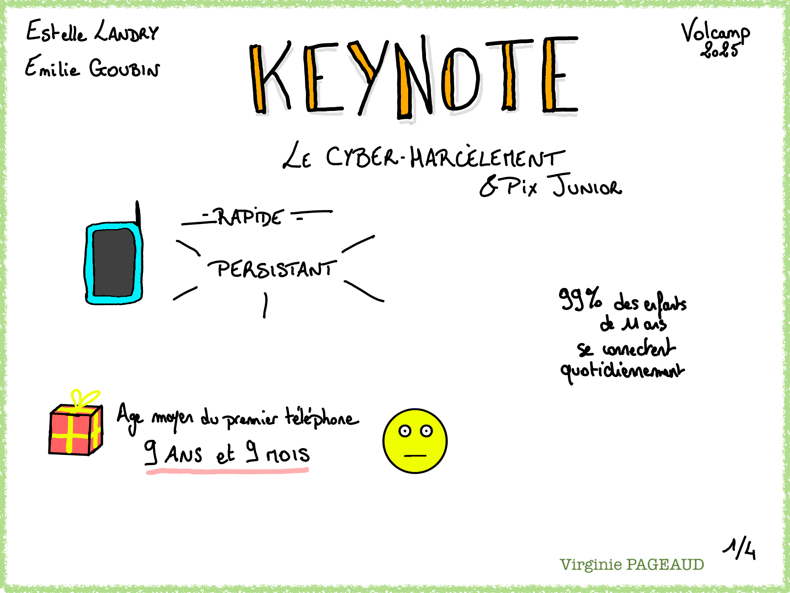  
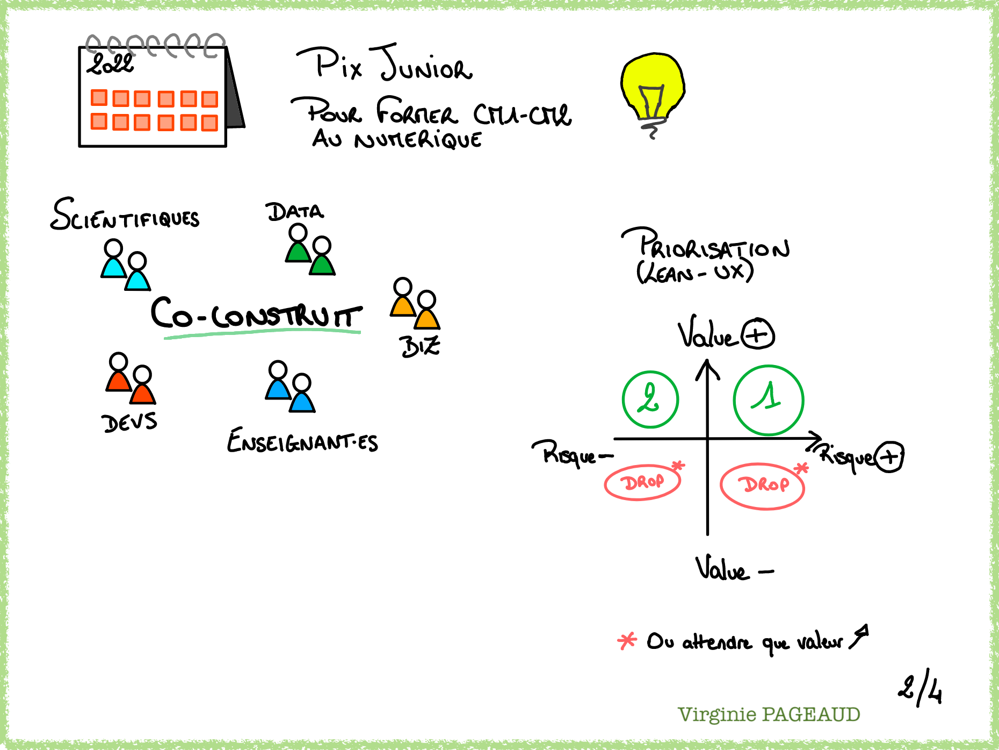  
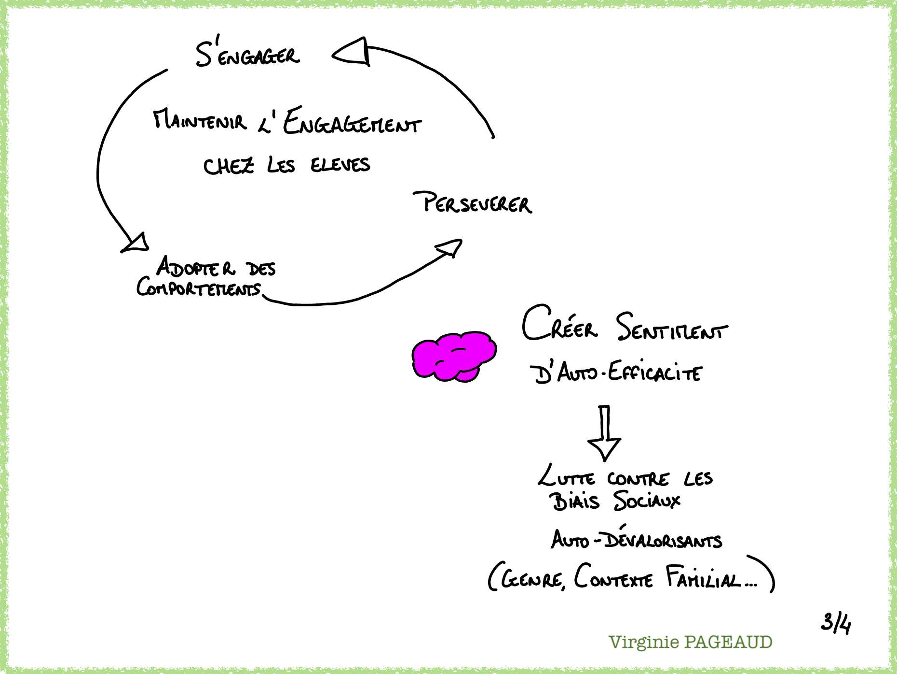  
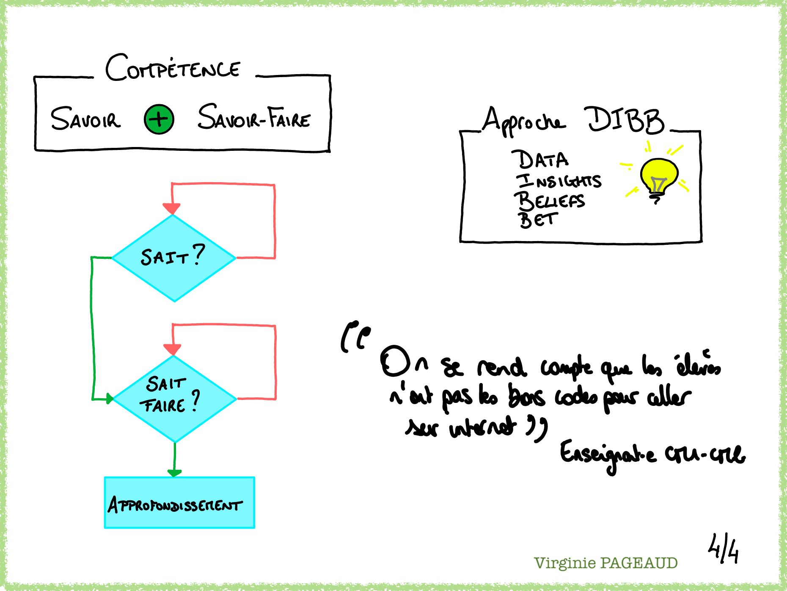  

## Créer son propre Jeu de Rôle en Agentic AI & MCP
_Format conférence 45 minutes_

**[Tiffany Souterre](https://www.linkedin.com/in/tiffanysouterre/)**  
**[Olivier Leplus](https://www.linkedin.com/in/olivierleplus/)**

Suite à la keynote, je suis allée en apprendre un peu plus sur les IA avec le talk de Tiffany et Olivier, qui nous ont montré comment développer un assistant MJ pour ses parties de jeu de rôle (cas d'usage typique évoqué, l'équipe décide de prendre une direction non anticipée, et il faut vite créer des PNJ et leur background pour peupler la taverne).  
J'ai bien apprécié ce talk, très accessible, et didactique 🎲  
Et on n'oublie pas de bien documenter ses méthodes pour les rendre accessibles en MCP !

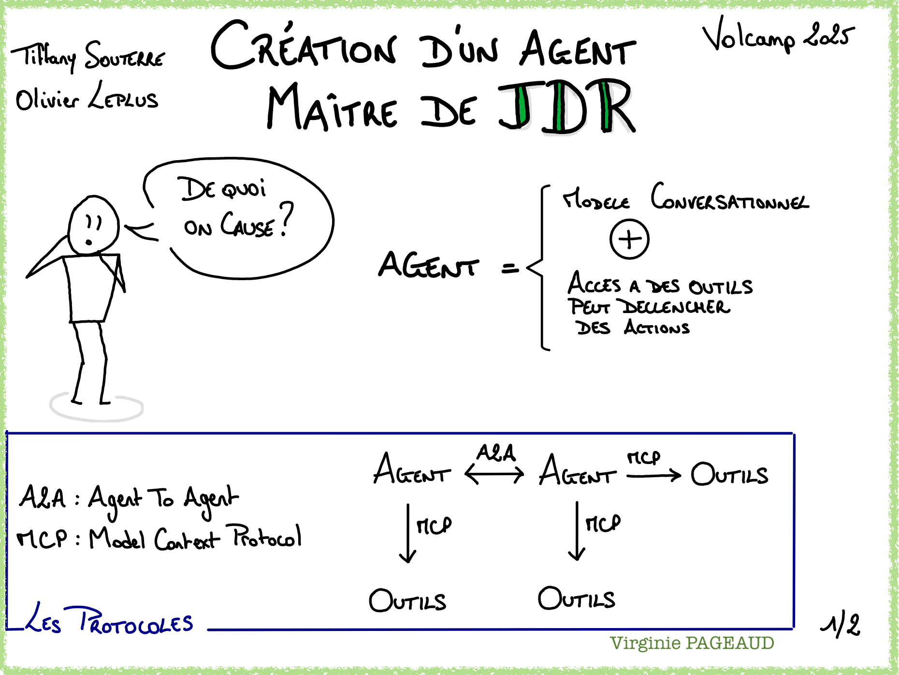  
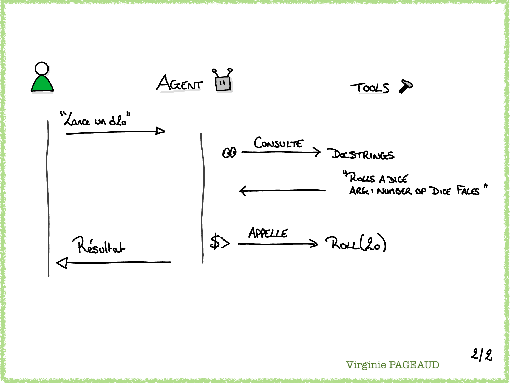  

## Pause gourmande

A la pause matinale, on reprend des forces avec les plateaux de fromages du coin 🧀.  
Une bénédiction quand on fait un talk en début de pause déjeuner et qu'il va falloir attendre pour l'aligot et les saucisses du midi !  

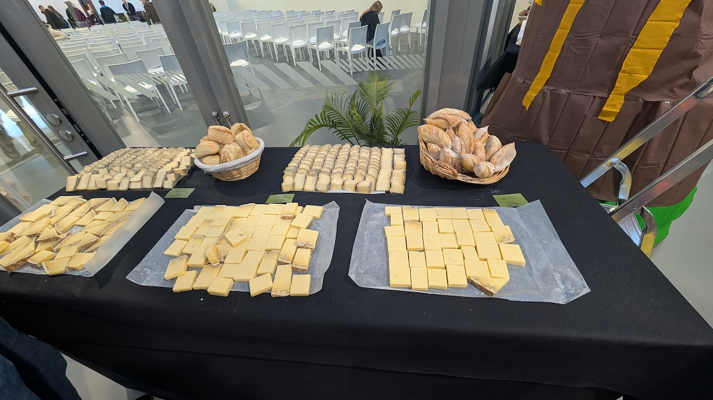  

## Se réapproprier internet par les noms de domaines
_Format conférence 45 minutes_

**[Arthur Vuillard](https://www.linkedin.com/in/arthur-vuillard/)**

Dernier talk avant la pause déjeuner et mon intervention, celui d'Arthur qui nous parle de la complexité de la gestion des noms de domaines.  
Je suis un peu restée sur ma faim avec ce talk, d'autant qu'il n'a duré que 30 minutes. Il manquait selon moi une partie détaillant les étapes à suivre pour déclarer/acheter/utiliser un nom de domaine, et comment se réapproprier internet quelque part.  
Je n'ai pas eu l'impression d'avoir la réponse à la question, ou en tous cas pas de façon suffisamment pratico-pratique.  
Mais le talk est un bon début, à retravailler de mon point de vue.

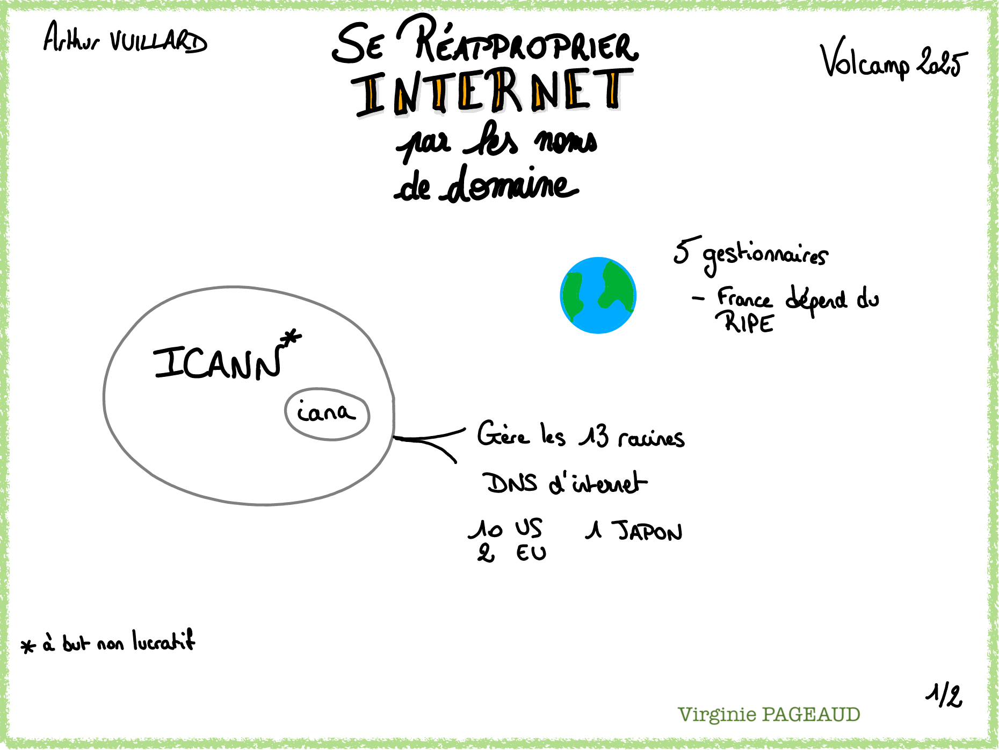  
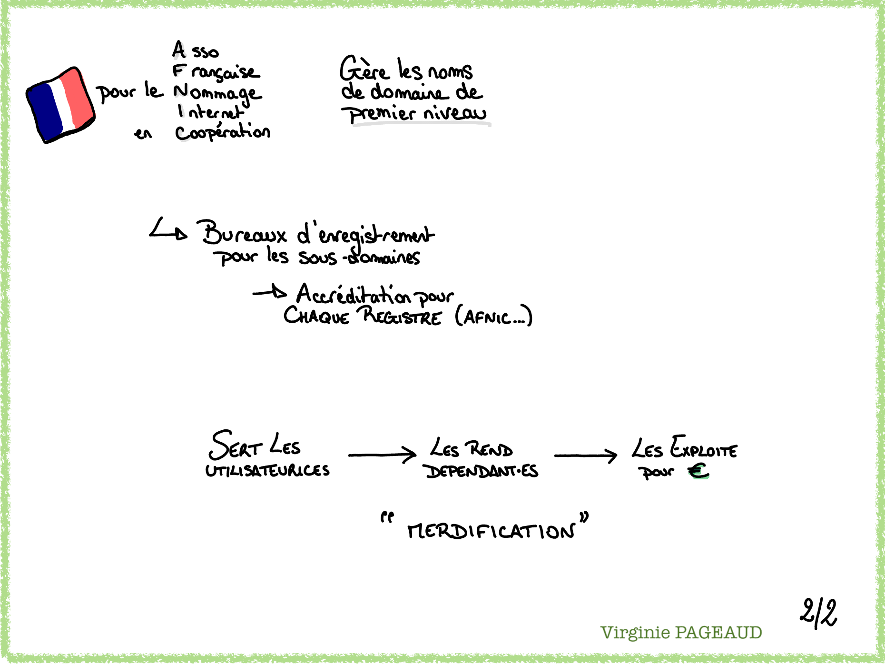  

## T'as vu mes docs ? Je les fais en Typst !
_Format lightening 15 minutes_

Avant de pouvoir profiter de l'aligot, j'ai présenté mon talk sur Typst depuis le FabLab.  
Je trouve qu'il s'est bien passé, j'ai eu des questions intéressantes qui me permettront de creuser le sujet et ajouter du contenu pour un éventuel format 20 minutes si l'occasion se présente.  
Les slides sont disponibles [juste ici](./mes_docs_en_Typst.pdf).  

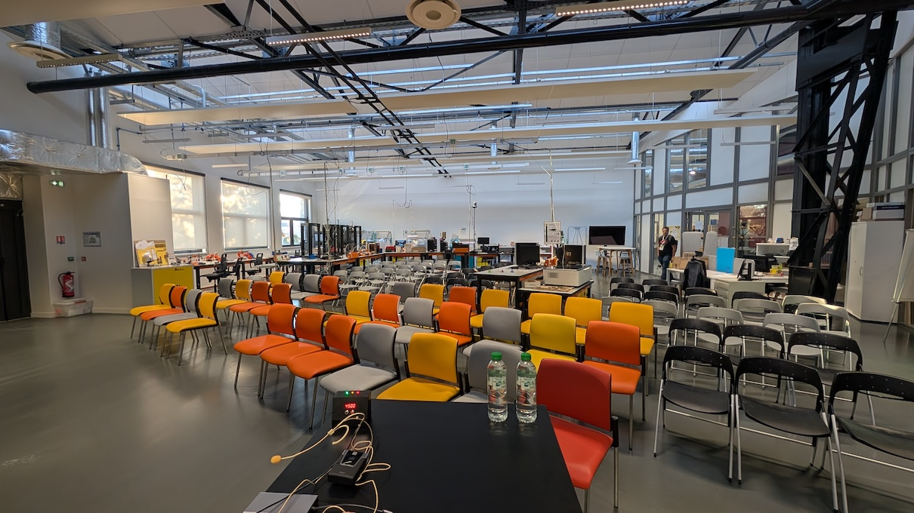  

## Le code dont vous êtes le héros ou l'héroïne, +5 en agilité, +10 en fun !
_Format conférence 45 minutes_

**[Paul Roye](https://www.linkedin.com/in/paulroye/)**

Après la pause déjeuner, je suis allée découvrir les principes et mécanismes de la gamification, qui permettent d'apporter un peu de dynamisme, de _team building_ et une pause ludique dans les équipes, sans pénaliser la productivité (au contraire !), ni prétendre résoudre d'éventuels problèmes organisationnels ou systémique (c'est toujours bon de le rappeler...).  
Moi qui ait toujours été intéressée par la psychologie et les neurosciences, j'ai été très intéressée par le sujet. Il était de plus bien présenté, ce qui donne envie d'essayer à l'occasion !  

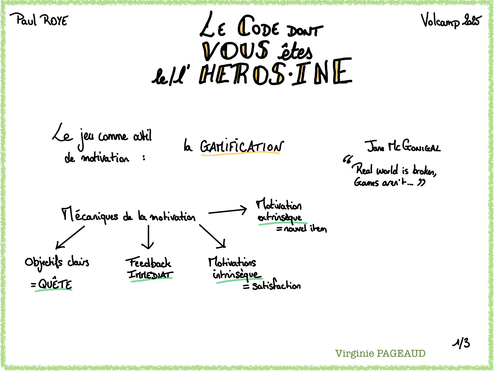  
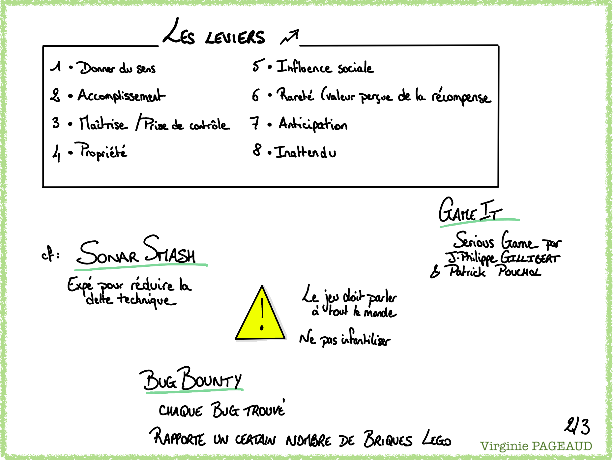  
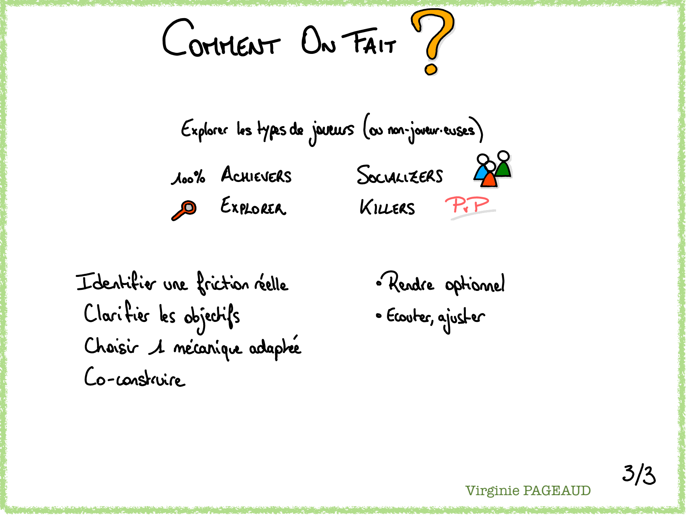  

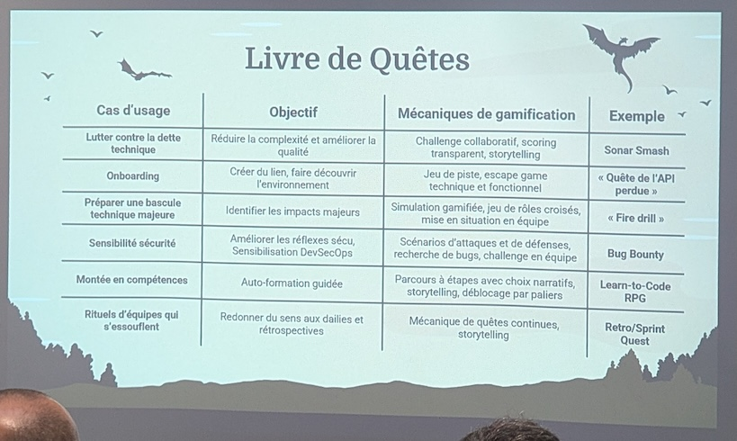

## 🎵 Faire une virée à deux, tous les deux sur les chemins 🎵
_Format conférence 45 minutes_

**[Rémi Leclere](https://www.linkedin.com/in/remi-leclere-b52034135/)**

J'ai poursuivi avec une présentation technique sur la création d'applications pour Android Auto.  
J'ai pu découvrir comment on passe d'une application Android classique à sa version Android auto, grâce à un live coding avec même une démo sur un équipement de test physique. J'ai été surprise de voir la simplicité avec laquelle on pouvait le faire, intuitivement j'aurais cru qu'il fallait développer une application complètement à part, mais non.  
Le principe est de sélectionner un template d'application Android Auto parmi les quelques définis par Google (selon l'usage, par exemple lecteur de musique, application de guidage, application utilisant la géolocalisation mais sans guidage...). Ensuite, on "relie" ça à la partie fonctionnelle de son code et "c'est tout".  

Je n'ai pas pris de sketchnotes, exercice difficile en live-coding je trouve 😅

## Les pires défaillances (logicielles) en 10 ans de téléradiologie d'urgence
_Format conférence 45 minutes_

**[Jean-Yves Laugel](https://www.linkedin.com/in/jeanyveslaugel/)**

Dernier sujet de la journée auquel j'ai assisté, un florilège d'incidents rencontrés en 10 ans au sein d'un système de radiologie d'urgence.  
Les 45 minutes furent trop courtes, Jean-Yves avait beaucoup à nous raconter à ce sujet.  
J'ai beaucoup apprécié la façon dont il a présenté les incidents, avec un grand naturel et toujours des explications sur comment la crise a été gérée, et les améliorations qui en ont découlé.  

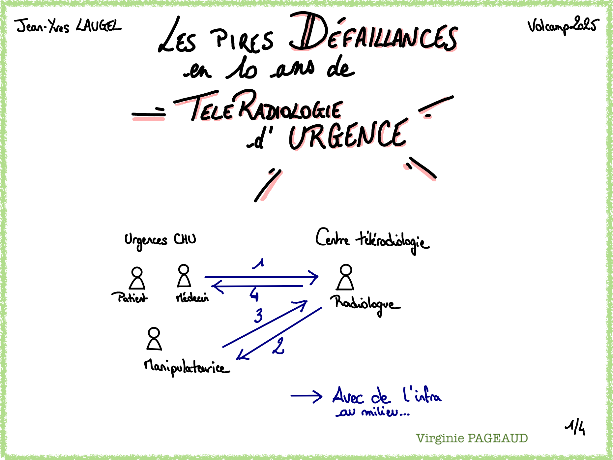  
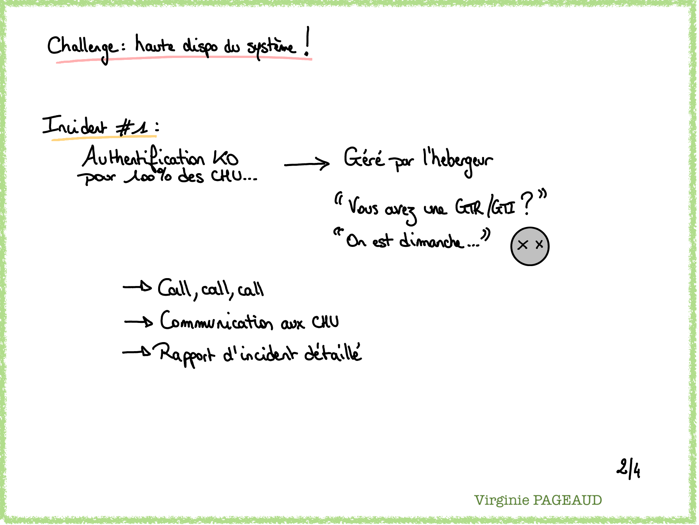  
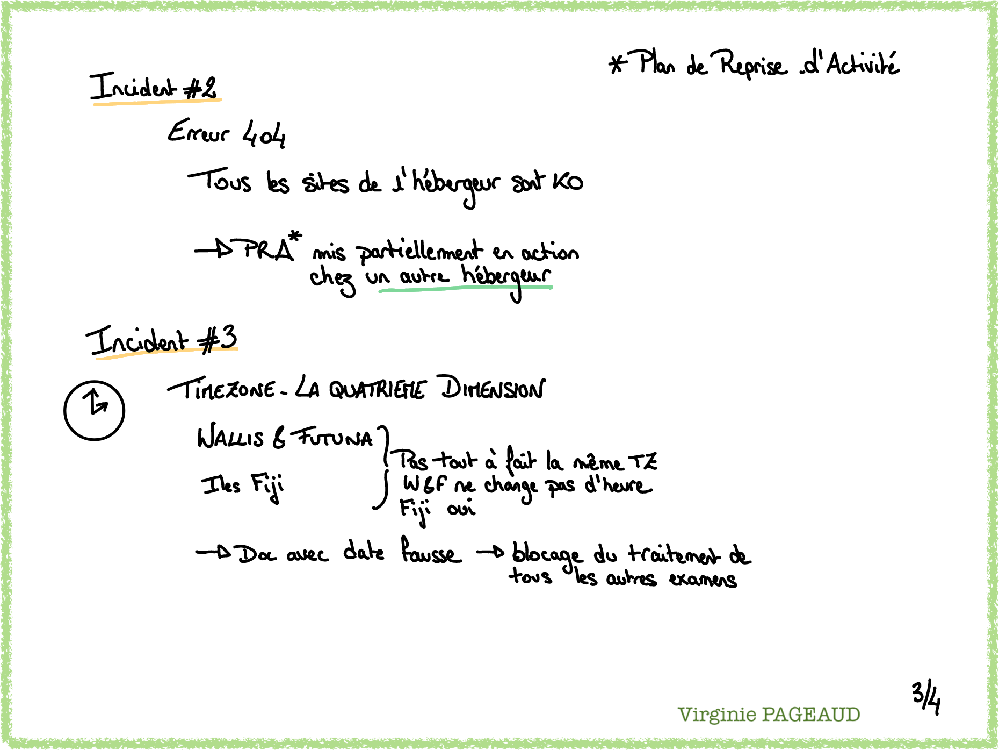  
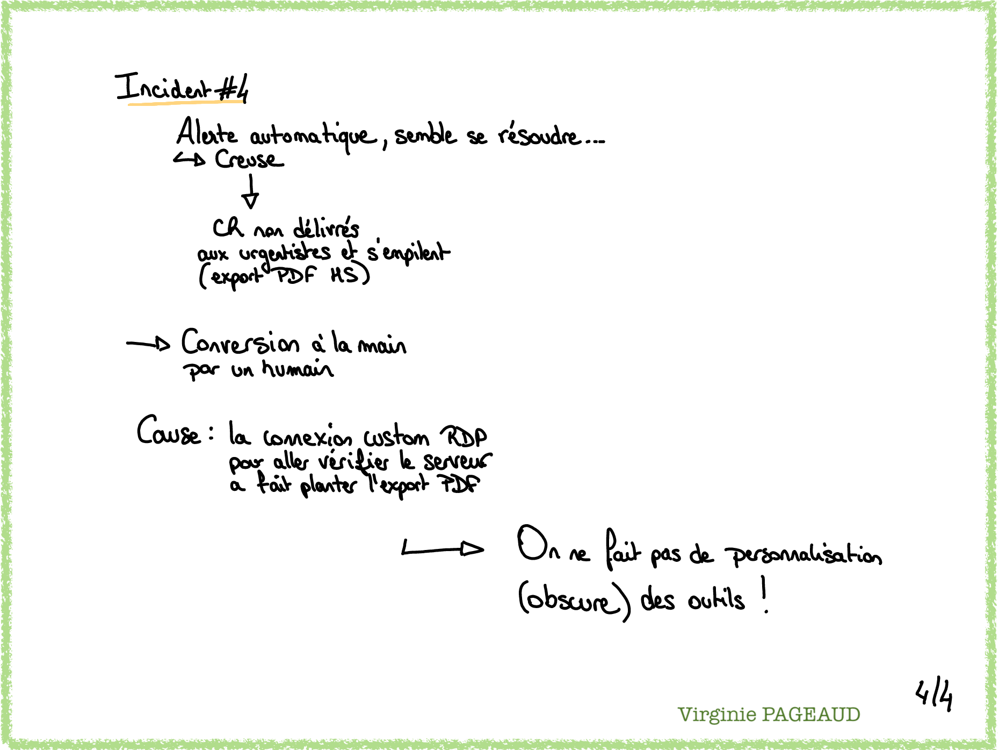  

## Soirée à _The Oval_

Le jeudi soir, l'équipe d'organisation a convié toutes les personnes présentes à la conférence à se retrouver à la brasserie _The Oval_, au pied du stade Michelin.  
En prime, une animation DJ réalisée par David Pilato.  
Au programme, discussions en tous genre autour de boissons et plateaux de charcuterie et fromage.  

# Vendredi 3 octobre

## Keynote
_Format conférence 45 minutes_

**[Alexandre Zapolsky](https://www.linkedin.com/in/alexandrezapolsky/)**

Je suis un peu partagée concernant la keynote de vendredi.  

D'un côté, le fond du sujet que je trouve très pertinent : notre dépendance aux GAFAM, et l'argent (notamment l'argent public) dépensé pour aller directement dans les poches des géants américains, sans compter l'aspect souveraineté numérique.  
Dans la forme, j'ai trouvé le ton un peu trop donneur de leçons envers les individus, et "publicitaire" pour sa propre suite logicielle.  

Pas de sketchnote non plus ici, je n'avais rien d'intéressant à noter.  

## Another world, une belle leçon d'architecture
_Format conférence 45 minutes_

**[Olivier Poncet](https://www.linkedin.com/in/olivier-poncet-33369010/)**

Dernier talk avant que je ne doive prendre le chemin du retour, la présentation de l'architecture du jeu Another World, véritable révolution à son époque (développé par Eric Chahi, _cocorico_ 🇫🇷).  
Nous avons plongé au cœur des registres, zones mémoires et mapping avec les interfaces physiques pour découvrir l'exploit technique derrière ce jeu.  

Pas de sketchnotes non plus ici, le sujet était difficile à dessiner pour moi (allez voir la vidéo !).

# Conclusion

C'était une belle édition, je suis ravie d'avoir pu y participer. J'ai appris de nouvelles choses, fait de nouvelles rencontres et passé de bons moments.  
L'accueil était au top (merci aux orgas pour la salle speaker ultra confortable et pratique !), la nourriture excellente.  
Il manquait juste un peu plus d'alternatives végétales dans les menus (ne serait-ce que pour préserver nos estomacs, et permettre à tout le monde de profiter des victuailles 😉).  

J'aurais aimé pouvoir rester jusqu'à la fin, mais grâce à la captation je pourrai visionner les talks que j'ai manqués le vendredi comme celui de Marc Chevaldonné sur [la SFUI](https://www.youtube.com/watch?v=dDWdOftYWYE&list=PLL-xGFWSe4-JfIOiJChWYWXkz0ksUg2Ej&index=32).  