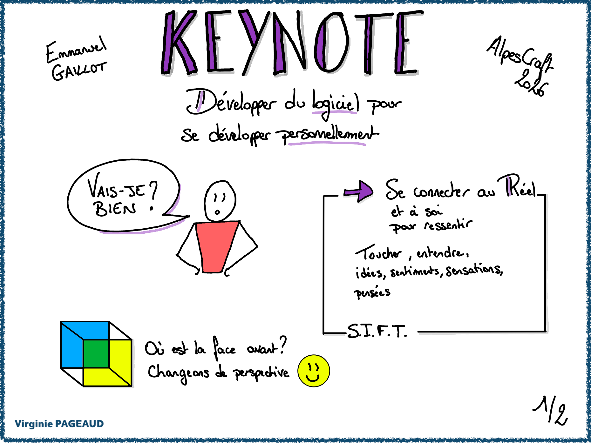
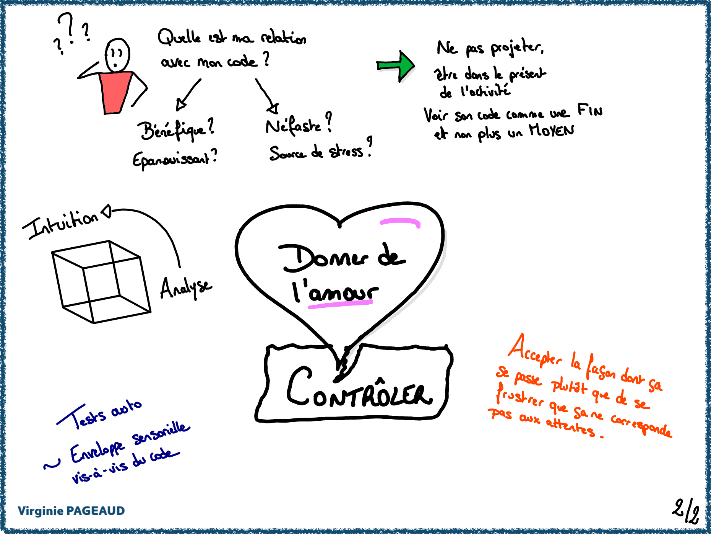
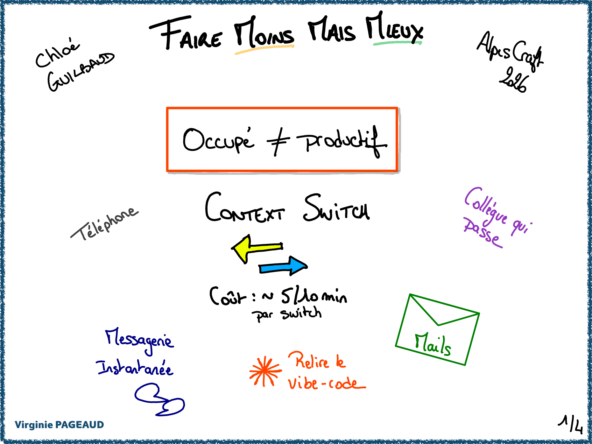
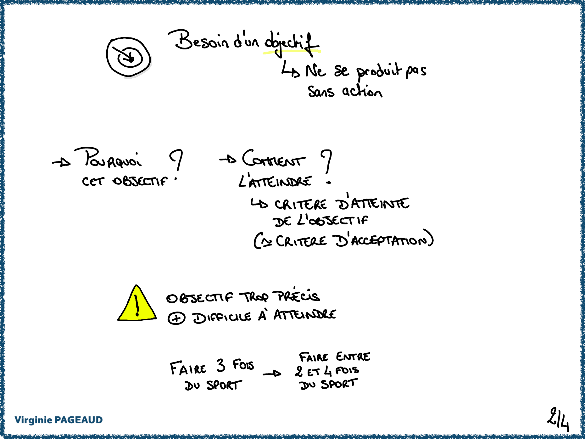
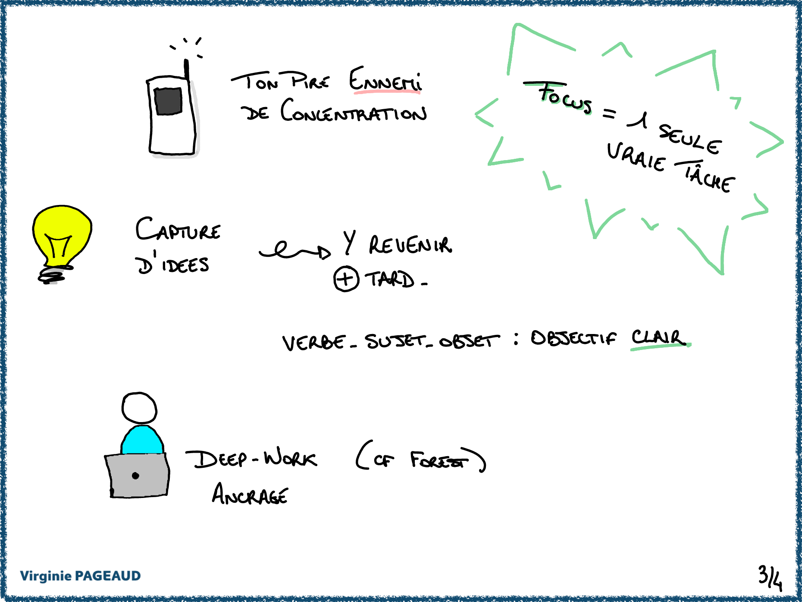
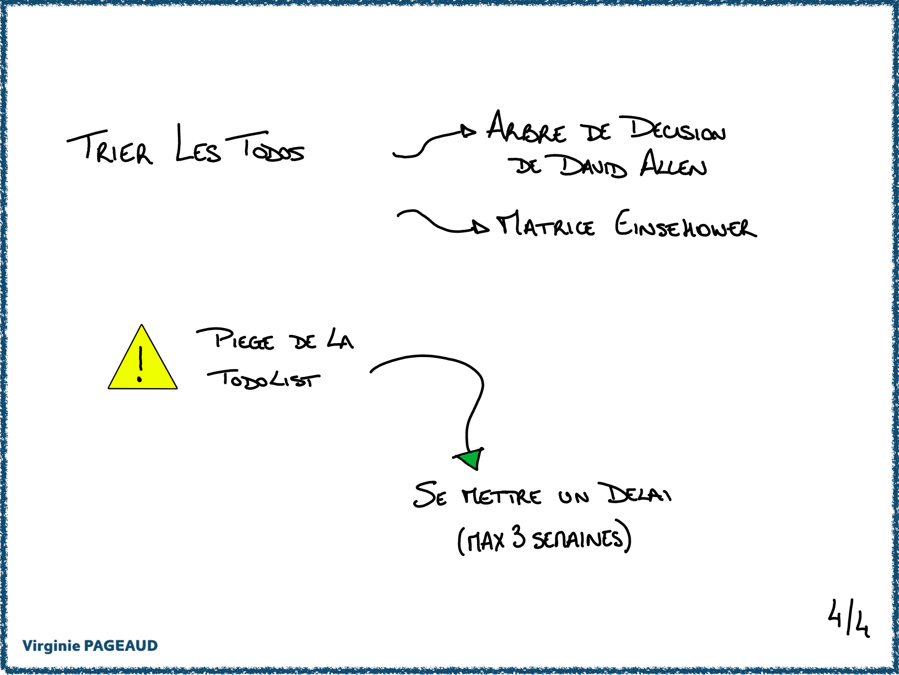

+++
title = "AlpesCraft 2026"
date = 2026-06-17
tags = ["conference", "sketchnotes"]
categories = ["tech"]
+++

Début juin j'ai eu le plaisir de participer pour la première fois à la conférence [AlpesCraft](https://www.alpescraft.fr/) à la fois en tant que participante et speaker.
C'est une petite conférence qui se passe à Grenoble, avec un format un peu moins habituel comparé aux conférences auxquelles j'assiste habituellement :
- la première journée, des talks "classiques" sont présentés, en parallèle de slot "office hour" durant lesquels un·e intervenant·e est présent·e pour répondre aux questions des participant·es
- la deuxième journée consiste en une unconférence : tout le monde peut proposer un sujet qu'il ou elle aimerait présenter ou un besoin "d'aide" sur un gros post-it, qui sont ensuite [placés sur un grand mur](https://photos.google.com/share/AF1QipNhfIDyJKdVGS8bPSKw9kM-0_Ehe3keUN4e-b3g1PewUvhiIrQRh-f3JnTH0QOGPg/photo/AF1QipNvf3or17LMZHzOivjJHViuzrhAo40C1qB5U3-V?key=TUpTaEhxcmRmcWowLW1QMkU1OVhXTks3VTNYME5B) pour répartir les horaires et lieux

J'ai fait 2 sketchnotes lors d'événement, sur 3 conférences auxquelles j'ai assisté le jeudi.
J'y ai présenté un sujet créé spécialement pour l'événement : _"Les quêtes secondaires ça n'est pas que dans les jeux vidéo !"_, et ai proposé 2 sessions lors de l'unconférence le vendredi : une démo de Typst, l'outil avec lequel je crée mes slides, et une initiation à l'art des sketchnotes.

Le programme et les photos de cette édition 2026 sont disponibles sur [le site de la conférence](https://www.alpescraft.fr/edition_2026/), ainsi que [les replays](https://www.youtube.com/watch?v=4vEu9eHWqc8&list=PLFZn9r_gMRpgtUX8xNg9MB8gXb-C3wD9_) sur la chaîne Youtube.

## Jeudi 4 juin

### Keynote

### Faire moins mais mieux

### 7 minutes x 7 langages

### Les quêtes secondaires IRL

[Le replay](https://www.youtube.com/watch?v=Fi0dj8ssY_k&list=PLFZn9r_gMRpgtUX8xNg9MB8gXb-C3wD9_&index=7)