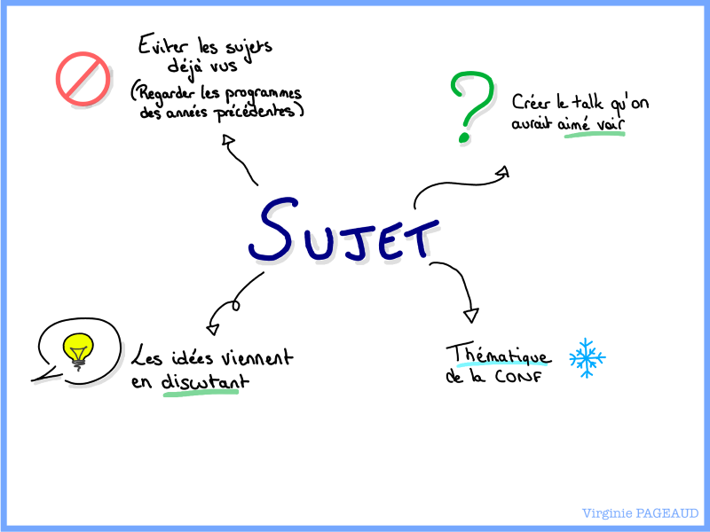
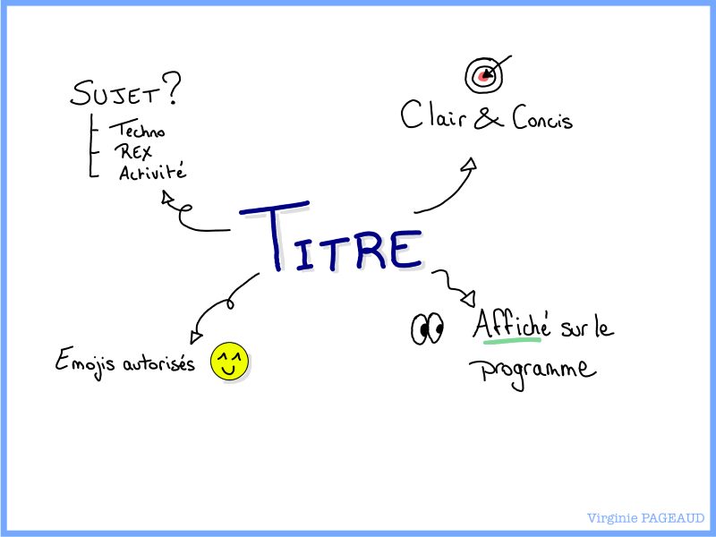
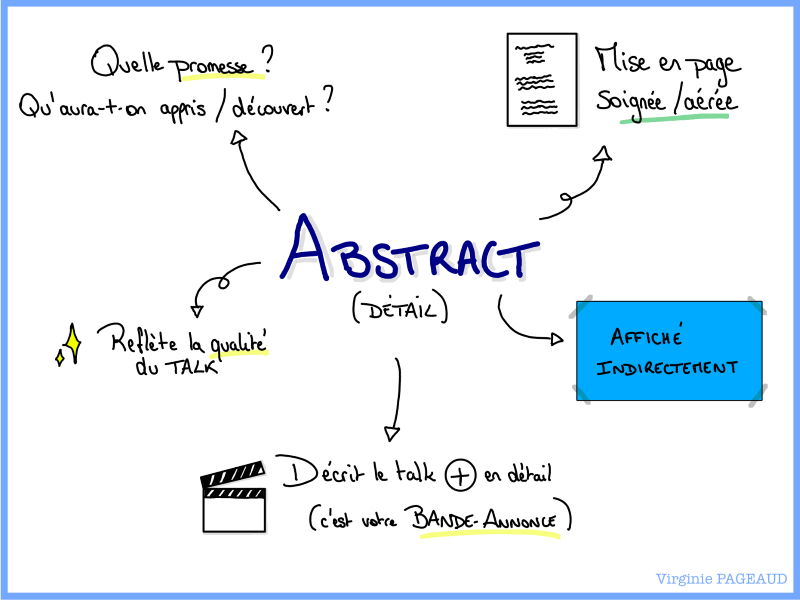
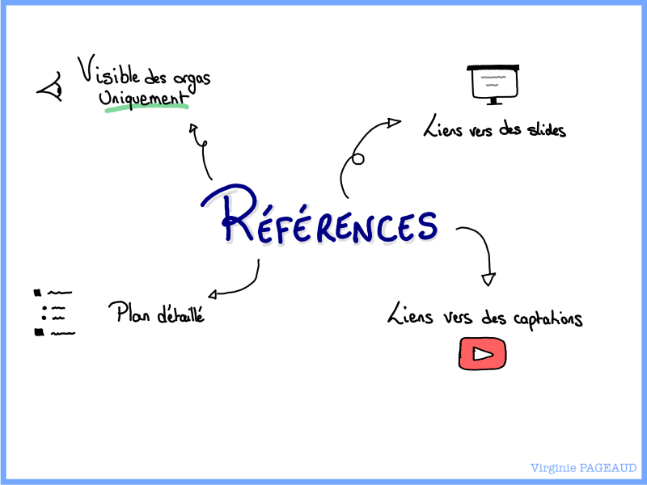

+++
title = "La cheatsheet de vos CFP"
date = 2026-09-10
tags = ["conference", "sketchnotes"]
categories = ["tech"]
+++

Il y a quelques mois (euh, presque 1 an ?!) les [Human Coders](https://www.linkedin.com/company/human-coders/) m'ont contactée pour obtenir quelques conseils à donner quant à la soumission de candidature à un CFP (Call For Proposals).  
En tant qu'oratrice, et membre de l'organisation du [SnowCamp](https://snowcamp.io/), je me suis empressée d'accepter.  

Le podcast est sorti en décembre dernier, et je m'étais dit que ce serait l'occasion de faire une cheatsheet en sketchnote à partager ici.  
Vous vous en doutez, le temps a filé _eeeet_, je viens seulement de finir (bon, ok, j'avais peut-être aussi **oublié** que j'avais commencé à dessiner ça).  

Bref, voici quelques conseils pour augmenter ses chances d'être sélectionné·es à un CFP (tout en sachant que les comités de sélection reçoivent en moyenne 5 fois plus de candidatures que de slots de talk) [en podcast](https://www.humancoders.com/podcast/conferences-10-conseils-pour-etre-selectionne-e-a-un-cfp-repondeur-11), et en sketchnotes :

  
  
  

