+++
title = "Sketchnotes 101"
date = 2026-09-20
tags = ["sketchnotes"]
categories = ["tech"]
+++

Aujourd'hui je voudrais vous partager comment j'ai découvert et me suis entrainée à réaliser des [sketchnotes](https://fr.wikipedia.org/wiki/Sketchnoting), cette façon d'allier textes, icônes et dessins sur un même support. Permettant non seulement d'organiser les informations et idées, cela nous oblige par ailleurs à faire une synthèse du discours (ou plus largement d'un sujet, on y reviendra) et facilite l'écoute active.  
La promesse est belle : pas besoin de savoir dessiner, acquisition d'une meilleure concentration et capacité de compréhension, entre autres. Et puis la fierté de produire quelque chose de joli, c'est toujours agréable.  

## Janvier 2022 : la découverte

Tout a commencé lors de la keynote d'ouverture du SnowCamp 2022 : [Pierre Tibulle](https://www.linkedin.com/in/pierre-tibulle-68674812b/) illustre en sketchnotes et en live la présentation de Noël Macé qui retrace l'histoire des navigateurs (web évidemment, pas ceux sur un voilier). C'est là que j'ai découvert ce que l'on appelle les sketchnotes en tant que spectatrice, mais pas encore derrière le stylo. 
Vous pouvez retrouver une [captation vidéo de leur talk à SunnyTech](https://www.youtube.com/watch?v=uURT1sWbWO8).  

## Juin 2022 : les premières esquisses

Quelques mois plus tard, je participe au Camping des Speakers, lors duquel [Marc Dugué](https://www.linkedin.com/in/marcdugue/) et [Sylvain Calmet](https://www.linkedin.com/in/sylvain-calmet-2136303/) ont proposé un atelier [Sketchnotes de vacances](https://2022.camping-speakers.fr/sessions/sketchnote_en_vacances/).  
Le principe : nous fournir des cahiers, des stylos, et nous donner les bases afin de réaliser nos premières sketchnotes, sur la thématique du camping notamment.  
Les bases en question : les personnages, conteneurs, banderole de titre, la décomposition des formes en éléments de base (· - o ~ 🔲 🌀...), etc. Voyez plutôt :  

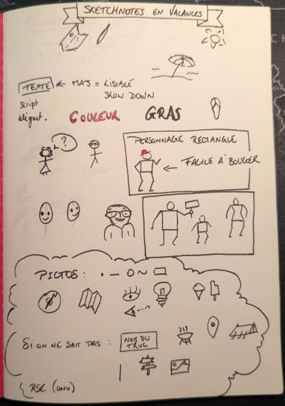  

Je dois avouer qu'ils avaient tout à fait raison : en 45 minutes (qui sont passées si vite !) j'avais acquis les bases qui m'auront permis de réaliser mes toutes premières sketchnotes.  
La première sketchnote en question a été réalisée pendant le talk de [Yannick Guern](https://bsky.app/profile/akanoa.bsky.social).  
La deuxième lors du trajet retour dans le train (je n'ai d'ailleurs pas vu le temps passer !) 😀.

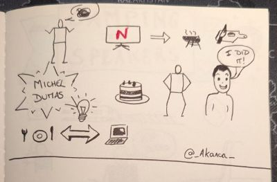  
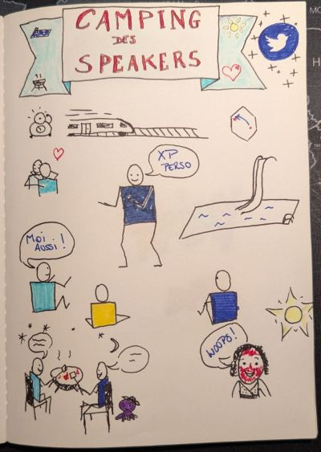  

## Juillet 2022 : un entraînement quotidien

Le mois suivant, je tombe sur [ce tweet](https://x.com/MChainotBatail/status/1550921575632879616?s=20) de Manuella Chainot-Bataille (oui c'était encore Twitter à l'époque) qui nous propose de nous entraîner aux sketchnotes par le biais d'une sorte de cahier de vacances, avec un exercice par jour.



Le tout est partagé sur [ce digipad](https://digipad.app/p/189422/12d13d44e6d08) où Manuella poste chaque jour un nouvel exercice, et les personnes y participant y ajoutent leurs réalisations. 

Ce qui m'a plu avec ça, c'est de prendre le temps de réaliser mes sketchnotes (temps que l'on a rarement en conférence). C'est un moyen d'appréhender l'exercice différement, qui nous permet ensuite d'être plus rapide puisque l'on aura déjà pris le temps auparavant d'expérimenter diverses techniques et forger notre propre "patte".  
De plus, le fait de partager ses créations et voir celles des autres permet de découvrir d'autres façons de faire auxquelles on n'aurait pas forcément pensé, et ainsi enrichir notre "vocabulaire" de sketchnotes (et recevoir au passage félicitations et encouragement, c'est toujours agréable !). 

Je n'ai rien produit concernant le cachier de vacances les 2 derniers jours car j'étais en réunion de famille. En revanche j'ai sketchnoté les festivités (mais ça reste dans mes sketchnotes privées 😉).

Si vous souhaitez vous aussi commencer à réaliser des sketchnotes, je vous encourage vivement à suivre ce cahier de vacances !  
Voici la galerie de mes réalisations durant ce challenge (cliquez pour agrandir une image).


	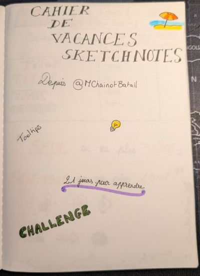
	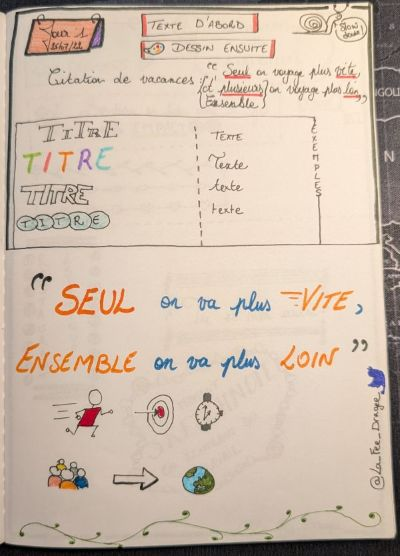
	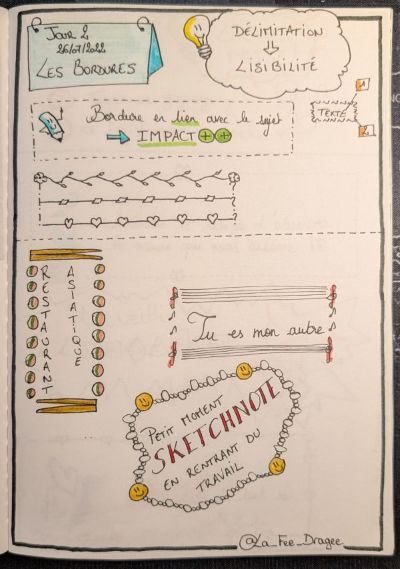
	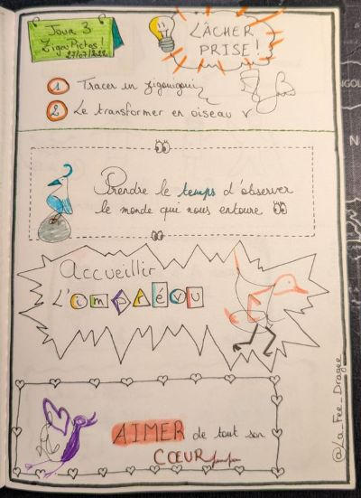
	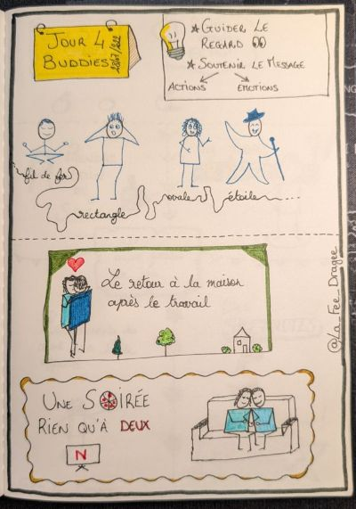
	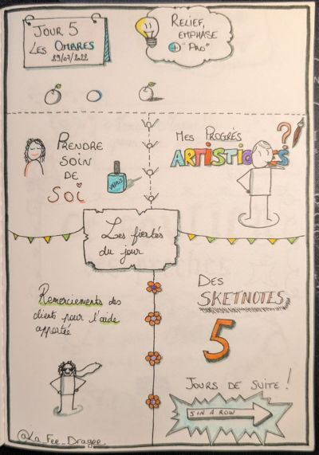
	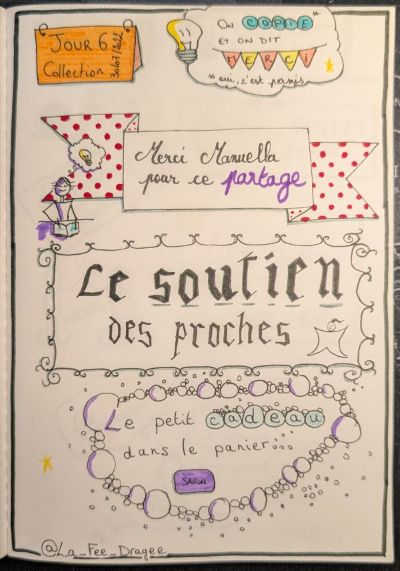
	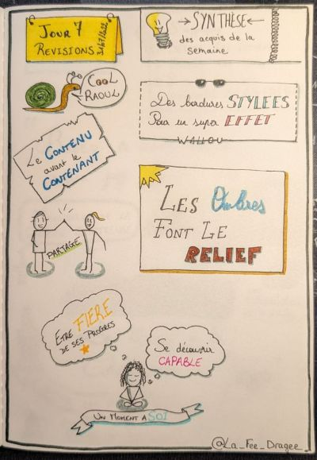
	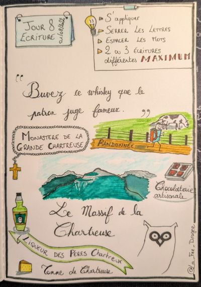
	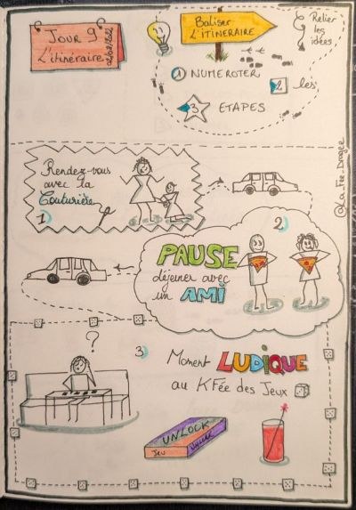
	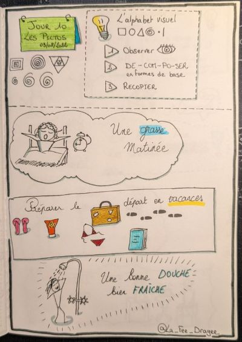
	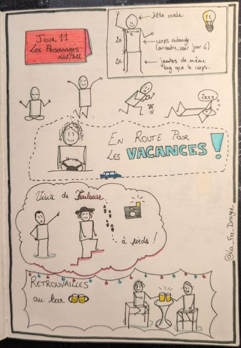
	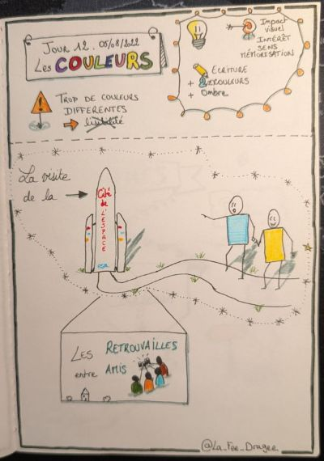
	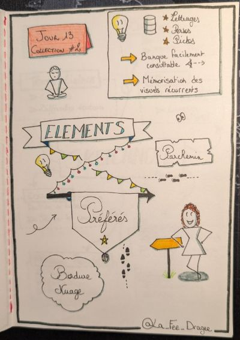
	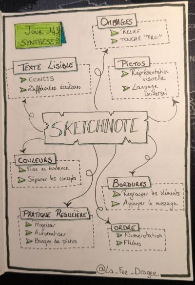
	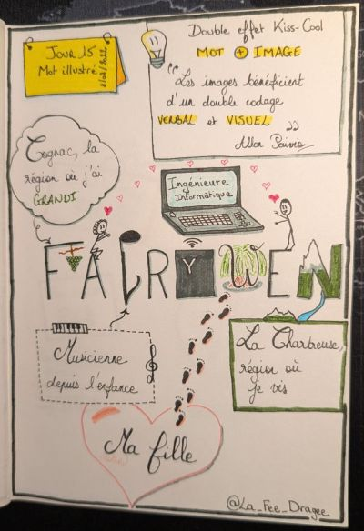
	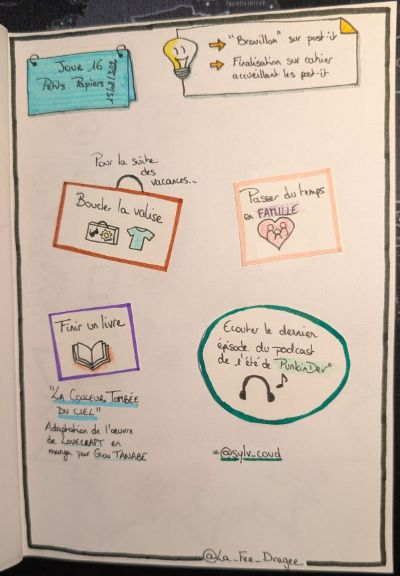
	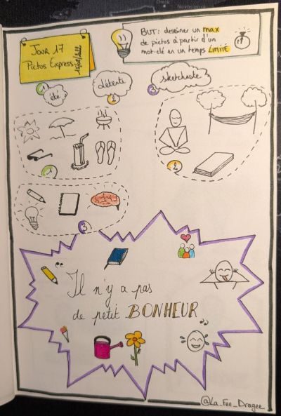
	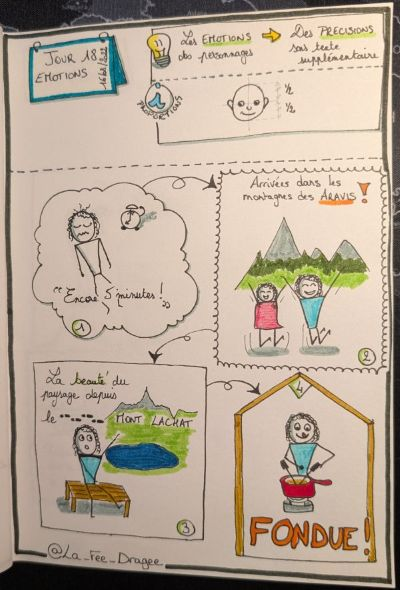
	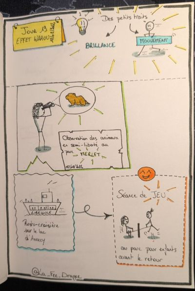


## Level up : la tablette graphique

Pendant un moment j'ai continué à réaliser mes sketchnotes sur papier. Il faut dire que j'ai toujours aimé le contact du crayon sur le papier. Puis lors de la conférence [MiXiT](../../2024/mixit/#apparté-parlons-sketchnotes), Aurélie Vache me montre comment elle utilise son iPad pour réaliser ses sketchnotes (je songeais à l'époque à passer au numérique justement).  
Quelques temps plus tard, je fais l'acquisition d'une tablette graphique [Boox Note Air4 C](https://shop.boox.com/products/noteair4c?srsltid=AU7gw4XlWWwQVvjvXoXdfigSCXgdVhTEj_ADqLRPj2YUal_OUA5KbbZg) et commence à réaliser mes sketchnotes avec.  

Il m'aura fallu un peu de temps pour la prendre en main et me faire de nouvelles habitudes, mais en tous cas je trouve que l'utilisation d'une tablette graphique permet de libérer tout son potentiel (ou presque).  
Le principal avantage que j'y trouve est le fait de pouvoir rapidement éditer le contenu : sélection intelligente au lasso, qui permet ensuite de copier/couper-coller, déplacer ou encore redimensionner en un coup de crayon. La suppression d'un trait ou dessin est également très rapide en utilisant soit le bouton sur le côté du crayon, soit "l'interrupteur" gomme au bout du crayon (on retourne donc le stylet pour utiliser la gomme, comme avec les crayons de papier).  

Enfin, le tracé est plus précis, mais pour cela je vous laisse mon astuce : zoomer sur la page et tracer "gros", les traits seront alors mieux lissés et plus propres plutôt que de faire de petits traits et dessins.  

La principale limitation de ma tablette est le jeu de couleurs : il n'y en a que 16 et elles ressortent très "flashy" une fois l'image affichée sur ordinateur/téléphone (la technologie d'affichage de la tablette a pour effet de rendre les couleurs plus ternes que la réalité). Pour des sketchnotes et vu le tarif de la tablette par rapport à la concurrence ce n'est pas gênant, par contre pour du dessin plus élaboré ça le sera (de toutes façons pour du "vrai" dessin j'utilise mes feutres et crayons sur un vrai cahier 😄).  
_[Edit: cette limitation n'est pas du fait de la tablette mais de l'application native de prise de notes.]_

## Bonus

Considéré comme le créateur des sketchnotes, [Mike Rohde](https://rohdesign.com/) a publié [2 livres](https://www.chez-mon-libraire.fr/listeliv.php?base=allbooks&form_recherche_avancee=ok&auteurs=Mike%20Rohde&exact) sur l'art de la prise de notes visuelle.  
Parfaits pour débuter également.  

Mon amie speakeuse Aurélie Vache publie de son côté des [articles de blog](https://dev.to/aurelievache/) et des [livres éducatifs](https://scraly.com/#zine) sur diverses technologies et langages tout en sketchnotes, un sacré travail !  

Par ailleurs, c'est bientôt la saison du challenge [Inktober](https://inktober.com/).  
Le principe si vous ne le connaissez pas : réaliser chaque jour d'octobre un croquis/dessin selon le thème défini [sur la liste officelle](https://www.instagram.com/p/DcvuJxSpkRA/). Aucun style artisitque n'est imposé, le but est simplement de nous inciter à progresser. Il est donc tout à fait possible de réaliser le challenge en sketchnotes (ça m'est déjà arrivé d'ailleurs).  
Et si le thème ne vous insipire pas, pas d'inquiétude, on trouve plein de thèmes alternatifs sur les réseaux sociaux, nulle doute que vous en trouverez un ! 

Je vous laisse avec mes bibliothèques visuelles.

A vos crayons ! ✏️


 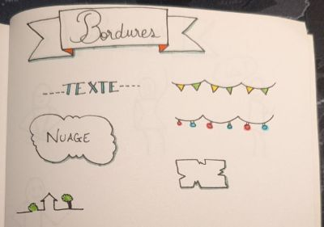
 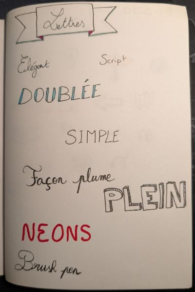
 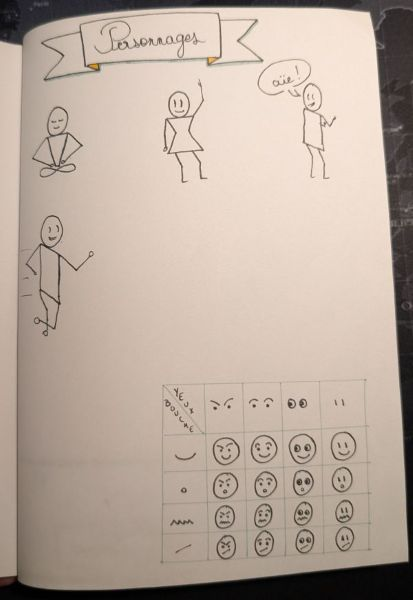
 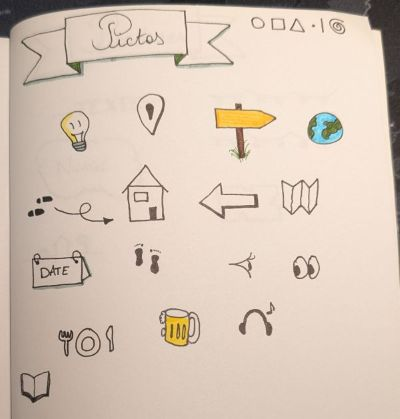
